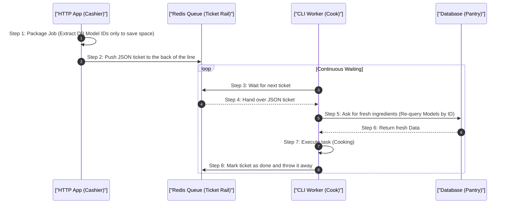

# 1. Analogy First: The Restaurant Order Rail

Imagine a busy fast-food restaurant:
- **HTTP Application (The Cashier):** Takes your order (the Job), hands you a receipt immediately, and puts the order ticket on a rail. They never cook the food.
- **Queue Broker / Redis (The Ticket Rail):** Holds all the order tickets in line securely.
- **CLI Workers (The Cooks):** Stand around waiting. When a ticket hits the rail, they grab it and start cooking (processing the Job) in the background.

## 2. Step-by-Step Flow: Job Serialization & Worker Lifecycle

How a job moves from a user request to a background worker:



## 3. Annotated Python Code: Safe Worker Memory

Here is how a background worker looks in Python using Celery. Workers are long-lived, so we have to manually manage memory sometimes!

```python
import logging
from celery import Task
from celery.app import shared_task
from app.models import Video

# 1. Define a background task (Job) that workers will pick up
@shared_task(
    bind=True, 
    # 2. Retry strategy: Try up to 3 times if it fails
    max_retries=3,
    # 3. Memory safety: Hard stop after 120 seconds to prevent getting stuck
    time_limit=120
)
def transcode_video_job(self: Task, video_id: int) -> None:
    # 4. Fetch fresh data from the database using the ID provided
    video = Video.query.get(video_id)
    
    # 5. Log that we are starting the heavy task
    logging.info(f"Transcoding started for video: {video.id}")
    
    # 6. Simulate a memory-heavy task (e.g., loading a video into RAM)
    buffer = "A" * (1024 * 1024 * 50) # 50MB allocation
    
    # 7. Manually delete large variables to help Garbage Collection
    # This prevents the long-lived worker process from bloating and crashing!
    del buffer
```

## 4. Architectural Trade-offs & Limits

- **Database Queues vs Redis Queues:** 
  - Using a SQL database as a queue is easy to set up, but causes traffic jams (deadlocks) when many workers try to lock rows at once.
  - Redis is lightning fast, but lives in RAM. If workers crash and jobs pile up, Redis runs out of memory.
- **Worker Memory Bloat:** PHP (and Python) weren't built to run forever. Memory slowly leaks over time. 
  - *Fix:* Set workers to restart after completing a certain number of jobs (e.g., `max-jobs=1000`).

## 5. Interview Tips: 3-Point Elevator Pitches

**Q: Why do we need to restart workers after every code deployment?**
1. **Resident Memory:** Workers are long-lived processes that load the code into RAM when they start.
2. **Disk vs RAM:** Changing files on disk during a deployment doesn't change the code already running in RAM.
3. **Graceful Restart:** A restart command tells them to finish their current job, exit cleanly, and reboot to pull the fresh code.

**Q: How do you prevent two workers from processing the same job?**
1. **Atomic Locks:** The queue broker uses atomic operations (like Redis Lua scripts).
2. **Reservation:** When Worker A grabs a job, it instantly marks it as "reserved" in a single step.
3. **Visibility:** Worker B never even sees the job, preventing duplicate processing.
