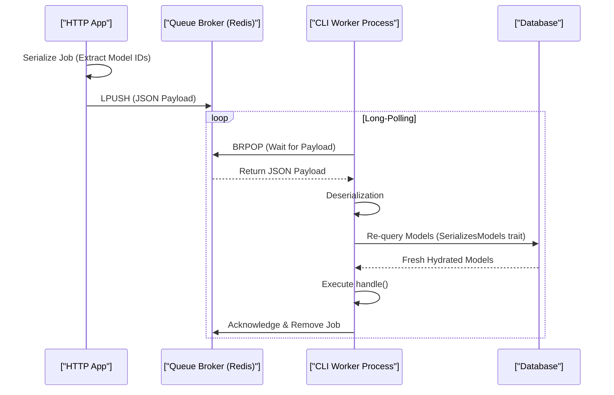

# Laravel Queue Architecture & Worker Lifecycle (Staff Architect Edition)

> **Module:** Laravel Internals (Topic 4.4)
> **Source Mapping:** `backend-roadmap.md` & `roadmap.md`

---

## 💡 1. First-Principles Mechanics & DB Level Locking

Laravel's Queue system decouples heavy tasks (like GitHub webhook processing) from the HTTP cycle. Under the hood, workers are long-lived CLI processes. At the memory level, PHP's Garbage Collector (GC) runs in cycles, but long-lived arrays can evade cleanup, causing memory bloat. At the database/broker level, atomic locks (e.g., Redis `LUA` scripts or SQL `FOR UPDATE`) prevent race conditions when multiple workers pick up the same job.

### Sequence Diagram: Job Serialization & Worker Lifecycle



---

## 🏢 2. Real-World Production Example: GitHub & Webhook Pipelines

At scale (like GitHub processing pushes or Netflix transcoding), a single queue is inefficient. Jobs are segmented into high, default, and low priority queues. Worker clusters scale based on queue depth (using tools like KEDA in Kubernetes).

### Production Code Snippet (Python 3.11+ & Celery)

```python
import logging
from celery import Task
from celery.app import shared_task
from app.models import Video

# Celery implicitly serializes/deserializes IDs. We fetch the model in the task.

@shared_task(
    bind=True, 
    # 1. Retry strategy: Max 3 attempts
    max_retries=3,
    # 2. Memory safety: Hard time limit (raises TimeLimitExceeded)
    time_limit=120
)
def transcode_video_job(self: Task, video_id: int) -> None:
    # Worker needs to fetch fresh model data (similar to SerializesModels)
    video = Video.query.get(video_id)
    
    # 3. Process intensive task
    logging.info(f"Transcoding started for video: {video.id}")
    
    # Simulating memory intensive task
    buffer = "A" * (1024 * 1024 * 50) # 50MB allocation
    
    # 4. Manual deletion to help Python Garbage Collector in long-lived worker process
    del buffer
```

---

## 📈 3. Benchmarks & CLI Commands

### Monitoring Redis Queue Latency

Using `redis-cli` to monitor real-time queue ingestion and latency.

**CLI Command:**
```bash
# Monitor Redis commands in real-time
redis-cli -a mysecretpassword monitor | grep -i "queues:default"

# Benchmark Redis LPUSH throughput
redis-benchmark -t lpush -q -n 100000
```

**Annotated Output:**
```text
# LPUSH Benchmark Output:
LPUSH: 124533.00 requests per second, p50=0.239 msec
  <-- Redis handles 124k job dispatches per second effortlessly.

# Monitor Output:
1691234567.123456 [0 127.00.1:54321] "EVAL" "..." "queues:default:reserved" 
  <-- Worker executing Lua script to atomically reserve a job
```

---

## 🛑 4. Architectural Trade-offs & Limits

- **Database Queues:** Suffers from severe deadlock issues and high CPU utilization under concurrent worker loads due to row-level locking (`SELECT ... FOR UPDATE`).
- **Redis Queues:** High throughput but memory constrained. If workers die and jobs pile up, Redis can hit OOM (Out Of Memory) limits, leading to data loss unless AOF persistence is strict.
- **Worker Memory Leaks:** PHP wasn't built for long-running daemons. Static variables grow indefinitely. **Mitigation:** Restart workers every 1000 jobs using `php artisan queue:work --max-jobs=1000`.

---

## ⚔️ 5. Staff / Senior Interview Scenarios

**Q1: Why do we need to run `php artisan queue:restart` after every deployment?**
*A1:* Workers are long-lived daemons that load PHP code into memory upon startup. A deployment changes code on disk, but memory remains unchanged. `queue:restart` sends an atomic cache signal. Workers detect this, cleanly `exit(0)`, and are respawned by Supervisor with the new code.

**Q2: What happens if a job throws an exception during execution?**
*A2:* The worker catches the exception, checks the attempt count against `$tries`, and if below the limit, pushes the job back into the queue (potentially with exponential backoff). If exhausted, the job is moved to the `failed_jobs` table and removed from Redis.

**Q3: How do you prevent race conditions when two background jobs modify the same user balance?**
*A3:* Use Pessimistic Locking in the database (`DB::table('users')->where('id', 1)->lockForUpdate()->get()`) or Distributed Locks (Redis `Cache::lock`) within the job's `handle()` method.
