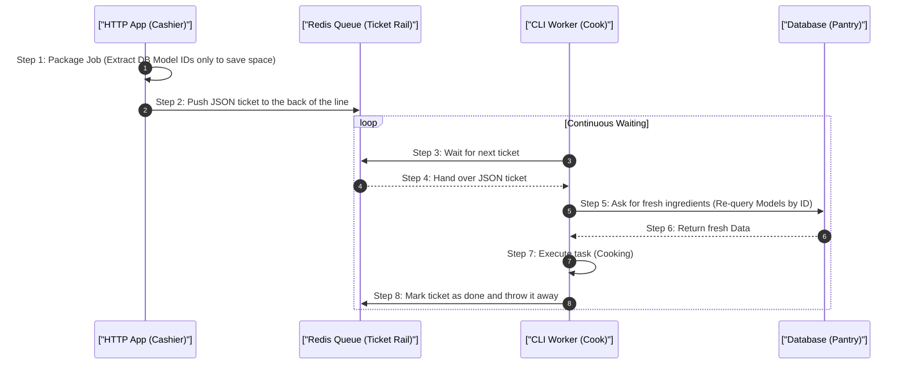

# 1. Analogy First: The Restaurant Order Rail

Imagine a busy fast-food restaurant:
- **HTTP Application (The Cashier):** Takes your order (the Job), hands you a receipt immediately, and puts the order ticket on a rail. They never cook the food.
- **Queue Broker / Redis (The Ticket Rail):** Holds all the order tickets in line securely.
- **CLI Workers (The Cooks):** Stand around waiting. When a ticket hits the rail, they grab it and start cooking (processing the Job) in the background.

## 2. Step-by-Step Flow: Job Serialization & Worker Lifecycle

How a job moves from a user request to a background worker:



## 3. Annotated Laravel Code: Safe Worker Memory & Job Lifecycle

Here is how a background job is built and dispatched in Laravel. Workers are long-lived CLI processes, so model serialization and retry strategies keep execution safe!

```php
<?php

namespace App\Jobs;

use App\Models\Video;
use Illuminate\Bus\Queueable;
use Illuminate\Contracts\Queue\ShouldQueue;
use Illuminate\Foundation\Bus\Dispatchable;
use Illuminate\Queue\InteractsWithQueue;
use Illuminate\Queue\SerializesModels;
use Illuminate\Support\Facades\Log;
use Illuminate\Http\JsonResponse;

// 1. Implement ShouldQueue so Laravel pushes this to the queue instead of running synchronously
class TranscodeVideoJob implements ShouldQueue
{
    // 2. SerializesModels saves only Model IDs in the queue payload (saving RAM and payload size)
    use Dispatchable, InteractsWithQueue, Queueable, SerializesModels;

    // 3. Retry strategy: Try up to 3 times before failing
    public int $tries = 3;

    // 4. Backoff strategy: Wait 10s, then 30s before retrying
    public array $backoff = [10, 30];

    // 5. Time limit: Maximum seconds the worker is allowed to run this job
    public int $timeout = 120;

    // 6. Injected Eloquent model is automatically serialized to its ID
    public function __construct(
        public Video $video
    ) {}

    public function handle(): void
    {
        // 7. SerializesModels re-queries the fresh Video model from DB when the worker starts
        Log::info("Transcoding started for video: {$this->video->id}");

        // 8. Execute heavy background task (e.g. video transcoding)
        // Workers process this in CLI memory without blocking the web request
    }
}

// 9. Dispatching the Job from a Controller
class VideoController
{
    public function transcode(Video $video): JsonResponse
    {
        // 10. Dispatch job to Redis queue; returns immediately to user (HTTP Cashier)
        TranscodeVideoJob::dispatch($video);

        return response()->json([
            'message' => 'Video transcoding queued successfully!',
        ], 202);
    }
}
```

## 4. Architectural Trade-offs & Limits

- **Database Queues vs Redis Queues:** 
  - Using a SQL database as a queue is easy to set up, but causes traffic jams (deadlocks) when many workers try to lock rows at once.
  - Redis is lightning fast, but lives in RAM. If workers crash and jobs pile up, Redis runs out of memory.
- **Worker Memory Bloat:** PHP (and Python) weren't built to run forever. Memory slowly leaks over time. 
  - *Fix:* Set workers to restart after completing a certain number of jobs (e.g., `max-jobs=1000`).

## 5. Interview Tips: 3-Point Elevator Pitches

**Q: Why do we need to restart workers after every code deployment?**
1. **Resident Memory:** Workers are long-lived processes that load the code into RAM when they start.
2. **Disk vs RAM:** Changing files on disk during a deployment doesn't change the code already running in RAM.
3. **Graceful Restart:** A restart command tells them to finish their current job, exit cleanly, and reboot to pull the fresh code.

**Q: How do you prevent two workers from processing the same job?**
1. **Atomic Locks:** The queue broker uses atomic operations (like Redis Lua scripts).
2. **Reservation:** When Worker A grabs a job, it instantly marks it as "reserved" in a single step.
3. **Visibility:** Worker B never even sees the job, preventing duplicate processing.
