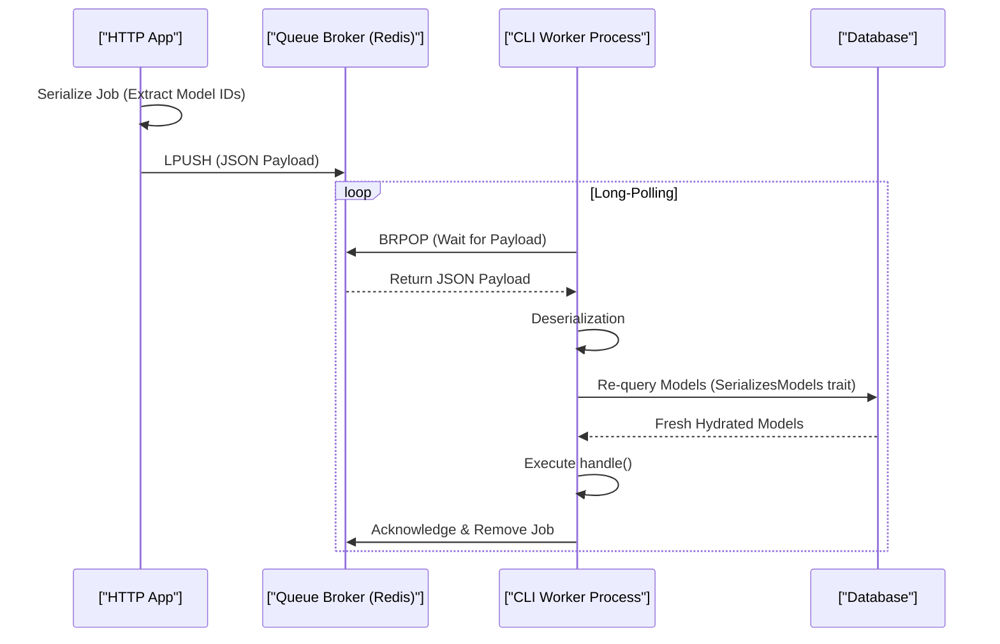

# Laravel Queue Architecture & Worker Lifecycle (Staff Architect Edition)

> **Module:** Laravel Internals (Topic 4.4)
> **Source Mapping:** `backend-roadmap.md` & `roadmap.md`

---

## 💡 1. Conceptual Blueprint & First Principles

Laravel's Queue system decouples heavy, time-consuming tasks (email sending, PDF generation) from the synchronous HTTP request-response cycle. 

**Design Motivations & Trade-offs:**
- **Asynchronous Execution:** Drastically improves user-facing response times by moving logic to background workers.
- **Resilience:** Jobs can be retried automatically upon failure.
- **Trade-off:** Adds system complexity. Requires a message broker (Redis/RabbitMQ/SQS), supervisor processes, and careful memory management since worker daemons are long-lived PHP processes.

---

## 🔬 2. Under-the-Hood Mechanics

### Sequence Diagram: Job Serialization & Worker Lifecycle



### The `SerializesModels` Trait
When a job is dispatched, PHP does not serialize the entire Eloquent object (which is huge and can contain stale DB data). The `SerializesModels` trait extracts only the Class name and Primary ID. When the worker picks up the job, it re-fetches a fresh copy of the model from the DB.

---

## 💻 3. Production Code & Benchmarks

### Supervisor Configuration (Production Standard)

```ini
[program:laravel-worker]
process_name=%(program_name)s_%(process_num)02d
command=php /var/www/html/artisan queue:work redis --sleep=3 --tries=3 --max-time=3600
autostart=true
autorestart=true
stopasgroup=true
killasgroup=true
user=www-data
numprocs=8 ; Spawn 8 parallel worker processes
stdout_logfile=/var/log/worker.log
```

### Benchmarks (Queue Drivers)

| Driver | Latency | Max Throughput | Persistence | Ideal Use Case |
|--------|---------|----------------|-------------|----------------|
| Database | High (~20ms) | Low (< 100/s) | High (ACID) | Small apps, no infra |
| Redis | Low (~1ms) | High (> 5k/s) | Medium (RDB/AOF) | High performance, Horizon |
| SQS | Med (~15ms) | Extreme | High (AWS) | Serverless, decoupled |

---

## ⚔️ 4. Staff / Senior Interview Scenarios

1. **Question:** "Why do we need to run `php artisan queue:restart` after every deployment?"
   - **Answer:** Workers are long-lived daemons. They load the PHP code into memory when they start. If you deploy new code, the worker will still execute the old code. `queue:restart` sends a broadcast signal to all workers instructing them to `exit(0)`. Supervisor then automatically re-spawns them, loading the fresh code.
2. **Question:** "What causes memory leaks in Laravel Queue Workers, and how do you mitigate them?"
   - **Answer:** PHP is generally designed to die after a request. In a long-lived worker, static arrays, singletons (like DB query logs or Monolog instances) can grow infinitely. Mitigation: Use `--max-jobs=1000` or `--max-time=3600` so the worker cleanly exits and respawns before memory exhaustion, or use `queue:listen` (which boots a fresh process per job but is 10x slower).
3. **Question:** "What happens if a job throws an exception?"
   - **Answer:** The worker catches it, increments the `attempts` counter, and releases it back to the queue (with a backoff delay if configured). If attempts exceed `--tries`, it is moved to the `failed_jobs` table.
