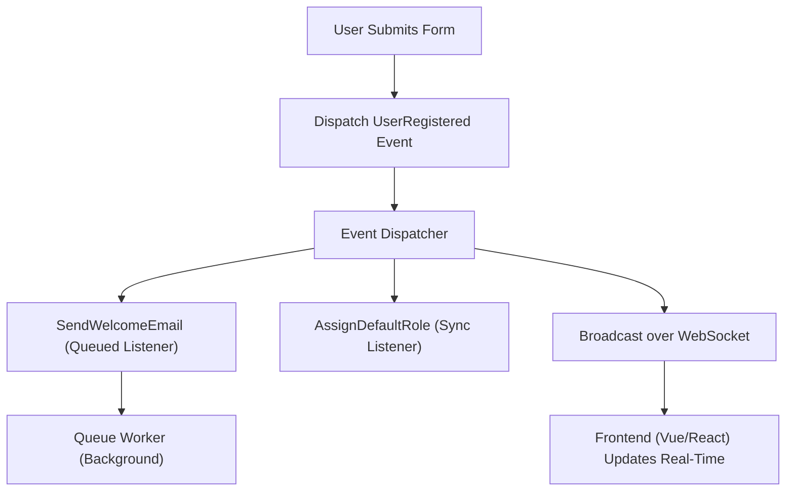

# Lesson 5: Events, Queued Listeners, and Broadcasting

## 1. The Analogy: A Megaphone in a Crowded Room
Imagine an airport terminal. When a flight is boarding, the gate agent doesn't walk up to every single passenger to tell them it's time to board. Instead, they pick up a microphone and announce it over the loudspeaker (**the Event**). 
Anyone who cares about that flight (**the Listeners**) hears the announcement and lines up. The people who are waiting for a different flight just ignore it. If the line is too long, the airline staff might handle passengers one by one in the background (**Queued Listeners**). If they announce it to the whole airport screens as well, that's **Broadcasting**!

## 2. Step-by-Step Flow
1. **Fire the Event:** Somewhere in your app, an action happens (e.g., `UserRegistered`). You "dispatch" this event.
2. **Listeners React:** Classes registered to listen to `UserRegistered` catch the event and run their logic (e.g., `SendWelcomeEmail`).
3. **Queue (Optional):** If a listener implements `ShouldQueue`, Laravel pushes the listener's job to the background queue so the user doesn't have to wait.
4. **Broadcast (Optional):** If the event implements `ShouldBroadcast`, Laravel sends it over a WebSocket connection (via Reverb or Pusher) so the frontend (like React or Vue) updates in real-time.

## 3. Annotated Code

```php
<?php

namespace App\Events;

use App\Models\User;
use Illuminate\Broadcasting\Channel;
use Illuminate\Contracts\Broadcasting\ShouldBroadcast;
use Illuminate\Foundation\Events\Dispatchable;
use Illuminate\Queue\SerializesModels;

// 1. The Event class acts as a simple data container.
// Implements ShouldBroadcast to send real-time updates to the frontend.
class UserRegistered implements ShouldBroadcast
{
    use Dispatchable, SerializesModels;

    public $user; // Public properties are automatically passed to listeners and broadcasts.

    public function __construct(User $user)
    {
        $this->user = $user;
    }

    // 2. Define which channel this event broadcasts on.
    public function broadcastOn()
    {
        return new Channel('public-announcements');
    }
}
```

```php
<?php

namespace App\Listeners;

use App\Events\UserRegistered;
use Illuminate\Contracts\Queue\ShouldQueue;

// 3. The Listener implements ShouldQueue to run in the background.
class SendWelcomeEmail implements ShouldQueue
{
    // The handle method receives the event it is listening to.
    public function handle(UserRegistered $event)
    {
        // 4. Access the data from the event and perform the action.
        // E.g., Mail::to($event->user)->send(new WelcomeEmail());
        echo "Sending email to " . $event->user->email;
    }
}
```

## 4. Mermaid Diagram



## 5. 3-Point Interview Pitch

**Q: Explain how Laravel's Event system works and how you'd scale it.**
1. **Decoupling:** "Laravel's event system acts as a pub/sub mechanism, decoupling the core logic (like user registration) from side effects (like sending emails or assigning roles)."
2. **Queued Listeners:** "To scale and improve response times, I use the `ShouldQueue` interface on listeners. This pushes heavy tasks (like third-party API calls) to a background worker like Redis, keeping the main request fast."
3. **Broadcasting:** "For real-time UI updates, I make the Event implement `ShouldBroadcast`, which pushes the event data over WebSockets (like Laravel Reverb) directly to the frontend without polling."
