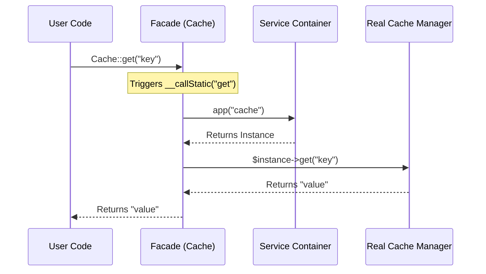

# Lesson 6: Facades, Macros, and Metaprogramming

## 1. The Analogy: The Restaurant Drive-Thru
Imagine you are at a fast-food drive-thru. You don't walk into the kitchen, find the specific fry cook, and ask them to make your burger. You just talk to the **speaker box (Facade)**. 
The speaker box isn't a person; it's a static interface. But when you say "I want a burger" (a static method call), the speaker box magically routes your request to the correct worker in the kitchen (**the underlying instance in the Service Container**). 

If you want to add a secret menu item that isn't on the official menu, you can teach the staff how to make it—that's a **Macro**.

## 2. Step-by-Step Flow
1. **The Static Call:** You call `Cache::get('key')`. It looks like a static method, but it's actually a Facade.
2. **The `__callStatic` Magic:** PHP triggers the `__callStatic()` magic method because `get()` doesn't actually exist as a static method on the Facade.
3. **Container Resolution:** The Facade looks up its registered "accessor" (e.g., the string `'cache'`) and pulls the real, instantiated object from the Laravel Service Container.
4. **Method Delegation:** The Facade passes your `get('key')` call to that real object.
5. **Macros:** Traits like `Macroable` allow you to dynamically add methods to existing classes at runtime using closures (metaprogramming).

## 3. Annotated Code

### How a Facade works internally
```php
<?php

namespace App\Facades;

use Illuminate\Support\Facades\Facade;

// 1. We create a Facade by extending Laravel's base Facade class.
class Payment extends Facade
{
    // 2. We define the string key that this facade represents in the container.
    protected static function getFacadeAccessor()
    {
        return 'payment-gateway';
    }
}

// 3. When we call Payment::charge(100), PHP hits the base Facade's __callStatic.
/*
    public static function __callStatic($method, $args) {
        // Resolves 'payment-gateway' from app() container
        $instance = static::resolveFacadeInstance(static::getFacadeAccessor());
        // Calls the method dynamically
        return $instance->$method(...$args);
    }
*/
```

### How Macros work (Metaprogramming)
```php
<?php

use Illuminate\Support\Str;

// 1. Laravel classes like Str use the Macroable trait.
// We can define a new method dynamically at runtime (usually in a ServiceProvider).
Str::macro('reverseWords', function (string $value) {
    // $this is NOT available here unless bound, but we use the input string.
    return implode(' ', array_reverse(explode(' ', $value)));
});

// 2. Now we can use it anywhere as if it was natively part of the framework.
$result = Str::reverseWords('Hello World'); // Outputs: "World Hello"
```

## 4. Mermaid Diagram



## 5. 3-Point Interview Pitch

**Q: Explain Laravel Facades vs Contracts, and what Macroable does.**
1. **Facades via `__callStatic`:** "Facades provide a clean, static-like syntax for interacting with classes in the Service Container. They use PHP's `__callStatic` magic method to resolve the underlying instance and proxy the method call, making code readable but still testable."
2. **Contracts vs Facades:** "Contracts are explicit interfaces that enforce implementation, ideal for strict dependency injection. Facades are proxies for convenience. I use Contracts when building decoupled packages, and Facades for rapid application development."
3. **Metaprogramming with Macros:** "The `Macroable` trait enables runtime metaprogramming. It allows us to add custom methods to core Laravel classes (like `Str` or `Collection`) without extending the class, keeping our codebase flexible and clean."
