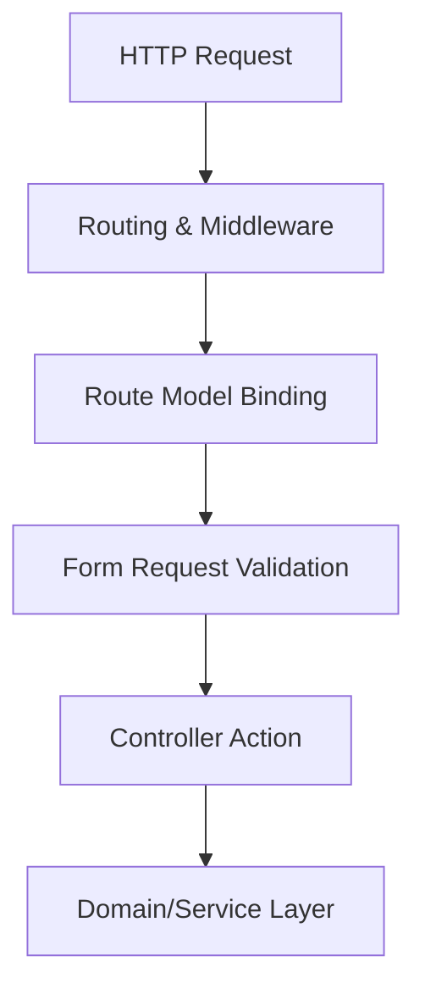

# 🎯 Routing, Controllers & Request Validation

This guide covers production-grade practices for HTTP routing, Controller patterns, Route Model Binding, and robust Request validation using Laravel Form Requests.

---

## 💡 Conceptual Blueprint & First Principles

In Laravel, the HTTP layer serves as the entry point of your application. Think of it like a **restaurant**:

*   **Routing & Middleware (The Receptionist & Security Guard)**: The router is the receptionist who greets you at the door, checks where you want to go, and directs you. Middleware is the security guard who checks if you are allowed in (e.g., checking if you are logged in or aren't requesting things too quickly).
*   **Route Model Binding (The Valet Service)**: Instead of handing you a ticket number and making you go to the parking lot to find your car, the valet (Laravel) takes your ticket (ID), fetches your actual car (the Database Record / Model), and hands it to you directly.
*   **Form Requests (The Order Validator)**: Before the chef (Controller) starts cooking your meal, the waiter checks if your order makes sense (e.g., you didn't order a food item that doesn't exist, and you provided all required details). If the order is invalid, they tell you immediately without wasting the chef's time.



1. **Routing**: Declares web addresses (URIs) and maps them to controllers.
2. **Controllers**: Should remain **thin**. A controller's only job is to receive requests, hand them over to the business logic handlers (Service/Action classes), and return a response.
3. **Form Requests**: Custom classes that check if the user is allowed to perform the action and if the data they sent is valid.

---

## 🔬 Under-the-Hood Mechanics

### Route Model Binding (RMB)
Laravel resolves database models automatically by injecting them into your controller methods.
*   **How it works**: Laravel's `SubstituteBindings` middleware inspects the method signature. If it sees a parameter like `{user}` and a corresponding type-hinted variable `User $user` in the controller, it queries the database for a user with that ID. If found, it passes the model object; if not, it automatically sends back a `404 Not Found` page.
*   **Scoping**: When using nested routes (e.g., `/projects/{project}/tasks/{task}`), Laravel can automatically ensure that the `{task}` actually belongs to that `{project}`.

### Form Request Validation Lifecycle
When a Form Request is type-hinted in a controller action:
1. The Service Container detects it and boots up the Form Request class.
2. It calls the `authorize()` method inside it. If this returns `false`, Laravel throws a `403 Forbidden` response and stops.
3. It runs the validation rules in the `rules()` method. If validation fails, Laravel throws a `ValidationException` which automatically returns a `422 Unprocessable Entity` JSON response (for APIs) or redirects the user back with error messages (for traditional web forms).

---

## 💻 Production Code & Patterns

### 1. Route Definition with Grouping & Scoping
Use clean groupings, namespaces, and middleware boundaries:

```php
// routes/api.php
use App\Http\Controllers\Api\V1\ProjectController;
use App\Http\Controllers\Api\V1\ProjectTaskController;

// Grouping routes that share the same URL prefix ('v1') and security rules (middleware)
Route::prefix('v1')->middleware(['auth:sanctum', 'throttle:api'])->group(function () {
    
    // Automatically generates standard API routes (index, store, show, update, destroy) for Projects
    Route::apiResource('projects', ProjectController::class);
    
    // Nested Route: Tasks are children of Projects. 
    // The 'scoped' call tells Laravel that tasks should be looked up using their 'slug' column
    // and checks under the hood that the task actually belongs to this specific project.
    Route::apiResource('projects.tasks', ProjectTaskController::class)->scoped([
        'task' => 'slug', // Binds URL: /projects/{project}/tasks/{task:slug}
    ]);
});
```

### 2. The Form Request Pattern
Create reusable validation classes to keep controllers clean:

```php
namespace App\Http\Requests\V1;

use Illuminate\Foundation\Http\FormRequest;
use Illuminate\Validation\Rules\Password;

class StoreProjectRequest extends FormRequest
{
    // Step 1: Check if the user is allowed to make this request
    public function authorize(): bool
    {
        // Enforces permission check: Can the logged-in user create a Project?
        return $this->user()->can('create', Project::class);
    }

    // Step 2: Define validation rules for the incoming data fields
    public function rules(): array
    {
        return [
            // Title must be provided, must be text, max 255 chars, and unique in 'projects' table
            'title' => ['required', 'string', 'max:255', 'unique:projects,title'],
            // Description is optional but if provided must be text
            'description' => ['nullable', 'string'],
            // Due date is required, must be a valid date, and must be set in the future (after today)
            'due_date' => ['required', 'date', 'after:today'],
            // Owner email must be a valid email format
            'owner_email' => ['required', 'email'],
            // Password is required, must be confirmed (needs password_confirmation field), and strong
            'password' => ['required', 'confirmed', Password::min(8)->letters()->numbers()],
        ];
    }
}
```

### 3. Thin Controller Pattern
Delegate validation and business logic:

```php
namespace App\Http\Controllers\Api\V1;

use App\Http\Controllers\Controller;
use App\Http\Requests\V1\StoreProjectRequest;
use App\Http\Resources\V1\ProjectResource;
use App\Services\ProjectService;

class ProjectController extends Controller
{
    // Inject the ProjectService through the constructor (Dependency Injection)
    public function __construct(protected ProjectService $projectService) {}

    // Store a new project. StoreProjectRequest automatically handles validation before this code runs.
    public function store(StoreProjectRequest $request): ProjectResource
    {
        // $request->validated() returns ONLY the fields that passed validation
        // $request->user() gets the currently authenticated user
        $project = $this->projectService->createProject(
            $request->validated(),
            $request->user()
        );

        // Return the newly created project formatted nicely via an API Resource
        return new ProjectResource($project);
    }
}
```

---

## ⚔️ Staff / Senior Interview Scenarios

### Q1: What is the risk of using Route Model Binding with Soft Deletes? How do you solve it?
* **Answer**: By default, Route Model Binding will throw a `404 Not Found` if a model is soft-deleted. If you need to retrieve or restore a soft-deleted model through the route (e.g., in a restore endpoint), you must explicitly chain `withTrashed()` to the route definition:
  ```php
  Route::post('/projects/{project}/restore', [ProjectController::class, 'restore'])->withTrashed();
  ```

### Q2: How do you handle validation of dynamic/nested arrays (e.g., bulk records)?
* **Answer**: Use wildcard notation in your Form Request rules to validate nested arrays efficiently without loading excessive records into memory:
  ```php
  public function rules(): array
  {
      return [
          'items' => ['required', 'array', 'min:1'],
          'items.*.id' => ['required', 'integer', 'exists:products,id'],
          'items.*.quantity' => ['required', 'integer', 'min:1'],
      ];
  }
  ```
