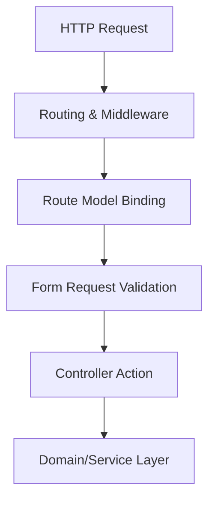

# 🎯 Routing, Controllers & Request Validation

This guide covers production-grade practices for HTTP routing, Controller patterns, Route Model Binding, and robust Request validation using Laravel Form Requests.

---

## 💡 Conceptual Blueprint & First Principles

In Laravel, the HTTP layer serves as the entry point of your application. A clean request lifecycle separates entry routing from domain logic:



1. **Routing**: Declares URIs and maps them to controllers. Routes should be RESTful, cached in production (`route:cache`), and thin.
2. **Controllers**: Should remain **thin**. A controller's single responsibility is to receive requests, delegate to the domain (Service/Action classes), and return responses.
3. **Form Requests**: Encapsulate authorization and validation rules. Never perform validation directly inside controller actions.

---

## 🔬 Under-the-Hood Mechanics

### Route Model Binding (RMB)
Laravel resolves models automatically by injecting them into your controller methods. 
* **Mechanics**: Laravel's `SubstituteBindings` middleware inspects method signatures, matches route parameters (e.g., `{user}`) to variables (`User $user`), and fetches the model via the defined key (default: `id`).
* **Scoping**: When using nested route parameters (e.g., `/{post}/comments/{comment}`), Laravel can auto-scope the child using relationship conventions.

### Form Request Validation Lifecycle
When a Form Request is type-hinted in a controller action:
1. The Service Container resolves the Form Request.
2. It calls `validateResolved()` on the request.
3. The request runs the `authorize()` method. If `false` is returned, a `403 Forbidden` response is sent.
4. It executes the defined rules. If validation fails, a `ValidationException` is thrown, auto-generating a `422 Unprocessable Entity` response (or redirecting back with errors for web requests).

---

## 💻 Production Code & Patterns

### 1. Route Definition with Grouping & Scoping
Use clean groupings, namespaces, and middleware boundaries:

```php
// routes/api.php
use App\Http\Controllers\Api\V1\ProjectController;
use App\Http\Controllers\Api\V1\ProjectTaskController;

Route::prefix('v1')->middleware(['auth:sanctum', 'throttle:api'])->group(function () {
    // Resource Route
    Route::apiResource('projects', ProjectController::class);
    
    // Nested & Scoped Route Model Binding
    Route::apiResource('projects.tasks', ProjectTaskController::class)->scoped([
        'task' => 'slug', // Binds /projects/{project}/tasks/{task:slug}
    ]);
});
```

### 2. The Form Request Pattern
Create reusable validation classes:

```php
namespace App\Http\Requests\V1;

use Illuminate\Foundation\Http\FormRequest;
use Illuminate\Validation\Rules\Password;

class StoreProjectRequest extends FormRequest
{
    public function authorize(): bool
    {
        // Check authorization logic
        return $this->user()->can('create', Project::class);
    }

    public function rules(): array
    {
        return [
            'title' => ['required', 'string', 'max:255', 'unique:projects,title'],
            'description' => ['nullable', 'string'],
            'due_date' => ['required', 'date', 'after:today'],
            'owner_email' => ['required', 'email'],
            'password' => ['required', 'confirmed', Password::min(8)->letters()->numbers()],
        ];
    }
}
```

### 3. Thin Controller Pattern
Delegate validation and business logic:

```php
namespace App\Http\Controllers\Api\V1;

use App\Http\Controllers\Controller;
use App\Http\Requests\V1\StoreProjectRequest;
use App\Http\Resources\V1\ProjectResource;
use App\Services\ProjectService;

class ProjectController extends Controller
{
    public function __construct(protected ProjectService $projectService) {}

    public function store(StoreProjectRequest $request): ProjectResource
    {
        // Data is already validated and authorized here
        $project = $this->projectService->createProject(
            $request->validated(),
            $request->user()
        );

        return new ProjectResource($project);
    }
}
```

---

## ⚔️ Staff / Senior Interview Scenarios

### Q1: What is the risk of using Route Model Binding with Soft Deletes? How do you solve it?
* **Answer**: By default, Route Model Binding will throw a `404 Not Found` if a model is soft-deleted. If you need to retrieve or restore a soft-deleted model through the route (e.g., in a restore endpoint), you must explicitly chain `withTrashed()` to the route definition:
  ```php
  Route::post('/projects/{project}/restore', [ProjectController::class, 'restore'])->withTrashed();
  ```

### Q2: How do you handle validation of dynamic/nested arrays (e.g., bulk records)?
* **Answer**: Use wildcard notation in your Form Request rules to validate nested arrays efficiently without loading excessive records into memory:
  ```php
  public function rules(): array
  {
      return [
          'items' => ['required', 'array', 'min:1'],
          'items.*.id' => ['required', 'integer', 'exists:products,id'],
          'items.*.quantity' => ['required', 'integer', 'min:1'],
      ];
  }
  ```
