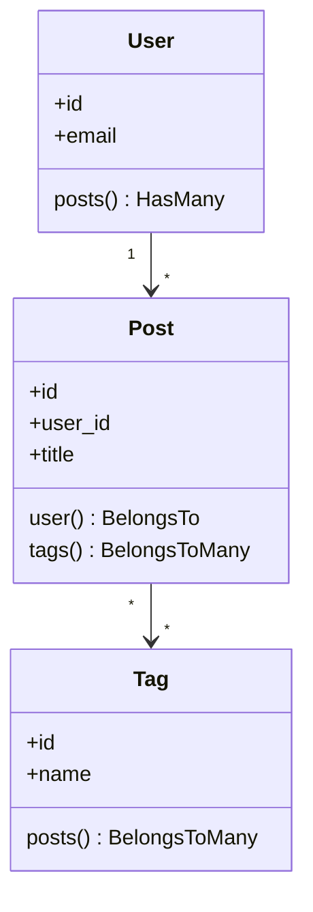

# 🗄️ Eloquent Relationships, Migrations & Transactions

This guide details professional Eloquent modeling, relationship mapping, database migrations, database seeders, query scopes, and robust transactional integrity in Laravel.

---

## 💡 Conceptual Blueprint & First Principles

Eloquent is an Active Record ORM. Every database table maps to a Model class, which is used to interact with that table. Think of it like this:

*   **Active Record Model**: A Model is like a **smart spreadsheet row**. Instead of writing raw SQL commands to insert, update, or delete data, you just interact with a PHP object, and Eloquent writes the SQL for you.
*   **Lazy vs Eager Loading (The Grocery Store analogy)**: 
    *   *Lazy Loading* is like making 10 cakes and driving to the grocery store separate times for *each* ingredient. For 10 posts, it runs 1 query for the posts, plus 10 separate queries to get the author of each post. This is the $N+1$ problem.
    *   *Eager Loading* is like making a grocery list and buying all ingredients (posts and their authors) in a single trip.
*   **Database Transactions (The ATM analogy)**: When you withdraw cash, two things must happen: (1) the bank deducts the money from your account, and (2) the machine dispenses the cash. If the machine runs out of cash, the bank must rollback the deduction. Either both actions succeed, or both fail. This is what `DB::transaction` ensures for your database updates.
*   **Polymorphic Relationships (The Universal Label analogy)**: Imagine you want users to comment on both `Post` and `Video` models. Instead of creating `post_comments` and `video_comments` tables, you create one `comments` table with a universal label: `commentable_type` (which model, e.g., Post or Video) and `commentable_id` (the ID of that Post or Video).



1. **Migrations & Seeders**: Version-control your schema and seed reproducible test/mock data.
2. **Relationships**: Model-level definitions mapping database foreign keys to objects.
3. **Query Scopes**: Encapsulate reusable query logic (e.g., active users, pending payments) inside the Model.
4. **Database Transactions**: Ensure all operations succeed or fail together (ACID compliance).

---

## 🔬 Under-the-Hood Mechanics

### Lazy Loading vs Eager Loading
*   **Lazy Loading**: Relationship data is loaded only when the property is accessed. This runs a separate SQL query for *every* parent model record (the classic $N+1$ problem).
*   **Eager Loading**: Using `with(['relationship'])` joins or runs a single bulk query (using SQL `IN (...)`) to load relationship data for all parents at once.

### Database Transactions (`DB::transaction`)
When calling `DB::transaction(callback)`:
1. Laravel begins a transaction on the PDO connection (`START TRANSACTION`).
2. It executes the code inside the callback.
3. If an exception occurs, it intercepts it, runs `ROLLBACK` on the database to undo all changes, and rethrows the exception.
4. If successful, it runs `COMMIT` to persist changes.

---

## 💻 Production Code & Patterns

### 1. Migrations with Proper Indexes
```php
use Illuminate\Database\Migrations\Migration;
use Illuminate\Database\Schema\Blueprint;
use Illuminate\Support\Facades\Schema;

return new class extends Migration
{
    // The up method runs when you run: php artisan migrate
    public function up(): void
    {
        Schema::create('posts', function (Blueprint $table) {
            $table->id(); // Primary Key: Auto-incrementing ID
            
            // Foreign Key: References the 'id' column on the 'users' table.
            // cascadeOnDelete means: if the user is deleted, delete all their posts automatically.
            $table->foreignId('user_id')->constrained()->cascadeOnDelete();
            
            $table->string('title'); // Column for post title
            $table->string('slug')->unique(); // Unique URL friendly version of the title
            $table->text('content'); // Long text column for post content
            $table->string('status')->default('draft'); // Default state is draft
            $table->timestamps(); // Automatically creates 'created_at' and 'updated_at' columns

            // Compound Index: Speeds up queries that search by both user_id and status
            // Example: SELECT * FROM posts WHERE user_id = 5 AND status = 'published'
            $table->index(['user_id', 'status']);
        });
    }

    // The down method runs when you rollback migrations: php artisan migrate:rollback
    public function down(): void
    {
        Schema::dropIfExists('posts'); // Delete the posts table if it exists
    }
};
```

### 2. Model, Relationships & Query Scopes
```php
namespace App\Models;

use Illuminate\Database\Eloquent\Builder;
use Illuminate\Database\Eloquent\Model;
use Illuminate\Database\Eloquent\Relations\BelongsTo;
use Illuminate\Database\Eloquent\Relations\BelongsToMany;

class Post extends Model
{
    // Mass-assignment protection: Only these columns can be filled via mass creation (e.g., Post::create([...]))
    protected $fillable = ['title', 'slug', 'content', 'status', 'user_id'];

    // Relationship: A post belongs to a User (Many-to-One)
    public function user(): BelongsTo
    {
        return $this->belongsTo(User::class);
    }

    // Relationship: A post can have many tags, and tags can belong to many posts (Many-to-Many)
    // withTimestamps ensures the pivot table's timestamps are updated automatically
    public function tags(): BelongsToMany
    {
        return $this->belongsToMany(Tag::class)->withTimestamps();
    }

    // Local Query Scope: Allows you to write Post::published()->get() in your application
    public function scopePublished(Builder $query): void
    {
        $query->where('status', 'published');
    }
}
```

### 3. Database Transactions with Try-Catch Block
Wrap critical updates (like financial transfers or multi-record creation) in transactions:

```php
use App\Models\Order;
use App\Models\Payment;
use Illuminate\Support\Facades\DB;

public function processOrder(array $orderData, array $paymentData): Order
{
    // The closure acts as a single transactional unit of work
    return DB::transaction(function () use ($orderData, $paymentData) {
        // Step 1: Create the order record
        $order = Order::create($orderData);

        // Step 2: Create the associated payment record
        // If this step fails (e.g., database disconnects, validation error), 
        // the order created in Step 1 will be automatically deleted (rolled back).
        $order->payments()->create([
            'amount' => $paymentData['amount'],
            'gateway' => $paymentData['gateway'],
            'status' => 'pending',
        ]);

        return $order;
    });
}
```

---

## ⚔️ Staff / Senior Interview Scenarios

### Q1: What is a polymorphic relationship, and when should you use it?
* **Answer**: A polymorphic relationship allows a target model to belong to more than one type of model on a single association. For example, a `Comment` model might belong to both a `Post` model and a `Video` model.
  * DB schema uses a string type field (`commentable_type`) and an ID field (`commentable_id`).
  * **Trade-off**: Harder to enforce foreign keys at the database level, but provides massive flexibility for shared concerns (likes, comments, attachments).

### Q2: How do you prevent N+1 queries globally in development?
* **Answer**: You can instruct Eloquent to throw an exception if a lazy-loaded relationship is detected. Put this in your `AppServiceProvider::boot()`:
  ```php
  use Illuminate\Database\Eloquent\Model;

  public function boot(): void
  {
      Model::preventLazyLoading(! app()->isProduction());
  }
  ```
