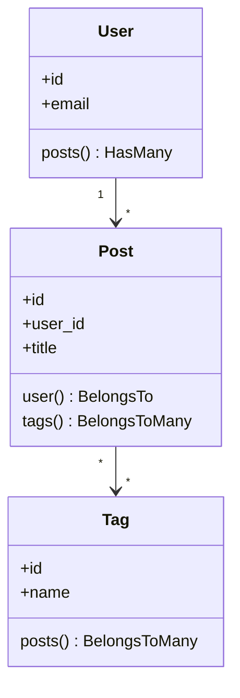

# 🗄️ Eloquent Relationships, Migrations & Transactions

This guide details professional Eloquent modeling, relationship mapping, database migrations, database seeders, query scopes, and robust transactional integrity in Laravel.

---

## 💡 Conceptual Blueprint & First Principles

Eloquent is an Active Record ORM. Every database table maps to a Model class, which is used to interact with that table.



1. **Migrations & Seeders**: Version-control your schema and seed reproducible test/mock data.
2. **Relationships**: Model-level definitions mapping database foreign keys to objects.
3. **Query Scopes**: Encapsulate reusable query logic (e.g., active users, pending payments) inside the Model.
4. **Database Transactions**: Ensure all operations succeed or fail together (ACID compliance).

---

## 🔬 Under-the-Hood Mechanics

### Lazy Loading vs Eager Loading
* **Lazy Loading**: Relationship data is loaded only when the property is accessed. This runs a separate SQL query for *every* parent model record (the classic $N+1$ problem).
* **Eager Loading**: Using `with(['relationship'])` joins or runs a single bulk query (using SQL `IN (...)`) to load relationship data for all parents at once.

### Database Transactions (`DB::transaction`)
When calling `DB::transaction(callback)`:
1. Laravel begins a transaction on the PDO connection.
2. It executes the code inside the callback.
3. If an exception occurs, it intercepts it, runs `ROLLBACK` on the database, and rethrows the exception.
4. If successful, it runs `COMMIT` to persist changes.

---

## 💻 Production Code & Patterns

### 1. Migrations with Proper Indexes
```php
use Illuminate\Database\Migrations\Migration;
use Illuminate\Database\Schema\Blueprint;
use Illuminate\Support\Facades\Schema;

return new class extends Migration
{
    public function up(): void
    {
        Schema::create('posts', function (Blueprint $table) {
            $table->id();
            $table->foreignId('user_id')->constrained()->cascadeOnDelete();
            $table->string('title');
            $table->string('slug')->unique();
            $table->text('content');
            $table->string('status')->default('draft');
            $table->timestamps();

            // Compound Index for status/user lookups
            $table->index(['user_id', 'status']);
        });
    }

    public function down(): void
    {
        Schema::dropIfExists('posts');
    }
};
```

### 2. Model, Relationships & Query Scopes
```php
namespace App\Models;

use Illuminate\Database\Eloquent\Builder;
use Illuminate\Database\Eloquent\Model;
use Illuminate\Database\Eloquent\Relations\BelongsTo;
use Illuminate\Database\Eloquent\Relations\BelongsToMany;

class Post extends Model
{
    protected $fillable = ['title', 'slug', 'content', 'status', 'user_id'];

    // Relationships
    public function user(): BelongsTo
    {
        return $this->belongsTo(User::class);
    }

    public function tags(): BelongsToMany
    {
        return $this->belongsToMany(Tag::class)->withTimestamps();
    }

    // Local Query Scope
    public function scopePublished(Builder $query): void
    {
        $query->where('status', 'published');
    }
}
```

### 3. Database Transactions with Try-Catch Block
Wrap critical updates (like financial transfers or multi-record creation) in transactions:

```php
use App\Models\Order;
use App\Models\Payment;
use Illuminate\Support\Facades\DB;

public function processOrder(array $orderData, array $paymentData): Order
{
    return DB::transaction(function () use ($orderData, $paymentData) {
        $order = Order::create($orderData);

        // Attach payment details to the order
        $order->payments()->create([
            'amount' => $paymentData['amount'],
            'gateway' => $paymentData['gateway'],
            'status' => 'pending',
        ]);

        return $order;
    });
}
```

---

## ⚔️ Staff / Senior Interview Scenarios

### Q1: What is a polymorphic relationship, and when should you use it?
* **Answer**: A polymorphic relationship allows a target model to belong to more than one type of model on a single association. For example, a `Comment` model might belong to both a `Post` model and a `Video` model.
  * DB schema uses a string type field (`commentable_type`) and an ID field (`commentable_id`).
  * **Trade-off**: Harder to enforce foreign keys at the database level, but provides massive flexibility for shared concerns (likes, comments, attachments).

### Q2: How do you prevent N+1 queries globally in development?
* **Answer**: You can instruct Eloquent to throw an exception if a lazy-loaded relationship is detected. Put this in your `AppServiceProvider::boot()`:
  ```php
  use Illuminate\Database\Eloquent\Model;

  public function boot(): void
  {
      Model::preventLazyLoading(! app()->isProduction());
  }
  ```
