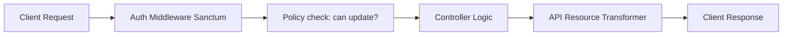

# 🔐 Authentication, Authorization & APIs

This guide details best practices for user authentication (Sanctum/Passport), authorization (Gates & Policies), API resources, and structured JSON responses.

---

## 💡 Conceptual Blueprint & First Principles

When building software in Laravel, securing endpoints and formatting response payloads is crucial.



1. **Authentication (Auth)**: Verifies *who* the client is (using session cookies or token validation with Laravel Sanctum).
2. **Authorization (Policy)**: Verifies *what* the authenticated user is allowed to do.
3. **API Resources**: Acts as a transformation layer between Eloquent Models and outward JSON responses, ensuring database schemas aren't leaked.

---

## 🔬 Under-the-Hood Mechanics

### Sanctum Token Authentication
1. The client sends credentials to a login endpoint.
2. The controller validates credentials and creates a token: `$user->createToken('token-name')->plainTextToken`.
3. The server hashes the token and stores it in the `personal_access_tokens` table.
4. The client includes the token in the `Authorization: Bearer <token>` header of subsequent requests.
5. Sanctum's middleware validates the token hash against the database and logs in the associated user context.

---

## 💻 Production Code & Patterns

### 1. Authorization Policies
Generate a Policy (`php artisan make:policy PostPolicy --model=Post`) to guard model access:

```php
namespace App\Policies;

use App\Models\Post;
use App\Models\User;

class PostPolicy
{
    /**
     * Determine whether the user can update the model.
     */
    public function update(User $user, Post $post): bool
    {
        // Only the owner or an admin can update the post
        return $user->id === $post->user_id || $user->hasRole('admin');
    }
}
```

### 2. Using Policies in Controllers
Use the `authorize` helper in your controller to enforce policies:

```php
namespace App\Http\Controllers\Api\V1;

use App\Http\Controllers\Controller;
use App\Models\Post;
use Illuminate\Http\Request;

class PostController extends Controller
{
    public function update(Request $request, Post $post)
    {
        // Enforces PostPolicy@update
        $this->authorize('update', $post);

        $post->update($request->all());

        return response()->json(['message' => 'Post updated successfully.']);
    }
}
```

### 3. API Resource Class
Create an API Resource (`php artisan make:resource V1/PostResource`):

```php
namespace App\Http\Resources\V1;

use Illuminate\Http\Request;
use Illuminate\Http\Resources\Json\JsonResource;

class PostResource extends JsonResource
{
    public function toArray(Request $request): array
    {
        return [
            'id' => $this->id,
            'title' => $this->title,
            'slug' => $this->slug,
            'content' => $this->content,
            'created_at' => $this->created_at->toIso8601String(),
            
            // Conditional eager-loaded relationship to avoid N+1 queries
            'user' => new UserResource($this->whenLoaded('user')),
        ];
    }
}
```

---

## ⚔️ Staff / Senior Interview Scenarios

### Q1: When do you choose Laravel Sanctum over Laravel Passport?
* **Answer**:
  * **Laravel Sanctum**: Best for Single Page Applications (SPAs), mobile apps, and simple API token applications. It uses simple token hashing and cookie-based CSRF protection, making it lightweight and easy to maintain.
  * **Laravel Passport**: Best for applications that require a full OAuth2 server implementation (authorization codes, client credentials, refresh tokens). If you need to let third-party integrations authenticate against your app, choose Passport.

### Q2: How do you authorize actions on a Model before it has been instantiated (e.g. creating a model)?
* **Answer**: You define a policy method (e.g. `create()`) that checks the class reference instead of a specific model instance.
  * Controller: `$this->authorize('create', Post::class);`
  * Policy: `public function create(User $user): bool { return $user->hasRole('writer'); }`
