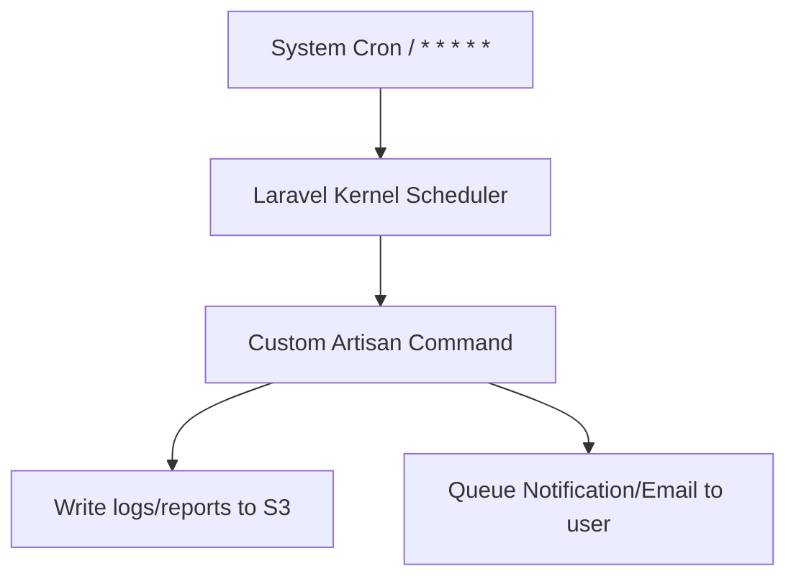

# ⚙️ Task Scheduling, Artisan Commands, Storage & Mail

This guide details task scheduling, custom Artisan CLI commands, file storage integrations, and asynchronous mail/notification delivery in Laravel.

---

## 💡 Conceptual Blueprint & First Principles

Real-world applications require background scheduling, command utilities, asset storage, and client notification loops. Think of it like this:

*   **Task Scheduler (The Master Alarm Clock)**: Instead of setting 20 separate alarms on your wall (individual server-level cron jobs) for tasks like clearing trash, sending email newsletters, or updating prices, you set **one single master alarm** that rings every minute. When it rings, it tells Laravel: "Check your planner and run whatever is scheduled for this exact minute."
*   **Flysystem File Storage (The Storage Locker Service)**: You want to store user profile pictures. Whether you store them in your local closet (Local Disk) or in a giant cloud warehouse (AWS S3), you use the same instructions: "Put this file in the 'avatars' folder." If you decide to switch from local to AWS, you just change a configuration setting, and the code continues to work without edits.
*   **Queued Mail (The Post Office mailbox)**: If you send an email directly during a web request (synchronously), the user has to wait (with a loading spinner) while your server connects to the email provider, sends the mail, and receives a response. Instead, you drop the email in a "post office mailbox" (Queue) and immediately tell the user "Done!". A background worker picks up the mail later and sends it.



1. **Artisan CLI**: Custom developer/operational commands.
2. **Task Scheduler**: Replaces individual server-level cron tabs with a single master cron entry calling Laravel's schedule runner.
3. **File Storage**: Abstract storage engines (Local, AWS S3) via the unified Flysystem client API.
4. **Mail & Notifications**: Deliver multi-channel messages (Mail, database logs, SMS) asynchronously.

---

## 🔬 Under-the-Hood Mechanics

### The Schedule Loop
To run Laravel's scheduler, you configure one server-level system cron job:
`* * * * * cd /path-to-your-project && php artisan schedule:run >> /dev/null 2>&1`
*   **Mechanics**: Every minute, the server executes `schedule:run`. Laravel checks all defined commands in your schedule configurations (e.g. `routes/console.php` or `Kernel.php`), compares their cron frequencies, and executes matching commands.

### Flysystem Storage Driver
Laravel wraps the Flysystem PHP package. Changing your environment variable `FILESYSTEM_DISK=s3` shifts file uploads from local filesystems to cloud object storage automatically without changing a single line of controller code.

---

## 💻 Production Code & Patterns

### 1. Custom Artisan Command
Generate command: `php artisan make:command CleanTempFiles`

```php
namespace App\Console\Commands;

use Illuminate\Console\Command;
use Illuminate\Support\Facades\Storage;

class CleanTempFiles extends Command
{
    // The signature defines how you type the command in the terminal
    // Example: php artisan app:clean-temp-files --hours=12
    protected $signature = 'app:clean-temp-files {--hours=24 : Clean files older than X hours}';
    
    // Description displayed when you run 'php artisan list'
    protected $description = 'Clean up temporary files from public storage';

    // The main code that runs when the command is triggered
    public function handle(): int
    {
        $hours = (int) $this->option('hours');
        $this->info("Cleaning files older than {$hours} hours...");

        // Retrieve all files inside the 'temp' folder on local storage disk
        $files = Storage::disk('local')->files('temp');
        foreach ($files as $file) {
            // Check if the current time minus the specified hours is greater than (after) the file's last modified time
            if (now()->subHours($hours)->gt(Storage::disk('local')->lastModified($file))) {
                // Delete the file
                Storage::disk('local')->delete($file);
                $this->line("Deleted: {$file}");
            }
        }

        $this->info('Cleanup complete.');
        return Command::SUCCESS; // Return 0 to indicate success
    }
}
```

### 2. Schedule Configuration
Define frequencies cleanly inside `routes/console.php` (Laravel 11+) or `app/Console/Kernel.php` (Laravel 10 and below):

```php
use Illuminate\Support\Facades\Schedule;

// Run the CleanTempFiles command daily at midnight.
// 'withoutOverlapping' prevents the command from running again if the previous run hasn't finished yet.
Schedule::command('app:clean-temp-files --hours=12')->daily()->withoutOverlapping();
```

### 3. File Upload to S3/Cloud storage
```php
use Illuminate\Http\UploadedFile;
use Illuminate\Support\Facades\Storage;

public function uploadProfilePicture(UploadedFile $file, $userId): string
{
    // Stores file in a private directory inside AWS S3
    // E.g., avatars/1/profile_162983749.jpg
    $path = $file->storeAs(
        "avatars/{$userId}", 
        'profile_' . time() . '.' . $file->getClientOriginalExtension(), 
        's3' // Specifies the storage disk configured in config/filesystems.php
    );

    // Since the files in S3 are private, we generate a temporary signed URL valid for 10 minutes
    // Anyone clicking this link will have access to download/view the photo for exactly 10 minutes.
    return Storage::disk('s3')->temporaryUrl($path, now()->addMinutes(10));
}
```

---

## ⚔️ Staff / Senior Interview Scenarios

### Q1: What is the purpose of `withoutOverlapping()` in the Laravel Scheduler, and how does it work?
* **Answer**: It prevents a scheduled command from starting if the previous execution instance is still running.
  * **Mechanics**: Laravel sets a cache lock when the command starts. If the next minute triggers and the lock exists, the execution is skipped. When the command successfully exits, the cache lock is released.
  * **Critical warning**: If a command crashes or the server is forced shut, the cache lock might persist. Be prepared to clear cache locks or define lock timeouts (`onOneServer()->expireAt(...)`).

### Q2: How do you send notification payloads asynchronously without blocking HTTP response times?
* **Answer**: Implement the `ShouldQueue` contract on your Notification or Mailable class.
  ```php
  use Illuminate\Contracts\Queue\ShouldQueue;
  use Illuminate\Notifications\Notification;

  class OrderShippedNotification extends Notification implements ShouldQueue
  {
      use Queueable;
      // ...
  }
  ```
  Laravel will automatically push the mail/notification rendering and dispatch steps to your configured background queue instead of running it inline during the client request.
