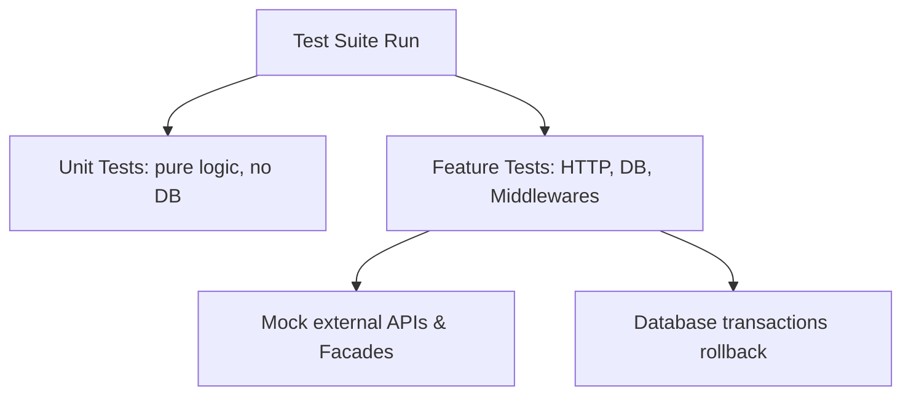

# 🧪 Testing, Debugging & CI in Laravel

This guide details testing structures using Pest and PHPUnit, Feature vs. Unit tests, HTTP request assertions, database assertions, and mocking external services.

---

## 💡 Conceptual Blueprint & First Principles

Testing ensures code reliability, prevents regression, and serves as living documentation.



1. **Unit Tests**: Test single methods or standalone classes in isolation. Avoid hitting the database or system containers.
2. **Feature Tests**: Test wider code slices (HTTP requests, routing, database state, middleware triggers).
3. **Database Isolation**: Keep test database states clean by executing tests inside transactions and rolling them back afterward.
4. **Mocking**: Prevent calls to external APIs (Stripe, Twilio) by replacing actual classes with mock expectations.

---

## 🔬 Under-the-Hood Mechanics

### Database Transactions (`RefreshDatabase` or `LazilyRefreshDatabase`)
When a test class imports the `RefreshDatabase` trait:
1. Before tests run, Laravel executes migrations to prepare the database schema.
2. At the start of *each* test, Laravel opens a database transaction.
3. The test performs insertions and queries.
4. When the test completes, Laravel rolls back the transaction. The database state remains clean for the next test.

### Mocking Facades (`Http::fake`, `Event::fake`, `Queue::fake`)
Laravel Facades contain mock helpers. For example, calling `Http::fake()` intercepts Guzzle clients. The request never makes an actual network outbound call, returning a simulated response.

---

## 💻 Production Code & Patterns

### 1. Pest Feature Test
Writing feature tests with the modern Pest testing framework:

```php
// tests/Feature/Api/V1/ProjectTest.php
use App\Models\User;
use App\Models\Project;
use Illuminate\Foundation\Testing\RefreshDatabase;

uses(RefreshDatabase::class);

test('authenticated user can create a project', function () {
    // 1. Arrange
    $user = User::factory()->create();
    $payload = [
        'title' => 'Alpha Project',
        'due_date' => now()->addDays(5)->toDateString(),
    ];

    // 2. Act
    $response = $this->actingAs($user)
        ->postJson('/api/v1/projects', $payload);

    // 3. Assert
    $response->assertStatus(201)
        ->assertJsonPath('data.title', 'Alpha Project');

    $this->assertDatabaseHas('projects', [
        'title' => 'Alpha Project',
        'user_id' => $user->id,
    ]);
});
```

### 2. Mocking an External Service (HTTP Fake)
Testing payment integration without calling the live payment gateway:

```php
use Illuminate\Support\Facades\Http;

test('submitting a payment requests external processor gateway', function () {
    // Mock the outgoing Stripe API request
    Http::fake([
        'api.stripe.com/*' => Http::response(['id' => 'ch_test123', 'status' => 'succeeded'], 200),
    ]);

    $user = User::factory()->create();

    $response = $this->actingAs($user)
        ->postJson('/api/v1/payments', [
            'amount' => 5000,
            'source' => 'tok_visa',
        ]);

    $response->assertStatus(200)
        ->assertJsonPath('transaction_id', 'ch_test123');

    // Assert that Stripe was called exactly once
    Http::assertSentCount(1);
});
```

### 3. Mocking Events & Queues
Asserting that an event is dispatched and queued properly:

```php
use App\Events\OrderPlaced;
use Illuminate\Support\Facades\Event;

test('placing an order dispatches order placed event', function () {
    Event::fake();

    $user = User::factory()->create();

    $this->actingAs($user)
        ->postJson('/api/v1/orders', [
            'product_id' => 1,
            'quantity' => 2,
        ]);

    Event::assertDispatched(OrderPlaced::class);
});
```

---

## ⚔️ Staff / Senior Interview Scenarios

### Q1: What is the difference between mocking a service container binding vs. using Facade fakes?
* **Answer**:
  * **Facade Fakes**: Laravel overrides the underlying static instance in the Facade accessor class (e.g. `Event::fake()`). It's highly convenient and requires no service container configuration.
  * **Container Mocking**: Useful for custom non-Facade classes. You bind a mock object directly into the service container (`$this->mock(PaymentGateway::class, function ($mock) { ... })`). This is cleaner when writing pure OOP designs without utilizing static Facades.

### Q2: Why should you avoid using `RefreshDatabase` when running parallel tests?
* **Answer**: Running parallel tests on a single database schema causes race conditions (one test thread writing while another truncates).
  * **Solution**: Use `ParallelTesting` tools (`php artisan test --parallel`). Laravel handles creating separate databases dynamically for each concurrent test process (e.g., `test_db_1`, `test_db_2`).
