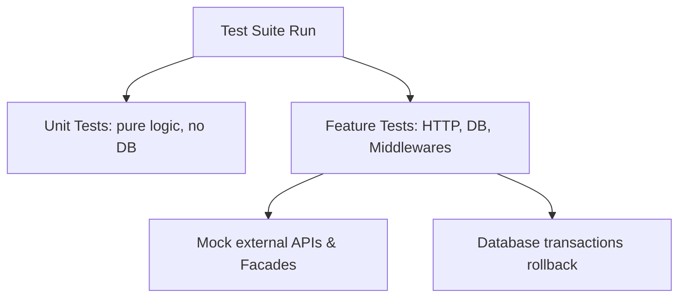

# 🧪 Testing, Debugging & CI in Laravel

This guide details testing structures using Pest and PHPUnit, Feature vs. Unit tests, HTTP request assertions, database assertions, and mocking external services.

---

## 💡 Conceptual Blueprint & First Principles

Testing ensures code reliability, prevents regression, and serves as living documentation. Think of it like **testing a car**:

*   **Unit Tests (The Engine Parts Bench)**: Testing a single spark plug or engine valve in isolation on a laboratory workbench. You don't connect it to the car; you just make sure that when given electricity, it sparks.
*   **Feature Tests (The Test Drive)**: Sitting in the driver's seat, turning the key, and checking if the engine starts, the transmission shifts, and the car moves forward. It tests how the database, routing, and controllers work together.
*   **Database Isolation / RefreshDatabase (The Dry-Erase Whiteboard)**: Imagine writing test formulas on a whiteboard. Before each new test, you want the whiteboard completely erased so old data doesn't mess up your new calculations. `RefreshDatabase` opens a transaction, lets the test run, and then rolls back (wipes) the database clean.
*   **Mocking / Faking (The Flight Simulator)**: You don't test a pilot's storm landing skills in a real $100 million jet. You use a flight simulator that mimics the plane's controls. Similarly, mocking intercepts requests to external services like Stripe or Twilio so you don't charge real credit cards during testing.



1. **Unit Tests**: Test single methods or standalone classes in isolation. Avoid hitting the database or system containers.
2. **Feature Tests**: Test wider code slices (HTTP requests, routing, database state, middleware triggers).
3. **Database Isolation**: Keep test database states clean by executing tests inside transactions and rolling them back afterward.
4. **Mocking**: Prevent calls to external APIs (Stripe, Twilio) by replacing actual classes with mock expectations.

---

## 🔬 Under-the-Hood Mechanics

### Database Transactions (`RefreshDatabase` or `LazilyRefreshDatabase`)
When a test class imports the `RefreshDatabase` trait:
1. Before tests run, Laravel executes migrations to prepare the database schema.
2. At the start of *each* test, Laravel opens a database transaction (`START TRANSACTION`).
3. The test performs insertions and queries.
4. When the test completes, Laravel rolls back the transaction. The database state remains clean for the next test.

### Mocking Facades (`Http::fake`, `Event::fake`, `Queue::fake`)
Laravel Facades contain mock helpers. For example, calling `Http::fake()` intercepts Guzzle clients. The request never makes an actual network outbound call, returning a simulated response.

---

## 💻 Production Code & Patterns

### 1. Pest Feature Test
Writing feature tests with the modern Pest testing framework:

```php
// tests/Feature/Api/V1/ProjectTest.php
use App\Models\User;
use App\Models\Project;
use Illuminate\Foundation\Testing\RefreshDatabase;

// Tell Pest to use RefreshDatabase so each test run leaves a clean database slate
uses(RefreshDatabase::class);

test('authenticated user can create a project', function () {
    // 1. Arrange: Prepare the state of the world
    // Create a mock user in the database using factory
    $user = User::factory()->create();
    
    // Create the data payload to send to the endpoint
    $payload = [
        'title' => 'Alpha Project',
        'due_date' => now()->addDays(5)->toDateString(),
    ];

    // 2. Act: Execute the action we are testing
    // Log in as the user and send a POST request to create a project
    $response = $this->actingAs($user)
        ->postJson('/api/v1/projects', $payload);

    // 3. Assert: Check that the outcome matches our expectations
    // Assert the response code is 201 Created and the return JSON has our title
    $response->assertStatus(201)
        ->assertJsonPath('data.title', 'Alpha Project');

    // Assert that the project was actually written to the database
    $this->assertDatabaseHas('projects', [
        'title' => 'Alpha Project',
        'user_id' => $user->id,
    ]);
});
```

### 2. Mocking an External Service (HTTP Fake)
Testing payment integration without calling the live payment gateway:

```php
use Illuminate\Support\Facades\Http;

test('submitting a payment requests external processor gateway', function () {
    // Intercept outbound HTTP calls to stripe.com and return a dummy success response
    Http::fake([
        'api.stripe.com/*' => Http::response(['id' => 'ch_test123', 'status' => 'succeeded'], 200),
    ]);

    $user = User::factory()->create();

    // Trigger the endpoint that processes payments under the hood
    $response = $this->actingAs($user)
        ->postJson('/api/v1/payments', [
            'amount' => 5000,
            'source' => 'tok_visa',
        ]);

    // Check that we got a success response and the transaction ID from our fake Stripe call
    $response->assertStatus(200)
        ->assertJsonPath('transaction_id', 'ch_test123');

    // Assert that Stripe was called exactly once so we don't double charge in real scenarios
    Http::assertSentCount(1);
});
```

### 3. Mocking Events & Queues
Asserting that an event is dispatched and queued properly:

```php
use App\Events\OrderPlaced;
use Illuminate\Support\Facades\Event;

test('placing an order dispatches order placed event', function () {
    // Intercept event dispatching so handlers (like sending emails) don't actually run
    Event::fake();

    $user = User::factory()->create();

    // Send order submission request
    $this->actingAs($user)
        ->postJson('/api/v1/orders', [
            'product_id' => 1,
            'quantity' => 2,
        ]);

    // Verify that the OrderPlaced event was fired
    Event::assertDispatched(OrderPlaced::class);
});
```

---

## ⚔️ Staff / Senior Interview Scenarios

### Q1: What is the difference between mocking a service container binding vs. using Facade fakes?
* **Answer**:
  * **Facade Fakes**: Laravel overrides the underlying static instance in the Facade accessor class (e.g. `Event::fake()`). It's highly convenient and requires no service container configuration.
  * **Container Mocking**: Useful for custom non-Facade classes. You bind a mock object directly into the service container (`$this->mock(PaymentGateway::class, function ($mock) { ... })`). This is cleaner when writing pure OOP designs without utilizing static Facades.

### Q2: Why should you avoid using `RefreshDatabase` when running parallel tests?
* **Answer**: Running parallel tests on a single database schema causes race conditions (one test thread writing while another truncates).
  * **Solution**: Use `ParallelTesting` tools (`php artisan test --parallel`). Laravel handles creating separate databases dynamically for each concurrent test process (e.g., `test_db_1`, `test_db_2`).
