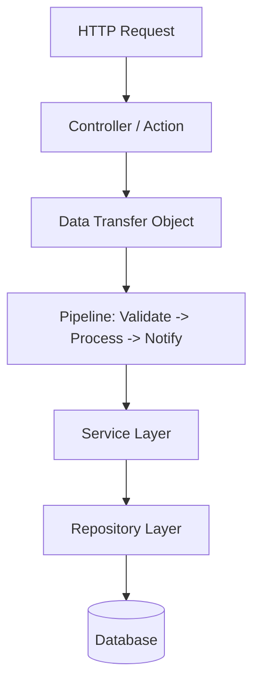

# 📐 Laravel Design Patterns & Architecture

This guide covers production-grade architectural design patterns used in Laravel applications, including the Service-Repository pattern, Action Classes, Data Transfer Objects (DTOs), and the Pipeline pattern.

---

## 💡 Conceptual Blueprint & First Principles

In large-scale enterprise Laravel applications, keeping all logic in controllers or models leads to "fat controllers" or "spaghetti models." Standardizing design patterns separates concerns cleanly:



* **Service-Repository**: Separates data storage queries (Repository) from business rules (Service).
* **Action Classes**: Replaces fat services with single-responsibility classes containing a single public method (usually `__invoke`).
* **DTOs**: Replaces raw arrays with strongly typed objects to pass data between application layers safely.
* **Pipelines**: Passes data sequentially through a series of stackable tasks (stages).

---

## 🔬 Under-the-Hood Mechanics

### The Laravel Pipeline (`Illuminate\Pipeline\Pipeline`)
Laravel's Middleware runs on the Pipeline design pattern.
* **Mechanics**: You pass a target object (`send($passable)`) through an array of classes (`through($pipes)`). Each class (pipe) receives the object and a closure (`$next`). The pipe performs its operation and calls `$next($passable)` to pass the data to the next stage.

---

## 💻 Production Code & Patterns

### 1. Action Classes & DTO Pattern
Instead of passing raw request arrays to services, parse them into a type-safe DTO and execute a single Action.

```php
// app/DTOs/CreateUserDTO.php
namespace App\DTOs;

use App\Http\Requests\RegisterRequest;

class CreateUserDTO
{
    public function __construct(
        public readonly string $name,
        public readonly string $email,
        public readonly string $password,
    ) {}

    public static function fromRequest(RegisterRequest $request): self
    {
        return new self(
            name: $request->validated('name'),
            email: $request->validated('email'),
            password: $request->validated('password')
        );
    }
}
```

```php
// app/Actions/CreateUserAction.php
namespace App\Actions;

use App\DTOs\CreateUserDTO;
use App\Models\User;
use Illuminate\Support\Facades\Hash;

class CreateUserAction
{
    public function __invoke(CreateUserDTO $dto): User
    {
        return User::create([
            'name' => $dto->name,
            'email' => $dto->email,
            'password' => Hash::make($dto->password),
        ]);
    }
}
```

```php
// app/Http/Controllers/RegisterController.php
namespace App\Http\Controllers;

use App\Actions\CreateUserAction;
use App\DTOs\CreateUserDTO;
use App\Http\Requests\RegisterRequest;

class RegisterController extends Controller
{
    public function __invoke(RegisterRequest $request, CreateUserAction $action)
    {
        $user = $action(CreateUserDTO::fromRequest($request));

        return response()->json(['message' => 'User registered successfully.'], 201);
    }
}
```

### 2. The Pipeline Pattern
Use pipelines for multi-step workflows like order checkouts:

```php
namespace App\Services;

use App\Models\Order;
use Illuminate\Pipeline\Pipeline;

class OrderProcessor
{
    public function process(Order $order): Order
    {
        return app(Pipeline::class)
            ->send($order)
            ->through([
                \App\Pipes\VerifyStock::class,
                \App\Pipes\CalculateTax::class,
                \App\Pipes\ChargePayment::class,
                \App\Pipes\GenerateInvoice::class,
            ])
            ->then(fn (Order $order) => $order);
    }
}
```

A pipe class structure:
```php
namespace App\Pipes;

use App\Models\Order;
use Closure;

class VerifyStock
{
    public function handle(Order $order, Closure $next)
    {
        // 1. Perform step logic (verify stock)
        if ($order->items->isEmpty()) {
            throw new \Exception("Cannot process empty order.");
        }

        // 2. Forward to the next pipe
        return $next($order);
    }
}
```

---

## ⚔️ Staff / Senior Interview Scenarios

### Q1: Is the Repository Pattern always necessary in Laravel?
* **Answer**: No. Eloquent is already an implementation of the Active Record pattern, providing a powerful query builder. Wrapping Eloquent in a Repository interface is often redundant ("over-abstraction") unless:
  * You expect to swap ORMs or data sources entirely (e.g., MySQL to MongoDB).
  * You need to decouple queries for testing without hitting a database (though mocking Eloquent is simple).
  * **Alternative**: Use Local Query Scopes to modularize and reuse database queries.

### Q2: What is the primary benefit of Action Classes over Service Classes?
* **Answer**: Service classes tend to accumulate methods over time and turn into "God classes" containing unrelated actions (e.g., `UserService` handling creation, editing, profile image uploading, password resets, and sending emails). Action classes enforce the **Single Responsibility Principle (SRP)**. Every action is a single file, making it highly testable, mockable, and easy to locate.
