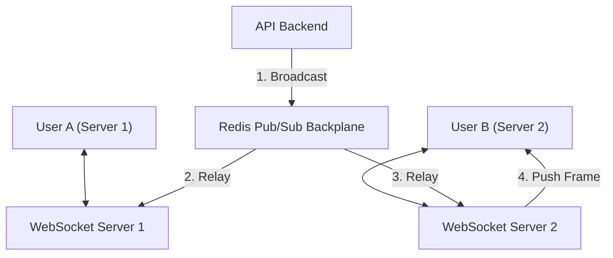

# Deep Dive: WebSockets at Scale (100,000+ Connections)

> **Module:** System Design & Real-Time (Topic 3.1)  
> **Target:** Master Stateful TCP Socket Lifecycle, Frame Formats, Redis Pub/Sub Relay, and OS Kernel Tuning (C10k/C1M).

---

## 🌐 1. WebSocket Protocol & First-Principles

### Analogy First: The Walkie-Talkie vs. The Phone Call
*   **HTTP = Walkie-Talkie:** You ask a question, get an answer, and the connection drops. If you want updates, you have to keep pressing the button (polling).
*   **WebSocket = A Phone Call:** You dial once (the Handshake), the line stays open, and both people can talk at the same time instantly.

### Step-by-Step Flow: The Connection Upgrade
1.  **The Ask:** Client sends a standard HTTP GET request saying, "Hey, can we upgrade to a WebSocket?"
2.  **The Handshake:** Server validates the security key and replies, "Yes, switching protocols!"
3.  **The Open Line:** The HTTP connection is dropped, and a raw, persistent TCP line stays open for 2-way traffic.

---

## 🏗️ 2. Architectural Scaling: Redis Pub/Sub Relay

### Analogy First: The Post Office Network
Imagine two separate apartment buildings (Server 1 and Server 2). User A is in Building 1, User B is in Building 2. Building 1's mailroom can't hand a letter directly to User B. They need a central Post Office (Redis Pub/Sub) to route the message to the correct building.



---

## 💻 3. Production Code & Benchmarks

### Annotated Python Code: FastAPI + Redis Pub/Sub
```python
import asyncio
import json
from fastapi import FastAPI, WebSocket, WebSocketDisconnect

# Mocking a Redis Pub/Sub client for the example
class MockRedis:
    async def publish(self, channel, message): pass
    def pubsub(self): return self
    async def subscribe(self, channel): pass
    async def listen(self): 
        yield {"type": "message", "data": '{"sender": "A", "data": "Hello!"}'}

app = FastAPI()
redis_client = MockRedis()

# Step 1: Keep a local phonebook of active connections in THIS server
active_clients: dict[str, WebSocket] = {}

@app.websocket("/ws/{user_id}")
async def websocket_endpoint(websocket: WebSocket, user_id: str):
    await websocket.accept()
    active_clients[user_id] = websocket # Add to local phonebook

    try:
        while True:
            # Step 2: Listen for messages from the user
            msg = await websocket.receive_text()
            
            # Step 3: Forward the message to the central Post Office (Redis)
            await redis_client.publish("chat_channel", json.dumps({
                "sender": user_id, 
                "data": msg
            }))
    except WebSocketDisconnect:
        del active_clients[user_id]

async def listen_to_redis_backplane():
    # Step 4: Constantly listen to the Post Office for incoming mail
    await redis_client.subscribe("chat_channel")
    async for message in redis_client.listen():
        if message["type"] == "message":
            payload = json.loads(message["data"])
            
            # Step 5: If the recipient is in OUR phonebook, deliver it!
            for client_id, ws in active_clients.items():
                await ws.send_text(payload["data"])
```

---

## ⚔️ 4. Interview Tips: 3-Point Elevator Pitches

**Q: Load balancers drop idle connections after 60 seconds. How do you keep WebSockets alive?**
1.  **The Problem:** Load balancers (like Nginx/AWS ALB) aggressively close quiet connections to save memory.
2.  **The Solution:** Implement a Heartbeat (Ping/Pong frames) at the application level.
3.  **The Mechanics:** The server pings the client every 30 seconds; the client pongs back. This keeps traffic flowing and resets the load balancer's idle timer.

**Q: How do you survive a "Thundering Herd" (1M users reconnecting instantly)?**
1.  **Client-Side Jitter:** Force clients to wait a random amount of time (e.g., 1-5 seconds) before reconnecting, spreading the load.
2.  **Rate Limiting:** Configure the API Gateway to only accept a strict number of new WebSocket handshakes per second.
3.  **Overprovision State:** Temporarily scale up the Redis backplane, as connection setups and teardowns are highly CPU intensive.
