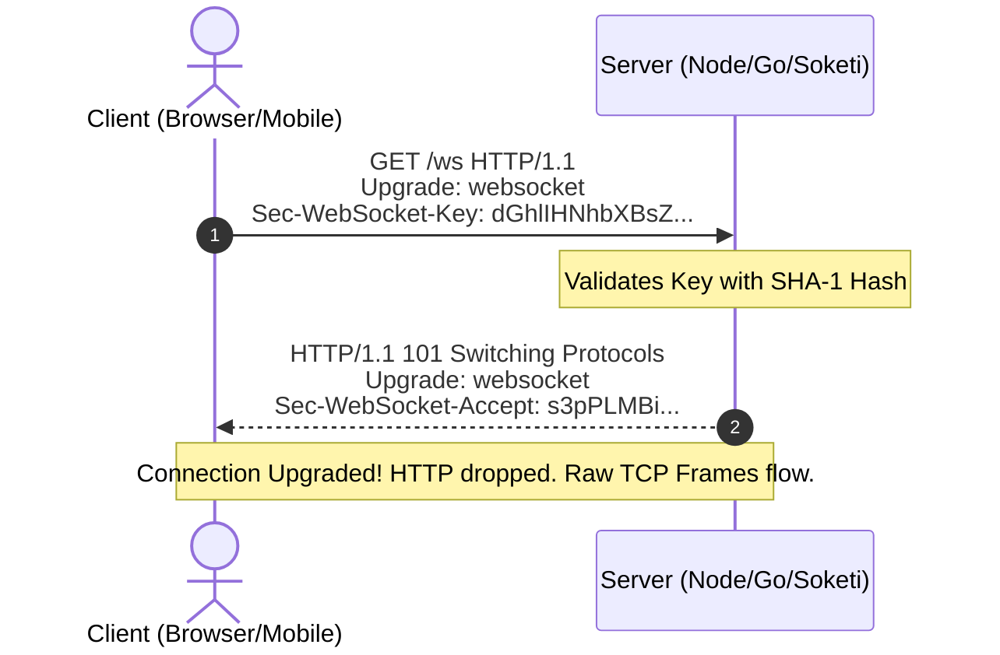
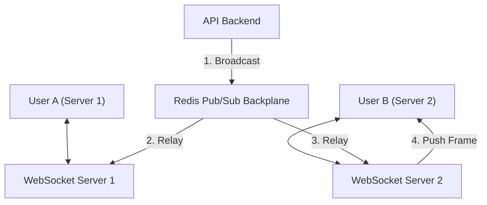

# Deep Dive: WebSockets at Scale (100,000+ Connections)

> **Module:** System Design & Real-Time (Topic 3.1)  
> **Target:** Master Stateful TCP Socket Lifecycle, Frame Formats, Redis Pub/Sub Relay, and OS Kernel Tuning (C10k/C1M).

---

## 🌐 1. WebSocket Protocol & First-Principles (OS/TCP)

Unlike HTTP (stateless, short-lived), WebSockets provide full-duplex, persistent TCP connections.

### Mechanics (Memory & TCP)
Each WebSocket is a TCP socket (`file descriptor`). In Linux, every open file descriptor requires RAM for TCP read/write buffers. By default, Linux might allocate 128KB per socket. Scaling to 1,000,000 sockets requires 128GB of RAM *just for TCP buffers* before your app even uses memory.

### The HTTP Upgrade Handshake


---

## 🏗️ 2. Architectural Scaling: Redis Pub/Sub Relay

**Real-World Problem (Slack / Discord):**
Because WebSockets are stateful, User A and User B will load-balance to different servers (Server 1 and Server 2). If Server 1 receives a message intended for User B, it physically does not have User B's socket connection.

**The Solution:**
A Redis Pub/Sub backplane. 
1. Server 1 publishes the message to Redis: `PUBLISH channel:chat_123 "{msg}"`
2. Server 2 is subscribed to Redis. It receives the message, looks up User B in its local RAM hash table, and pushes the TCP frame.



---

## 💻 3. Production Code & Benchmarks

### Node.js WebSocket + Redis PubSub implementation
```javascript
const WebSocket = require('ws');
const Redis = require('ioredis');

const wss = new WebSocket.Server({ port: 8080 });
const redisSub = new Redis(process.env.REDIS_URL);
const redisPub = new Redis(process.env.REDIS_URL);

// Local memory map of userId -> WebSocket instance
const clients = new Map();

wss.on('connection', (ws, req) => {
    // Authenticate and get User ID (simplified)
    const userId = getUserIdFromRequest(req);
    clients.set(userId, ws);

    ws.on('message', (msg) => {
        // Broadcast to Redis backplane
        redisPub.publish('chat', JSON.stringify({ sender: userId, data: msg }));
    });

    ws.on('close', () => clients.delete(userId));
});

// Listen to Redis Backplane
redisSub.subscribe('chat');
redisSub.on('message', (channel, message) => {
    const payload = JSON.parse(message);
    // Push only to users physically connected to THIS process
    for (const [id, ws] of clients.entries()) {
        if (ws.readyState === WebSocket.OPEN) ws.send(payload.data);
    }
});
```

### Exact CLI Benchmark Command (`tsung` or `thor`)
```bash
# Using Thor to blast 10,000 WebSocket connections
thor -a 10000 -c 1000 ws://localhost:8080/ws
```

---

## ⚡ 4. Linux Kernel Tuning (The C10M Problem)

To achieve 1M connections, the OS must be tuned. Ephemeral port exhaustion (only 65k ports available on a single IP) is a huge issue for Load Balancers holding connections.

```bash
# /etc/sysctl.conf

# 1. File Descriptor Limits (Max open sockets)
fs.file-max = 2097152

# 2. TCP Buffer Tuning (Reduce memory footprint per socket!)
net.ipv4.tcp_rmem = 4096 16384 262144  # Min 4KB, Default 16KB, Max 256KB
net.ipv4.tcp_wmem = 4096 16384 262144

# 3. Increase Max Backlog & Local Port Range
net.core.somaxconn = 65535
net.ipv4.ip_local_port_range = 1024 65535

# Apply changes
sysctl -p
```

---

## ⚔️ 5. Staff / Senior Interview Scenarios

**Q: Load balancers (like Nginx/AWS ALB) often close idle connections after 60 seconds. How do you keep WebSockets alive?**
**Staff Answer:** We implement a **Ping/Pong Heartbeat** at the application or protocol level (Opcode `0x9` and `0x0A`). The server sends a Ping frame every 30 seconds. The client must reply with Pong. This keeps the TCP connection marked as "active" in the Load Balancer's NAT table, preventing premature timeouts.

**Q: A massive sports event happens, and 1 million clients suddenly drop connection and try to reconnect at the same time (Thundering Herd). How do you survive?**
**Staff Answer:** 
1. **Client-side Jitter:** Implement exponential backoff with random jitter on the client (e.g., reconnect in `base_delay * 2^retries + random(0, 1000) ms`).
2. **Connection Rate Limiting:** Configure the API Gateway or Nginx to accept a maximum of X new WebSocket upgrades per second.
3. **Overprovision Redis:** The sudden burst of state changes (connections opening/closing) will flood the Redis backplane or connection trackers. We scale up Redis horizontally in advance.
