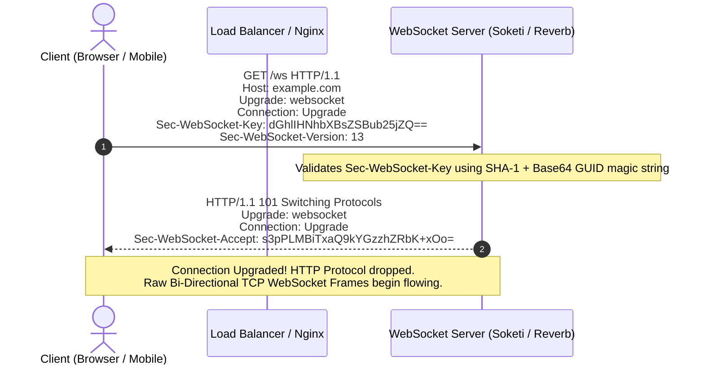
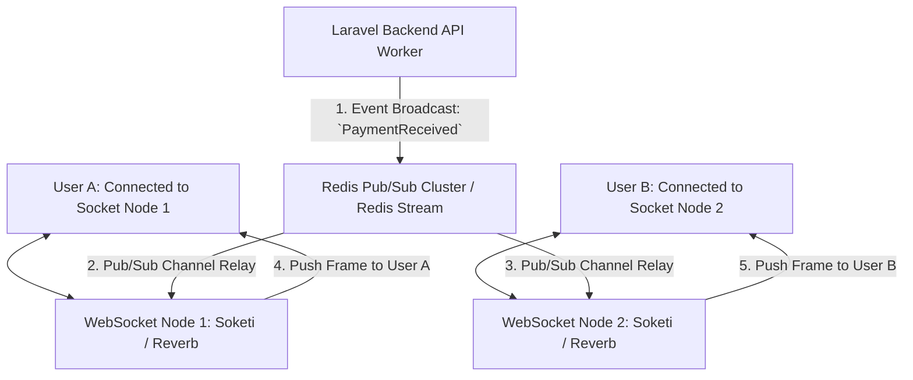

# Deep Dive: WebSockets at Scale (100,000+ Concurrent Connections)

> **Module:** System Design & Real-Time (Topic 3.1)  
> **Target:** Master Stateful TCP Socket Lifecycle, Frame Formats, Redis Pub/Sub Relay Architecture, OS Kernel TCP Memory Tuning, and Soketi / Laravel Reverb Scaling.

---

## 🌐 1. WebSocket Protocol & Handshake Mechanics

Unlike HTTP (which is stateless, short-lived request/response), **WebSockets (RFC 6455)** provide full-duplex, persistent, low-latency communication over a single TCP socket connection.

### A. The HTTP Upgrade Handshake

Every WebSocket connection starts as a standard HTTP/1.1 request containing special upgrade headers:



### B. Frame Format & Ping/Pong Heartbeats
Once upgraded, data is transmitted in binary/text **Frames**:
- **Opcode `0x1`:** Text Frame (JSON message payload).
- **Opcode `0x8`:** Connection Close Frame.
- **Opcode `0x9` (Ping) / `0x0A` (Pong):** Heartbeat frames sent every 30s to detect dropped TCP connections (e.g. mobile device switching from Wi-Fi to 5G).

---

## 🏗️ 2. Distributed Scaling Architecture: Redis Pub/Sub Relay

Because WebSockets are **stateful persistent TCP connections**, User A and User B will land on different physical WebSocket server nodes:



### The Problem:
If Laravel Backend broadcasts a `PaymentReceived` event, Node 1 does not know which users are connected to Node 2!

### The Solution (Redis Pub/Sub Relay):
1. Laravel broadcasts the event payload to a central **Redis Pub/Sub Channel** (`presence-order.42`).
2. Every WebSocket Node subscribes to Redis channels.
3. When Redis relays the message, Node 2 inspects its local memory connection table (`$connections['user_b']`) and delivers the socket frame directly.

---

## 💻 3. Production Broadcasting Code (Laravel & Reverb / Soketi)

### Laravel Event Class Definition

```php
namespace App\Events;

use App\Models\Order;
use Illuminate\Broadcasting\Channel;
use Illuminate\Broadcasting\InteractsWithSockets;
use Illuminate\Broadcasting\PresenceChannel;

use Illuminate\Contracts\Broadcasting\ShouldBroadcastNow; // Broadcasts instantly without delay!
use Illuminate\Queue\SerializesModels;

class OrderStatusUpdated implements ShouldBroadcastNow 
{
    use Dispatchable, InteractsWithSockets, SerializesModels;

    public function __construct(public Order $order) {}

    // Specify the Private Broadcast Channel
    public function broadcastOn(): array 
    {
        return [
            new PrivateChannel('orders.' . $this->order->user_id),
        ];
    }

    // Explicitly define payload sent over WebSocket frame
    public function broadcastWith(): array 
    {
        return [
            'order_id' => $this->order->id,
            'status' => $this->order->status,
            'amount_cents' => $this->order->amount_cents,
            'timestamp' => now()->toIso8601String(),
        ];
    }
}
```

---

## ⚡ 4. Linux Kernel Tuning for 100,000+ Concurrent Sockets

Operating systems default to strict resource limits intended for standard desktop usage. Serving 100k open TCP sockets requires OS kernel tuning (`/etc/sysctl.conf`):

```bash
# 1. File Descriptor Limits (Each socket = 1 File Descriptor)
# Check current limit: ulimit -n
# Set system-wide descriptor limit in /etc/security/limits.conf
* soft nofile 1048576
* hard nofile 1048576

# 2. Kernel Socket Memory Tuning (/etc/sysctl.conf)
# Reduce memory allocated per TCP socket so 100k sockets fit in RAM
net.ipv4.tcp_rmem = 4096 87380 16777216  # Min, default, max read buffer (bytes)
net.ipv4.tcp_wmem = 4096 65536 16777216  # Min, default, max write buffer (bytes)

# 3. Increase Max Backlog Queue & Local Port Range
net.core.somaxconn = 65535
net.ipv4.ip_local_port_range = 1024 65535

# 4. Enable Fast TCP Recycling & Re-use
net.ipv4.tcp_tw_reuse = 1

# Apply settings immediately:
sysctl -p
```
