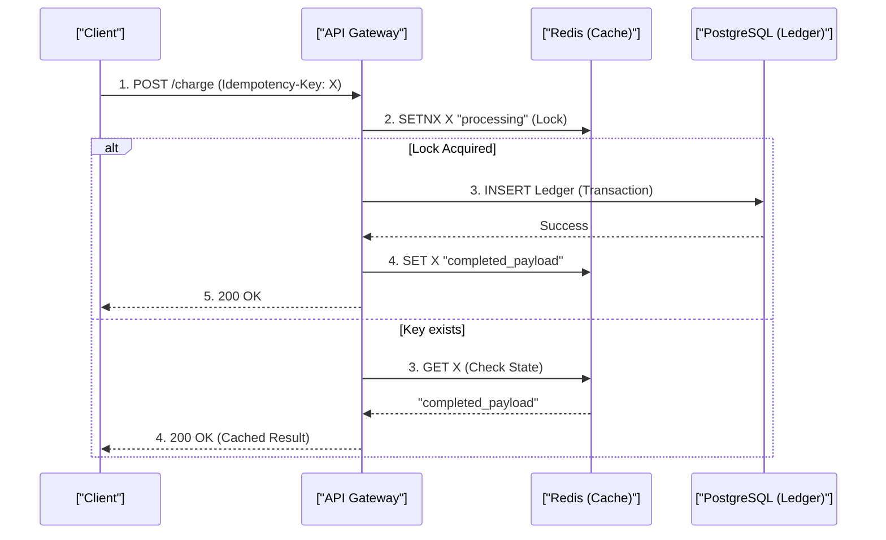

# Idempotency, Double-Entry Ledgers, Financial Systems & Webhook Retries

> **Module:** System Design & Real-Time (Topic 3.2)  
> **Source Mapping:** `backend-roadmap.md` (Level 10: #233–#244, Level 14 & 15) & `roadmap.md` (Tier 1: #95–#132)

---

## 💳 1. What is Idempotency?

**Analogy:** Imagine an elevator button. If you press the "Up" button once, the button lights up, and the elevator comes to your floor. If you furiously press it 10 times because you're in a hurry, it doesn't summon 10 elevators or make it arrive faster. The result of pressing it once is the exactly the same as pressing it 10 times. That is **Idempotency**.

An operation is **Idempotent** if performing it multiple times yields the exact same server state as performing it once.
- `GET`, `PUT`, `DELETE` are naturally idempotent according to HTTP spec.
- `POST` is NOT naturally idempotent! If you click "Buy" twice, you might get charged twice.

### Step-by-Step: Why We Need It
1. **The Request:** Client sends a payment request to the server.
2. **The Processing:** Server processes it and deducts money.
3. **The Failure:** The network drops the response back to the client.
4. **The Retry:** The client doesn't know if it succeeded, so it retries. Without idempotency, they are charged again!

---

## 🔑 2. Idempotency Key Pattern (Preventing Double Charging)

Real-world example: **Stripe's Idempotency API**. Every payment request includes an `Idempotency-Key` header (usually a unique ID like a UUID).

### The Flow



### Python 3.11+ Annotated Implementation

```python
import asyncio
import time
from typing import Optional
from redis.asyncio import Redis

async def process_payment(rdb: Redis, idempotency_key: str, payload: str) -> str:
    # Prefix the key to keep our Redis cache organized
    key = f"idemp:{idempotency_key}"
    
    # 1. Acquire Lock: nx=True means "Set only if it does NOT exist".
    # ex=86400 sets a 24-hour expiration so our cache doesn't grow forever.
    is_set = await rdb.set(key, "PROCESSING", nx=True, ex=86400)
    
    if not is_set:
        # 2. Key exists! This means it's a retry of a previous request.
        val: Optional[bytes] = await rdb.get(key)
        
        # 3. Handle concurrent retries (user double-clicked fast).
        if val == b"PROCESSING":
            raise ValueError("HTTP 409: Please wait, request is already processing.")
            
        # 4. Return the cached success response from the first attempt.
        return val.decode("utf-8") if val else ""

    # 5. Perform the actual database operation (simulated here with sleep).
    # If this fails, we'd delete the Redis key in an exception handler.
    await asyncio.sleep(0.1) 
    
    # 6. Store the final successful payload for any future retries.
    final_payload = '{"status":"SUCCESS", "tx_id":"12345"}'
    await rdb.set(key, final_payload, ex=86400)
    
    return final_payload
```

---

## ⚖️ 3. Double-Entry Bookkeeping Ledger Systems

**Analogy:** Imagine a seesaw. If you add 10 pounds to one side (credit), you must add 10 pounds to the other side (debit) to keep it perfectly balanced. Money **must never disappear**; it only moves from one place to another. 

**Real-world Example:** Uber's payout system, Square's ledgers.

### The Equation:
$$\text{Assets} = \text{Liabilities} + \text{Equity}$$

### Step-by-Step SQL Schema

```sql
-- 1. Create a table that records every single money movement.
CREATE TABLE ledger_entries (
    id BIGSERIAL PRIMARY KEY,
    transaction_id UUID NOT NULL, -- Links the debit and credit together
    account_id BIGINT NOT NULL,
    entry_type VARCHAR(10) CHECK (entry_type IN ('DEBIT', 'CREDIT')),
    amount_cents BIGINT NOT NULL CHECK (amount_cents > 0),
    created_at TIMESTAMPTZ DEFAULT NOW(),
    -- 2. Prevent duplicate entries for the same transaction & account
    CONSTRAINT unique_tx_acc UNIQUE(transaction_id, account_id)
);

-- 3. Add an index so calculating balances is blazing fast
CREATE INDEX idx_ledger_account ON ledger_entries(account_id, created_at DESC);

-- 4. Query to calculate the current balance by summing credits and subtracting debits
SELECT 
    SUM(CASE WHEN entry_type = 'CREDIT' THEN amount_cents ELSE -amount_cents END) AS balance_cents
FROM ledger_entries
WHERE account_id = 1001;
```

---

## 💰 4. Financial Money Representation

**Analogy:** Using floating-point numbers for money is like cutting a pizza into slices without a ruler. You think you have exactly 1/3 of a pizza, but it's actually 0.333333... and over thousands of slices, you'll end up with missing crumbs.

**Rule #1:** NEVER use floating-point numbers (`FLOAT`, `DOUBLE`) for money!

### The Problem
```python
# Computers struggle with decimals because they think in binary.
print(0.1 + 0.2) # Output: 0.30000000000000004
```

### The Solution
Store money as **Integer Minor Units**. Store `$10.50` as `1050` (cents) using a 64-bit integer (`BIGINT`). Whole numbers are exact, fast, and never lose pennies.

---

## 🔄 5. Webhook Reliability & Exponential Backoff

When Stripe tells you a payment succeeded via a Webhook (HTTP callback), they expect a fast `200 OK` response.

**Analogy:** Think of a webhook like a mail carrier delivering a certified letter. If you stop the mail carrier at your door to read the entire letter, verify its contents, and file it away (synchronous processing), the carrier's whole route is delayed. Instead, you should just sign for it immediately (Ack), toss it in your inbox (Queue), and read it later (Async Processing).

### Interview Tip: Handling Webhook Storms
**Q: How do you handle a sudden flood of webhooks if your system goes offline and comes back?**

**3-Point Pitch:**
1. **Queue First, Process Later:** We accept the webhooks instantly, save them to a message queue or database, and return `200 OK` to close the connection fast.
2. **Exponential Backoff:** If our internal processing fails, we wait progressively longer (2s, 4s, 8s) before retrying.
3. **Jitter:** We add random noise (jitter) to the retry delays so millions of events don't all retry at the exact same millisecond and crash the database (Thundering Herd problem).
