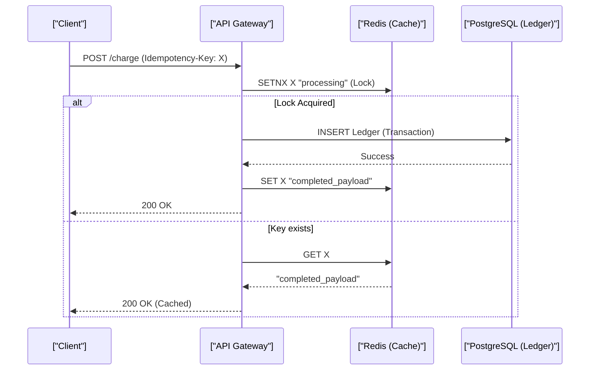

# Idempotency, Double-Entry Ledgers, Financial Systems & Webhook Retries

> **Module:** System Design & Real-Time (Topic 3.2)  
> **Source Mapping:** `backend-roadmap.md` (Level 10: #233–#244, Level 14 & 15) & `roadmap.md` (Tier 1: #95–#132)

---

## 💳 1. What is Idempotency?

An operation is **Idempotent** if performing it multiple times yields the exact same server state as performing it once.
- `GET`, `PUT`, `DELETE` are naturally idempotent according to HTTP spec.
- `POST` is NOT naturally idempotent!

### Deep Mechanics (Memory & SQL Level)
At the database layer, non-idempotent operations often map to `INSERT` or relative `UPDATE` (e.g., `SET balance = balance - 100`). An idempotent operation maps to an absolute `UPDATE` (e.g., `SET status = 'paid'`) or an `UPSERT` (`INSERT ... ON CONFLICT DO NOTHING`).
When a network call fails, the client does not know if the failure occurred *before* the server processed the request, or *after* (during the response phase). Retrying without idempotency leads to data duplication.

---

## 🔑 2. Idempotency Key Pattern (Preventing Double Charging)

Real-world example: **Stripe's Idempotency API**. Every payment request includes an `Idempotency-Key` header (usually a UUIDv4).



### Production Go Implementation

```python
import asyncio
import time
from typing import Optional
from redis.asyncio import Redis

# ProcessPayment ensures idempotency using Redis SETNX
async def process_payment(rdb: Redis, idempotency_key: str, payload: str) -> str:
    key = f"idemp:{idempotency_key}"
    
    # 1. Try to acquire the lock / check if already processed
    # nx=True: Only set if it doesn't exist, ex=86400: Expire in 24 hours
    is_set = await rdb.set(key, "PROCESSING", nx=True, ex=86400)
    
    if not is_set:
        # Key exists, fetch the current state
        val: Optional[bytes] = await rdb.get(key)
        
        if val == b"PROCESSING":
            raise ValueError("HTTP 409: Concurrent request processing")
            
        # Return the cached result
        return val.decode("utf-8") if val else ""

    # 2. Perform the actual database operation (omitted)
    await asyncio.sleep(0.1) # Simulate DB I/O
    
    # 3. Store the final successful payload
    final_payload = '{"status":"SUCCESS", "tx_id":"12345"}'
    await rdb.set(key, final_payload, ex=86400)
    
    return final_payload
```

### CLI Benchmark: Redis `SETNX` Throughput
Using `redis-benchmark` to test idempotency lock speed:
```bash
$ redis-benchmark -t set -n 100000 -q
SET: 125156.45 requests per second, p50=0.239 msec
```
*At 125k TPS, Redis easily handles idempotency checks before hitting the RDBMS.*

---

## ⚖️ 3. Double-Entry Bookkeeping Ledger Systems

**Real-world Example:** Uber's payout system, Square's ledgers.
Money **must never disappear**. Every transaction must consist of equal Debits and Credits.

### The Double-Entry Equation:
$$\text{Assets} = \text{Liabilities} + \text{Equity}$$

### Production SQL Schema & Query

```sql
-- Immutable Ledger Entries Schema (PostgreSQL)
CREATE TABLE ledger_entries (
    id BIGSERIAL PRIMARY KEY,
    transaction_id UUID NOT NULL, -- Links the debit and credit together
    account_id BIGINT NOT NULL,
    entry_type VARCHAR(10) CHECK (entry_type IN ('DEBIT', 'CREDIT')),
    amount_cents BIGINT NOT NULL CHECK (amount_cents > 0),
    created_at TIMESTAMPTZ DEFAULT NOW(),
    CONSTRAINT unique_tx_acc UNIQUE(transaction_id, account_id)
);

CREATE INDEX idx_ledger_account ON ledger_entries(account_id, created_at DESC);

-- Query to get the current balance of an account
-- EXPLAIN ANALYZE shows this uses the idx_ledger_account index.
SELECT 
    SUM(CASE WHEN entry_type = 'CREDIT' THEN amount_cents ELSE -amount_cents END) AS balance_cents
FROM ledger_entries
WHERE account_id = 1001;
```

**Limits & Trade-offs:** Running `SUM()` on millions of rows is slow. Production systems use **Snapshotting** (materialized views or daily balance tables) to aggregate historical balances and only run `SUM()` on recent rows.

---

## 💰 4. Financial Money Representation

**Rule #1:** NEVER use floating-point numbers (`FLOAT`, `DOUBLE`) for money!
At the CPU architecture level (ALU), IEEE 754 floats are represented as base-2 fractions. `0.1` cannot be stored precisely.

```python
# Python IEEE 754 limitation
print(0.1 + 0.2) # Output: 0.30000000000000004
```

### Safe Representations:
1. **Integer Minor Units:** Store `$10.50` as `1050` (cents) using `BIGINT` (64-bit integer). This uses the CPU's native integer ALU which is exact and fast.
2. **SQL `DECIMAL(18, 4)`:** Fixed-point arithmetic handled by the DB engine, good for micro-transactions or crypto.

---

## 🔄 5. Webhook Reliability & Exponential Backoff

When Stripe sends a webhook, they expect a `200 OK` fast.
**Architecture Trade-off:** Do not process the webhook synchronously. Write it to an outbox/queue and ack immediately.

### Deep Mechanics: Exponential Backoff with Jitter
If Netflix's payment systems go down, and Stripe retries 1M webhooks simultaneously when it recovers, it causes a **Thundering Herd** problem.
Jitter spreads out the load.

$$\text{Retry Delay} = 2^{\text{attempt}} + \text{rand}(0, 1000)\text{ ms}$$

### Staff Q&A
**Q: How do you handle out-of-order webhooks? (e.g. `charge.refunded` arrives before `charge.succeeded`)**
> **A:** We use a State Machine pattern in the database. When `charge.refunded` arrives for an unknown transaction, we store it in a `pending_webhooks` table or queue it with a delay. When `charge.succeeded` is processed, it checks the pending table to apply the out-of-order refund.
