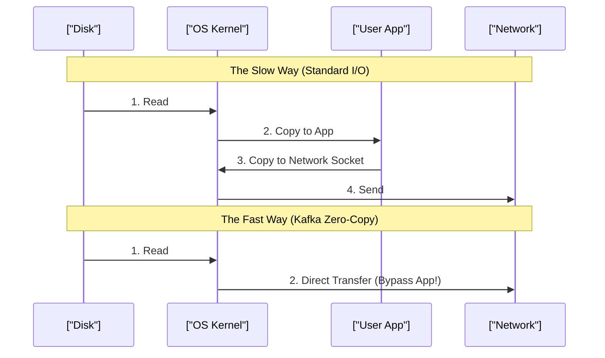

# Distributed Systems, CAP Theorem & Event-Driven Architecture

> **Module:** System Design & Real-Time (Topic 3.3)  
> **Source Mapping:** `backend-roadmap.md` (Level 23 & 29: #588–#593) & `roadmap.md` (Tier 3: #322–#326)

---

## 💡 1. The CAP Theorem

**Analogy:** Imagine a busy coffee shop with two baristas. You want the coffee shop to have:
1. **Consistency (C):** Both baristas always know the exact same menu and stock.
2. **Availability (A):** The shop never closes during working hours.
3. **Partition Tolerance (P):** The shop keeps running even if the two baristas can't hear each other over the loud blender.

The **CAP Theorem** states that when the "loud blender" happens (a Network Partition, **P**), you must choose:
- **CP (Consistency):** Close the shop until they can communicate again (Nobody gets served, but no mistakes are made). Used for bank accounts.
- **AP (Availability):** Keep serving, but one barista might sell you a pastry they are actually out of. Used for social media feeds.

---

## 🔬 2. Kafka & Zero-Copy I/O: Why is it so fast?

**Analogy:** Imagine moving boxes from a warehouse to a delivery truck. The old way is a chain of 4 people passing the box to each other (Slow & lots of handoffs). Kafka's "Zero-Copy" is like a conveyor belt that goes straight from the warehouse shelf into the truck (Fast & skips the middlemen).

### Step-by-Step: Zero-Copy
1. **The Old Way:** Read from Disk $\rightarrow$ OS Kernel $\rightarrow$ App Memory $\rightarrow$ OS Socket $\rightarrow$ Network. (4 copies, slow!)
2. **Kafka's Way:** Disk $\rightarrow$ OS Kernel $\rightarrow$ Network. (Bypasses the App entirely!)



---

## 💻 3. Producing to Kafka (Python 3.11+)

Here's how we safely send financial transactions to Kafka without losing data.

```python
from confluent_kafka import Producer
import json

def delivery_report(err, msg):
    """Callback triggered to let us know if the message succeeded or failed."""
    if err:
        print(f"❌ Failed: {err}")
    else:
        print(f"✅ Sent to topic {msg.topic()} partition [{msg.partition()}]")

def send_money_event():
    # 1. Setup the Producer Configuration
    conf = {
        "bootstrap.servers": "broker1:9092",
        "acks": "all",              # CP Mode: Wait for all replicas to save it safely
        "enable.idempotence": True, # Prevent duplicate messages if we retry!
        "compression.type": "lz4",  # Shrink data to save network bandwidth
        "linger.ms": 5              # Wait 5ms to batch messages together for speed
    }
    
    producer = Producer(conf)
    
    # 2. Prepare our data
    topic = "financial-transactions"
    key = "user-123" # Messages with the same key go to the same partition (Order guaranteed!)
    value = json.dumps({"amount": 500, "currency": "USD"})
    
    # 3. Send it asynchronously
    producer.produce(
        topic, 
        key=key.encode('utf-8'), 
        value=value.encode('utf-8'), 
        callback=delivery_report
    )
    
    # 4. Wait for all messages in the background to finish sending
    producer.flush(timeout=15.0)

if __name__ == "__main__":
    send_money_event()
```

---

## ⚔️ 4. Interview Tips

### Q: Explain how you'd handle a "Poison Pill" message?
**Analogy:** A poison pill is like a piece of metal on an assembly line. If it hits the machine, the machine stops completely. You need a side-bucket for the bad pieces so the line keeps moving.

**3-Point Pitch:**
1. **The Problem:** A malformed message (like bad JSON) crashes the consumer, which retries infinitely and blocks the whole queue.
2. **The Solution:** We wrap our parsing logic in a `try/except` block.
3. **The Dead Letter Queue (DLQ):** On failure, we skip the bad message, send it to a separate "Dead Letter Queue" for manual inspection, and keep processing the good messages.

### Q: Distributed Locks: Redis (AP) vs ZooKeeper (CP)?
**3-Point Pitch:**
1. **Redis (AP):** It's extremely fast and highly available. Great for things that aren't catastrophic if they fail, like rate-limiting a user or preventing cache stampedes.
2. **ZooKeeper/etcd (CP):** It uses strict consensus protocols (like Raft). Slower, but 100% safe. 
3. **The Trade-off:** If you are dealing with financial ledgers where two servers deducting money at once is disastrous, use CP (ZooKeeper). For speed and non-critical locks, use AP (Redis).
