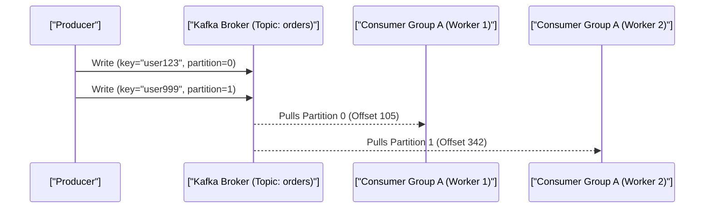

# Distributed Systems, CAP Theorem & Event-Driven Architecture

> **Module:** System Design & Real-Time (Topic 3.3)  
> **Source Mapping:** `backend-roadmap.md` (Level 23 & 29: #588–#593) & `roadmap.md` (Tier 3: #322–#326)

---

## 💡 1. Conceptual Blueprint & First Principles

In distributed systems, the fundamental physical reality is that network communication is unreliable. This brings us to the **CAP Theorem**, which states that in the presence of a Network Partition (**P**), a distributed data store must choose between:
- **Consistency (C):** Every read receives the most recent write or an error.
- **Availability (A):** Every request receives a (non-error) response, without the guarantee that it contains the most recent write.

**PACELC Theorem** extends CAP by acknowledging that even when the system is running normally (no partition), a trade-off exists:
If there is a Partition (**P**), trade off Availability (**A**) vs Consistency (**C**); **E**lse (no partition), trade off Latency (**L**) vs Consistency (**C**).

**Event-Driven Architecture (EDA) & Messaging:**
To decouple distributed systems, we rely on asynchronous messaging. 
- **Message Queues (e.g., RabbitMQ):** Smart broker, dumb consumers. Transient messages (deleted upon ack). Optimized for task distribution.
- **Event Streams (e.g., Apache Kafka):** Dumb broker, smart consumers. Distributed commit log where events are immutable and persisted. Optimized for high-throughput event sourcing and stream processing.

---

## 🔬 2. Under-the-Hood Mechanics

### Kafka Architecture & Partitioning

Kafka scales horizontally by dividing Topics into **Partitions**. Partitions are distributed across brokers. Consumers within a Consumer Group coordinate to read from mutually exclusive partitions.



### In-Sync Replicas (ISR) and Leader Election
For a given partition, one broker is the **Leader** and others are **Followers**. The ISR list tracks followers fully caught up with the leader. If the leader fails, Kafka (via KRaft or Zookeeper) promotes an ISR member to leader. 
- `acks=all`: The leader waits for all ISRs to acknowledge the message before responding to the producer. This guarantees CP (at the cost of latency).

### Disk I/O Optimization
Kafka achieves disk write speeds close to RAM by relying on the OS Page Cache and Sequential I/O. It uses `sendfile()` system calls for Zero-Copy data transfer directly from the disk buffer to the network socket, bypassing user space entirely.

---

## 💻 3. Production Code & Benchmarks

### Go Producer with Idempotency (Exactly-Once Semantics)

To prevent duplicate messages during network retries, we enable idempotence.

```go
package main

import (
    "fmt"
    "github.com/confluentinc/confluent-kafka-go/kafka"
)

func main() {
    p, err := kafka.NewProducer(&kafka.ConfigMap{
        "bootstrap.servers": "broker1:9092,broker2:9092",
        "acks":              "all",
        "enable.idempotence": true, // Ensures exactly-once producer semantics
        "compression.type":  "lz4",  // Balances CPU and Network I/O
        "linger.ms":         5,      // Batching delay for higher throughput
    })
    if err != nil {
        panic(err)
    }

    topic := "financial-transactions"
    err = p.Produce(&kafka.Message{
        TopicPartition: kafka.TopicPartition{Topic: &topic, Partition: kafka.PartitionAny},
        Key:            []byte("txn-8472"), // Key hashing ensures ordering per transaction
        Value:          []byte(`{"amount": 500, "currency": "USD"}`),
    }, nil)
    
    p.Flush(15 * 1000)
}
```

### Performance Benchmarks
- **Standard MQ:** ~20,000 to 50,000 msg/sec.
- **Kafka Cluster (3 brokers, optimized):** 1M+ msg/sec (sustained 100MB/s throughput per broker).

---

## ⚔️ 4. Staff / Senior Interview Scenarios

**Q: In Kafka, what happens during a Consumer Rebalance Storm?**
> **A:** When a consumer joins or leaves a group, Kafka triggers a rebalance. In older versions (Stop-the-World), all consumers paused while partitions were reassigned, causing latency spikes. The architectural fix is to use **Incremental Cooperative Rebalancing**, which revokes only the affected partitions, allowing the rest of the consumer group to continue processing uninterrupted.

**Q: How do you handle Poison Pill messages in an Event Stream?**
> **A:** A poison pill (e.g., malformed JSON) can crash a consumer in an infinite retry loop, blocking the entire partition. As a Staff Architect, I design a **Dead Letter Queue (DLQ)** pattern. The consumer wraps processing in a try/catch. On failure, it logs the error, publishes the raw message to `topic-dlq`, and commits the offset in the main topic, allowing the stream to proceed.

**Q: Explain how you would implement a distributed lock in an AP system like Redis versus a CP system like Zookeeper?**
> **A:** Redis (AP) using Redlock provides high availability and low latency but can suffer from split-brain scenarios during network partitions, meaning multiple clients could potentially acquire the lock. Zookeeper/etcd (CP) guarantees strict consistency using consensus protocols (Raft/ZAB), meaning locks are completely safe, but availability is sacrificed if a quorum is lost. I would choose Zookeeper/etcd for financial distributed locking and Redis for rate-limiting or caching coordination.
