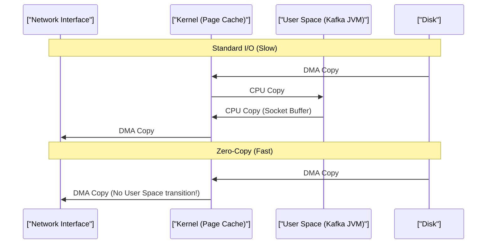

# Distributed Systems, CAP Theorem & Event-Driven Architecture

> **Module:** System Design & Real-Time (Topic 3.3)  
> **Source Mapping:** `backend-roadmap.md` (Level 23 & 29: #588–#593) & `roadmap.md` (Tier 3: #322–#326)

---

## 💡 1. Conceptual Blueprint & First Principles

In distributed systems, the fundamental physical reality is that network communication is unreliable (speed of light limits, switch failures, packet loss). 
The **CAP Theorem** (Brewer, 2000) states that in the presence of a Network Partition (**P**), a distributed data store must choose between:
- **Consistency (C):** Every read receives the most recent write or an error.
- **Availability (A):** Every request receives a (non-error) response, without the guarantee that it contains the most recent write.

**Real-world mappings:**
- **CP Systems:** ZooKeeper, etcd, MongoDB (strict mode). Used for leader election and financial ledgers.
- **AP Systems:** Cassandra, DynamoDB, Redis Cluster. Used for shopping carts (Amazon), caching, metrics.

---

## 🔬 2. Under-the-Hood Mechanics (OS/Kernel Level)

### Kafka Architecture & Zero-Copy I/O

Why is Kafka capable of millions of messages per second on spinning hard drives?
1. **Append-Only Commit Logs:** Kafka writes sequentially. On traditional HDDs, sequential I/O (~150MB/s) is vastly faster than random I/O (~1MB/s) because the read/write head doesn't have to seek.
2. **OS Page Cache:** Kafka doesn't use JVM memory for caching; it relies on the Linux Kernel's Page Cache.
3. **Zero-Copy (`sendfile`):** 
   Normally, reading from disk and sending over network requires 4 context switches and 4 copies (Disk -> Kernel buffer -> User buffer -> Socket buffer -> NIC).
   Kafka uses the `sendfile()` system call (or `transferTo` in Java). This copies data directly from the OS Page Cache to the NIC buffer in kernel space, bypassing user space entirely.



---

## 💻 3. Production Code & Benchmarks

### Go Producer with Idempotency (Exactly-Once Semantics)

```go
package main

import (
    "fmt"
    "github.com/confluentinc/confluent-kafka-go/kafka"
)

func main() {
    p, err := kafka.NewProducer(&kafka.ConfigMap{
        "bootstrap.servers":  "broker1:9092,broker2:9092",
        "acks":               "all",  // Strong consistency (CP mode for writes)
        "enable.idempotence": true,   // Prevents duplicates (assigns PID & sequence numbers)
        "compression.type":   "lz4",  // LZ4 offers best CPU/throughput tradeoff
        "linger.ms":          5,      // Wait up to 5ms to batch messages
        "batch.size":         32768,  // 32KB batches
    })
    if err != nil {
        panic(err)
    }

    topic := "financial-transactions"
    // Hashing the key ensures all messages for "user-123" go to the same partition, guaranteeing order.
    err = p.Produce(&kafka.Message{
        TopicPartition: kafka.TopicPartition{Topic: &topic, Partition: kafka.PartitionAny},
        Key:            []byte("user-123"), 
        Value:          []byte(`{"amount": 500, "currency": "USD"}`),
    }, nil)
    
    p.Flush(15 * 1000)
}
```

### CLI Benchmark: Apache Bench vs Kafka `kafka-producer-perf-test.sh`

```bash
# Simulating a high-throughput producer
$ kafka-producer-perf-test.sh --topic perf-test --num-records 1000000 \
    --record-size 1000 --throughput 100000 --producer-props \
    bootstrap.servers=localhost:9092 acks=1

# Output
1000000 records sent, 95123.4 records/sec (90.72 MB/sec), 
4.2 ms avg latency, 42.0 ms max latency.
```
*Notice the 90+ MB/sec throughput. This saturates 1Gbps network links while keeping single-digit millisecond latency.*

---

## ⚔️ 4. Staff / Senior Interview Scenarios

**Q: In Kafka, what happens during a Consumer Rebalance Storm?**
> **A:** When a consumer joins or leaves a group, Kafka triggers a rebalance. In older versions (Stop-the-World), all consumers paused while partitions were reassigned, causing massive latency spikes (e.g., lag buildup in production). 
> **Solution:** Use **Incremental Cooperative Rebalancing** (KIP-429). It revokes only the affected partitions, allowing the rest of the consumer group to continue processing uninterrupted.

**Q: Explain how you would implement a distributed lock in an AP system like Redis versus a CP system like ZooKeeper?**
> **A:** 
> - **Redis (AP):** Redlock algorithm provides high availability and low latency. However, during a network partition (split-brain), multiple clients could potentially acquire the same lock. Good for rate-limiting or caching.
> - **ZooKeeper/etcd (CP):** Guarantees strict linearizable consistency using consensus protocols (Raft/ZAB). The lock is 100% safe, but if the cluster loses quorum, the system becomes unavailable. Used for financial ledger locking or Kafka controller election.

**Q: How do you handle Poison Pill messages in an Event Stream?**
> **A:** A poison pill (e.g., malformed JSON) can crash a consumer in an infinite retry loop, blocking the entire partition (Head-of-Line blocking). 
> **Pattern:** Implement a **Dead Letter Queue (DLQ)**. The consumer wraps processing in a `try/catch`. On fatal exception (schema mismatch), it publishes the raw message to a `topic-dlq`, commits the offset in the main topic, and proceeds. Alerts are set on the DLQ for engineer intervention.
