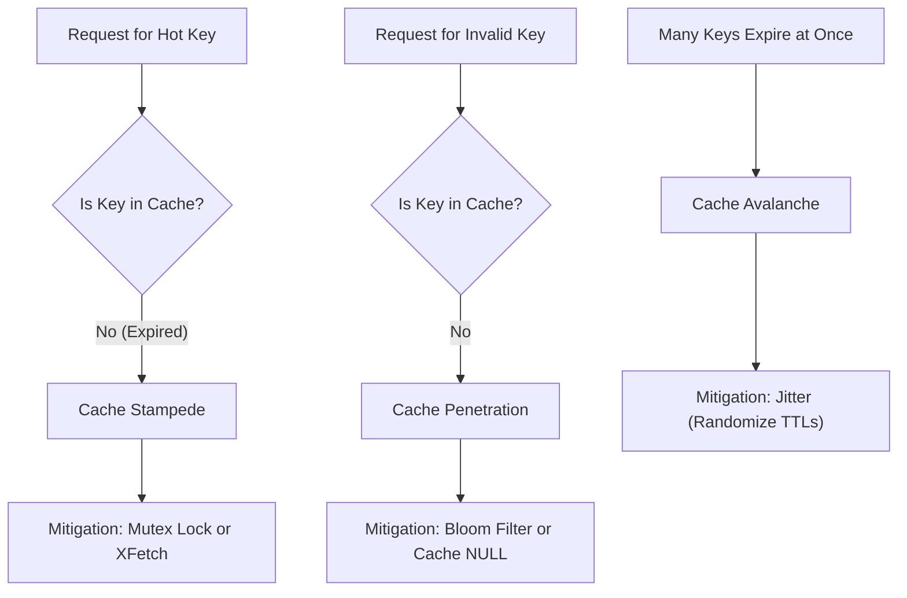

# System Design Blueprint: Load Balancing, Caching & Scaling

> **Module:** System Design & Real-Time (Topic 3.4)  
> **Source Mapping:** `backend-roadmap.md` (Level 23: #465–#494) & `roadmap.md` (Tier 1: #247–#270)

---

## 🍽️ Real-World Analogy: The Busy Restaurant Kitchen

To understand load balancing, caching, and scaling strategies, imagine a bustling gourmet restaurant:

- 🛎️ **Load Balancer = The Restaurant Host / Maître D' (Traffic Routing):**
  When 500 hungry guests arrive at the front door, they don't storm the kitchen directly. The host stands at the entrance, evaluates table availability, and seats guests evenly across multiple dining rooms and waiter sections. If Dining Room B is full or temporarily closed for cleaning (server crash), the host smoothly redirects new diners to Dining Rooms A and C without turning customers away.

- 📝 **Cache = The Waiter's Quick Memory / Notepad (Fast Retrieval):**
  When regular customers sit down and ask "What is today's soup of the day?", the waiter doesn't run all the way back to the head chef in the kitchen every single time ($15\text{ms}$ disk/database query). Instead, the waiter memorized the answer during the morning team briefing and answers in a split second at the table ($<1\text{ms}$ in-memory cache hit).

- 🔥 **Cache Stampede (Thundering Herd) = The Menu Board Update Frenzy:**
  Imagine the head chef wipes the daily soup board clean at 1:00 PM. Suddenly, 50 waiters all notice the missing special at the exact same moment. If all 50 waiters rush into the kitchen at once and scream questions at the head chef, the kitchen collapses in chaos (Cache Stampede). A distributed mutex lock is like a house rule: *"Only Waiter #1 enters the kitchen to ask the chef; the other 49 waiters wait at the kitchen door for 2 seconds until Waiter #1 comes back with the answer."*

---

## 💡 1. Conceptual Blueprint & First Principles

Scaling a system inherently requires dealing with state.
- **Vertical Scaling (Scale Up):** Adding CPU/RAM. Ultimately hits hardware limits and represents a Single Point of Failure (SPOF).
- **Horizontal Scaling (Scale Out):** Adding more generic compute nodes behind a load balancer.

For horizontal scaling to work efficiently, application servers must be **Stateless**. Any state (sessions, uploaded files) must be pushed down to distributed stores (Redis, S3). 

**Load Balancing layers:**
- **Layer 4 (Transport):** Routes traffic based on IP/Port (TCP/UDP). Very fast, low CPU overhead, unaware of HTTP semantics.
- **Layer 7 (Application):** Routes based on HTTP headers, URLs, or cookies. Enables SSL termination and smart routing, but higher CPU overhead.

**Caching** sits between compute and storage to absorb read-heavy workloads, trading memory for latency reduction and database protection.

---

## 🔬 2. Under-the-Hood Mechanics

### Consistent Hashing
When distributing cache across multiple Redis nodes, a naive modulo hash `hash(key) % N` causes massive cache misses when `N` changes (nodes added/removed). **Consistent Hashing** maps keys and nodes to a virtual ring (0 to 2^32-1). Keys are assigned to the first node found by walking clockwise. When a node fails, only its adjacent keys are remapped, preserving 90%+ of the cache.

### The 3 Cache Disasters & Mitigation



**Probabilistic Early Expiration (XFetch):**
Instead of letting a hot key expire naturally (triggering a stampede), a background thread probabilistically recomputes the key *before* it expires based on the formula: `time() - (delay * rand(0,1)) > ttl_time`.

---

## 💻 3. Production Code & Benchmarks

### Redis Cache Stampede Protection via Distributed Mutex (PHP/Predis)

```php
<?php
function getProductData($redis, $db, $productId) {
    $cacheKey = "product:{$productId}";
    $lockKey = "lock:{$productId}";
    
    $data = $redis->get($cacheKey);
    if ($data !== false) {
        return json_decode($data, true); // Cache Hit
    }

    // Cache Miss: Attempt to acquire lock to prevent Thundering Herd
    if ($redis->set($lockKey, "1", "NX", "EX", 5)) {
        // Lock acquired, query DB
        $data = $db->query("SELECT * FROM products WHERE id = ?", $productId);
        
        // Cache result (even if empty, to prevent penetration)
        $redis->setex($cacheKey, 3600 + rand(0, 300), json_encode($data)); // Adding Jitter
        $redis->del($lockKey); // Release lock
        
        return $data;
    } else {
        // Lock not acquired, another thread is computing. Wait and retry.
        usleep(50000); // 50ms
        return getProductData($redis, $db, $productId);
    }
}
```

### Benchmarks
- DB Query: `~15ms` per request. At 10,000 concurrent reqs on stampede -> Database crash.
- Redis Hit: `<1ms`. With Mutex, max 1 DB query is executed, absorbing the remaining 9,999 requests via the 50ms retry loop or subsequent cache hits.

---

## ⚔️ 4. Staff / Senior Interview Scenarios

**Q: We are launching a massive viral marketing campaign and expect traffic to spike 100x in 1 minute. How do you design the cache?**
> **A:** Standard caching will fail due to network bandwidth saturation on the Redis nodes (the Hot Key problem). I would implement a **Multi-Level Caching** strategy.
> 1. Layer 1: In-Memory cache (Local LRU cache like Guava/Memcached on the app server itself) with a very short TTL (e.g., 5 seconds).
> 2. Layer 2: Distributed Redis Cluster.
> This prevents the hot key from constantly traversing the network, completely isolating the Redis cluster from the massive read throughput.

**Q: How do you guarantee absolute data consistency between the primary database and a distributed cache?**
> **A:** You cannot easily guarantee absolute consistency without distributed transactions (Two-Phase Commit), which kills performance. Instead, we aim for eventual consistency. For strong consistency requirements, I recommend avoiding the cache entirely and reading from the DB. Alternatively, we can use a **Change Data Capture (CDC)** system like Debezium reading the database Write-Ahead Log (WAL) to asynchronously and reliably invalidate or update cache entries, completely decoupling cache invalidation from application logic.
