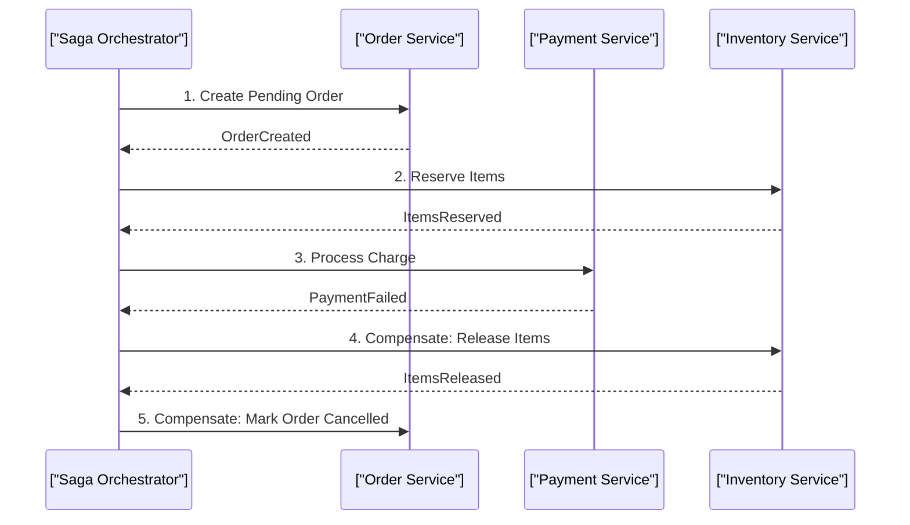

# Microservices vs Monolith, Saga Pattern & Observability

> **Module:** System Design & Real-Time (Topic 3.6)  
> **Source Mapping:** `backend-roadmap.md` (Level 22 & 28) & `roadmap.md` (Tier 1: #264–#270)

---

## 💡 1. Conceptual Blueprint & First Principles

**Conway's Law** states that systems reflect the communication structures of the organizations that build them. Architecture is fundamentally about organizational scaling, not just technical scaling.

- **Monolith:** All code and modules compile into a single deployment unit pointing to a shared database. Low network latency, simple ACID transactions. Often becomes a "Big Ball of Mud" at scale.
- **Modular Monolith:** Single deployment unit, but strictly enforced domain boundaries (Bounded Contexts) via internal APIs/interfaces. Cross-domain database joins are banned. The gold standard for modern scaling.
- **Microservices:** Independently deployable services with absolute domain isolation and a **Database-per-Service** architecture. High network overhead, complex distributed failures, but allows massive teams to operate autonomously.

---

## 🔬 2. Under-the-Hood Mechanics

### Distributed Transactions: The Saga Pattern
When a business process spans multiple microservices, traditional 2-Phase Commit (2PC) locks too many resources and fails in distributed environments. We use **Sagas**: a sequence of local ACID transactions. If a step fails, **Compensating Transactions** are executed backwards to undo preceding steps.

- **Choreography:** Services publish events and react to each other. No central coordinator. Good for simple workflows (2-3 services).
- **Orchestration:** A centralized coordinator (e.g., AWS Step Functions, Temporal) commands services what to do. Essential for complex workflows to avoid tangled logic.



### Distributed Tracing (Observability)
To debug a request traversing 15 microservices, we inject a **Trace ID** into the HTTP Headers (W3C Trace Context). Each microservice logs its own **Span ID**, referencing the parent Trace ID. Aggregators like Jaeger reconstruct the entire request waterfall.

---

## 💻 3. Production Code & Benchmarks

### W3C Trace Context Propagation (Go Middleware)

```go
package main

import (
    "net/http"
    "go.opentelemetry.io/otel"
    "go.opentelemetry.io/otel/propagation"
)

func TracingMiddleware(next http.Handler) http.Handler {
    return http.HandlerFunc(func(w http.ResponseWriter, r *http.Request) {
        // Extract trace context from incoming headers (traceparent)
        ctx := otel.GetTextMapPropagator().Extract(r.Context(), propagation.HeaderCarrier(r.Header))
        
        // Start a new span for this specific microservice operation
        ctx, span := otel.Tracer("microservice-b").Start(ctx, "ProcessOrder")
        defer span.End()

        // Inject the context into any outbound requests to other services
        r = r.WithContext(ctx)
        
        next.ServeHTTP(w, r)
    })
}
```

### Benchmarks
- **Monolith Latency:** In-memory function call (`<0.1ms`).
- **Microservices Latency:** Network hop + SerDes (JSON/gRPC) (`2ms - 10ms` per hop). A chain of 5 microservices can add 50ms of pure architectural latency.

---

## ⚔️ 4. Staff / Senior Interview Scenarios

**Q: In an Orchestrated Saga, what happens if the Orchestrator itself crashes in the middle of a workflow?**
> **A:** The Orchestrator must be built as a highly available, stateful state machine. Tools like Temporal or AWS Step Functions persist the state of the workflow to an underlying database (like Cassandra) at every step. Upon crashing and restarting, the Orchestrator reads the last committed state from the database and resumes exactly where it left off, ensuring workflow durability.

**Q: How do you handle a scenario where a Compensating Transaction fails?**
> **A:** Compensating actions *must* be idempotent and designed to never fail due to business logic (since we already know we need to rollback). If they fail due to transient network issues, the system must retry infinitely. If it persistently fails (e.g., a database corruption), the system must raise a critical alert and push the failed saga ID to a manual Dead Letter Queue for operator intervention. We cannot leave the system in an inconsistent state.

**Q: Generating trace data for every request in a system doing 100k RPS will bankrupt us in storage costs. How do we fix this?**
> **A:** We implement **Tail-Based Sampling**. Instead of randomly sampling 1% of requests at the entry gateway (Head-Based), we buffer traces in memory and only flush them to persistent storage (Jaeger/Datadog) if the request exhibits anomalies, such as HTTP 5xx errors or taking longer than 99th percentile latency. This retains 100% of the useful debugging data while dropping the "boring" successful requests.
