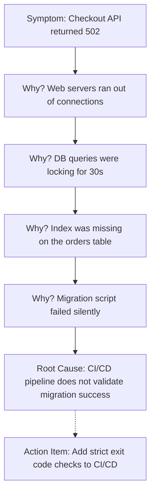

# Staff Engineering Leadership, System Trade-offs & High-Scale Systems

> **Module:** System Design & Real-Time (Topic 3.7)  

---

## 🏛️ Real-World Analogy: The City Planner & The Blueprint Log

Think of building and guiding high-scale software systems like constructing and running a modern metropolis:
- **Staff Engineer = The City Planner**: A city planner doesn't lay individual bricks or paint walls for single houses (write every single line of code). Instead, they design the transit grid, zone districts for high traffic, ensure power grid redundancy, and make sure the entire city won't collapse as the population grows 100x.
- **ADR (Architectural Decision Record) = The Architect's Blueprint Log**: When building a skyscraper, engineers document *why* they chose reinforced steel over timber, recording environmental trade-offs, weight limits, and cost constraints. Years later, when new builders join, they know exactly why decisions were made instead of guessing or repeating past mistakes.
- **Post-Mortem = The Flight Black Box Investigation**: When an aircraft encounters an anomaly, aviation investigators don't blame or punish the pilot; they analyze the flight recorder (black box) to understand system failures, instrumentation gaps, and warning signals. The sole focus is finding the systemic root cause so safety protocols can be updated and the incident can never happen again.

---

## 💡 1. Conceptual Blueprint & First Principles

The transition from Senior to Staff/Principal Engineer represents a shift from solving *how* to build something, to defining *what* should be built and *why*. 

- **Scope:** Seniors operate within a team context. Staff operate across organizational boundaries, influencing multiple teams and architectural paradigms.
- **Ambiguity:** Staff engineers thrive in high ambiguity, transforming vague business problems into crisp, actionable technical strategies.
- **Trade-off Mastery:** Every architectural decision is a compromise. Staff engineers document these trade-offs rigorously, optimizing for maintainability, developer velocity, and long-term TCO (Total Cost of Ownership).

**The Two Primary Tools of Technical Leadership:**
1. **Architectural Decision Records (ADRs):** Immutable logs of major technical choices, preventing cyclic debates.
2. **Blameless Post-Mortems (RCA):** Institutionalizing learning from failures without pointing fingers.

---

## 🔬 2. Under-the-Hood Mechanics

### Anatomy of an Architectural Decision Record (ADR)
An ADR forces structured thinking. It requires identifying the context, the proposed solution, and critically, the *negative* consequences.

### The "5 Whys" Incident Analysis Framework
Root Cause Analysis (RCA) must penetrate beyond symptoms.



---

## 💻 3. Production Code & Benchmarks

### Example: A Production-Grade ADR

```markdown
# ADR-042: Migrate Analytical Queries from PostgreSQL to ClickHouse

**Date:** 2026-08-15
**Status:** Accepted
**Authors:** [Staff Engineer Name]

## 1. Context
Our core PostgreSQL database is experiencing 80% CPU utilization during peak hours. Profiling indicates that complex aggregations for the Merchant Dashboard are causing table locks and degrading the performance of the core OLTP transactional API.

## 2. Decision
We will extract all analytical read queries from PostgreSQL. We will deploy ClickHouse (an OLAP columnar database) and use Debezium (CDC) to stream data from Postgres to ClickHouse in near real-time.

## 3. Consequences
### Positive (Benefits)
- Completely isolates OLAP workload from the OLTP primary DB.
- Dashboard query latency expected to drop from ~4s to <100ms.
### Negative (Trade-offs)
- Adds significant infrastructure complexity (managing ClickHouse clusters).
- Eventual consistency: Dashboards will be ~2 seconds behind real-time.
- Requires upskilling the data engineering team in ClickHouse SQL dialect.
```

---

## ⚔️ 4. Staff / Senior Interview Scenarios

**Q: Two engineering managers passionately disagree on whether to use GraphQL or gRPC for internal service communication. The debate has stalled progress for weeks. As the Staff Architect, how do you resolve this?**
> **A:** My role is to de-escalate emotional attachment to technology and re-focus on objective business requirements. I would write an RFC (Request for Comments) outlining the exact constraints of our system. I would facilitate a meeting focused purely on facts: GraphQL is optimized for flexible client-side querying (UI-driven), while gRPC offers strict contracts and maximum throughput for backend-to-backend communication. Based on our primary bottleneck (throughput), I would mandate gRPC for internal comms and draft an ADR. Disagree and commit is the expected outcome.

**Q: We have a massive, 10-year-old monolithic application that is slowing down feature delivery. Management wants to rewrite it into Microservices. How do you approach this?**
> **A:** A "big bang" rewrite is statistically doomed to fail. I would advocate for the **Strangler Fig Pattern**. We keep the monolith running. We identify a single, high-value domain (e.g., Billing) and build it as a new microservice. We put an API Gateway in front to route billing traffic to the new service and everything else to the monolith. Once stable, we strangle the next domain. This minimizes risk and delivers incremental value to the business.

**Q: You just joined a company that had a major outage, and engineers are blaming "Bob" for deploying bad code. How do you handle the post-mortem?**
> **A:** I immediately establish a **Blameless Culture**. Humans making mistakes is inevitable; the system allowing a mistake to reach production is the failure. I would guide the post-mortem away from "Why did Bob do this?" to "Why did our CI/CD pipeline not catch the regression?", "Why did the canary deployment not halt the rollout?", and "Why did the blast radius take down the whole platform instead of degrading gracefully?". The output must be systemic guardrails, not reprimands.
