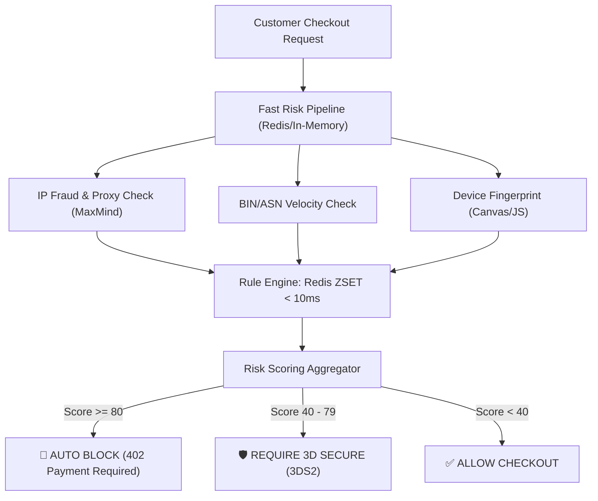

# Real-World Fraud Detection Engine Architecture & Risk Scoring

> **Module:** System Design & Real-Time (Topic 3.8)  
> **Source Mapping:** E-Commerce Risk Management & Senior Technical Deep Dive

---

## 🛡️ 1. The Real-World Fraud Problem

In high-volume digital marketplaces (e.g., game keys, SaaS, crypto exchanges), attackers use stolen credit cards to buy digital goods that can be instantly resold.
- **The Financial Danger:** **Chargebacks**. If a victim reports fraud to their bank, the payment processor (Stripe) initiates a chargeback. You lose the money, the product, AND pay a **$15–$25 chargeback fee**. 
- **The Existential Danger:** If your chargeback rate exceeds 1% on Visa/Mastercard networks, you will be placed on a monitoring program and eventually banned from processing payments entirely.

---

## 🏗️ 2. High-Level Fraud Engine Architecture (Latency < 50ms)

Fraud engines must execute *synchronously* during the checkout flow. If it takes 2 seconds to run rules, cart abandonment skyrockets. 



---

## 💻 3. Real-World Code Implementation (PHP 8.2 & Redis)

### Sliding Window Velocity Check (Redis ZSET)
Velocity checks measure how many times a user/IP/Card tried to buy in the last N minutes. We use Redis Sorted Sets (`ZSET`) where the score is the timestamp.

```php
<?php
namespace App\Services\Fraud\Rules;

use Illuminate\Support\Facades\Redis;

class VelocityCheckRule 
{
    /**
     * Checks if an IP has attempted too many transactions in the last hour.
     * Time Complexity: O(log(N) + M) in Redis, incredibly fast.
     */
    public function calculateRisk(string $ipAddress): int 
    {
        $key = "fraud:velocity:ip:" . $ipAddress;
        $now = time();
        $windowStart = $now - 3600; // 1 hour window

        // 1. Add current timestamp to Redis Sorted Set
        // Score = timestamp, Value = timestamp + random to ensure uniqueness
        Redis::zadd($key, $now, $now . '_' . uniqid());
        
        // 2. Remove entries older than 1 hour to maintain the sliding window
        Redis::zremrangebyscore($key, '-inf', $windowStart);
        
        // 3. Count remaining transactions in the window
        $count = Redis::zcard($key);
        
        // 4. Auto-expire the key to save memory
        Redis::expire($key, 3600);

        // 5. Evaluate Risk
        if ($count > 10) return 100; // Extreme velocity -> Auto Block
        if ($count > 5) return 40;   // Suspicious -> Challenge via 3DS2
        
        return 0; // Safe
    }
}
```

### Deep Mechanics (Redis Memory & CPU)
Why Redis `ZSET` instead of a SQL `COUNT()`? 
Executing `SELECT COUNT(*) FROM orders WHERE ip = X AND created_at > NOW() - INTERVAL 1 HOUR` hitting a MySQL DB during a bot attack will cause CPU exhaustion and bring down the main DB. Redis `ZSET` operations are performed entirely in RAM, executing in sub-milliseconds per command.

---

## 📊 4. Testing & CLI Benchmarks

To ensure the fraud engine doesn't introduce latency, we benchmark the Redis sliding window logic.

```bash
# Using redis-cli to simulate a velocity check pipeline
# 1. Add event
$ redis-cli ZADD "fraud:velocity:1.1.1.1" 1691234567 "event_1"
(integer) 1

# 2. Cleanup old
$ redis-cli ZREMRANGEBYSCORE "fraud:velocity:1.1.1.1" -inf 1691230967
(integer) 0

# Benchmark the ZADD operation throughput
$ redis-benchmark -t zadd -n 100000 -q
ZADD: 110253.59 requests per second, p50=0.219 msec
```

---

## ⚔️ 5. Senior / Staff Interview Q&A

### Q1: How do you prevent false positives (blocking legitimate buyers)?
> **A:** Instead of binary Allow/Block, modern systems use **Step-Up Authentication**. If the score is in the grey area (e.g., 50), we trigger **3D Secure 2.0 (3DS2)**. The user is redirected to their bank to enter an SMS OTP or biometric scan. 
> *Crucial Detail:* A successful 3DS2 authentication shifts the chargeback liability from the merchant to the issuing bank! Even if it turns out to be fraud, we don't pay the fee.

### Q2: How do you deploy new fraud rules without accidentally blocking millions of dollars in revenue?
> **A:** **Shadow Mode (Dry-Run Pattern).** 
> 1. We deploy the rule in `shadow=true` mode.
> 2. It runs asynchronously via a message queue *after* checkout and logs what it *would* have done to an OLAP database (ClickHouse).
> 3. Data Analysts review the ClickHouse logs after 7 days to calculate the False Positive Rate. Only then is it promoted to blocking mode.

### Q3: What happens when an attacker uses a massive residential proxy network to bypass IP velocity limits?
> **A:** We move beyond IPs and use **Device Fingerprinting** (Canvas hashing, WebGL rendering artifacts, audio context). Even if the IP changes 10,000 times, the hardware signature generated by the browser remains consistent, allowing us to velocity-limit on `device_id` rather than `ip_address`.
