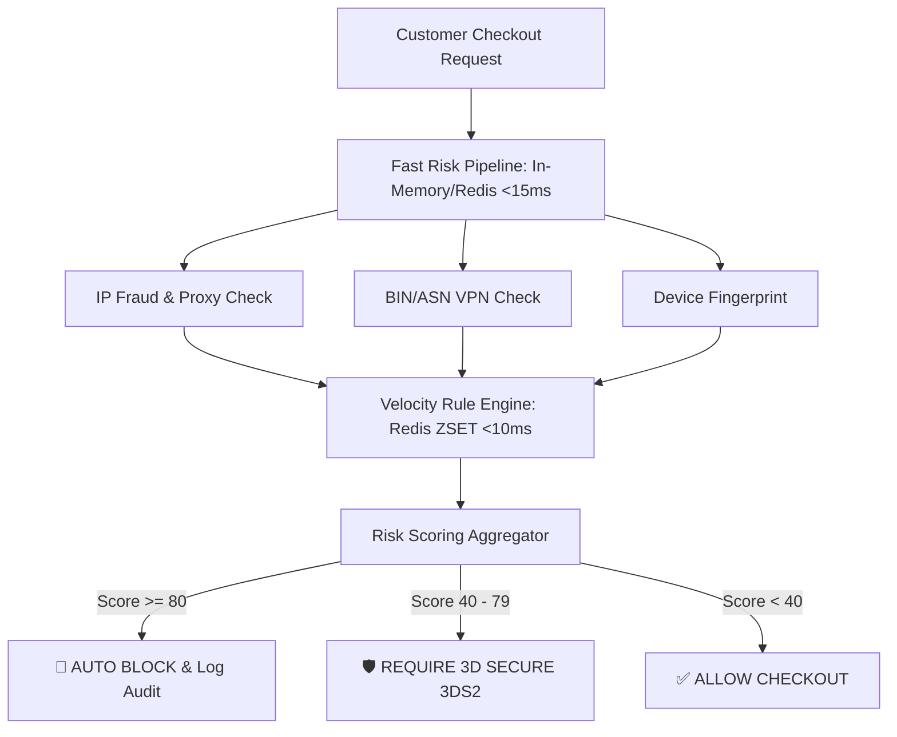

# Real-World Fraud Detection Engine Architecture & Risk Scoring

> **Module:** System Design & Real-Time (Topic 3.8)  
> **Source Mapping:** E-Commerce Risk Management & Senior Technical Deep Dive

---

## 🛡️ 1. The Real-World Fraud Problem

In high-volume digital marketplaces (e.g. game keys, gift cards, software licenses), stolen credit cards are used to make quick purchases.
- **The Danger:** **Chargebacks**. If a victim reports fraud, the payment processor (Stripe/PayPal) takes back the money + charges a **$15–$25 chargeback fee**. High chargeback rates (>1%) cause payment gateways to shut down your merchant account!

---

## 🏗️ 2. High-Level Fraud Engine Architecture

To block fraud without slowing down legitimate users (latency < 50ms):



---

## 💻 3. Real-World Laravel Code Implementation

### The Risk Evaluation Pipeline Pattern

```php
namespace App\Services\Fraud;

use App\Models\Order;

class FraudDetectionEngine 
{
    protected array $rules = [
        IpProxyCheckRule::class,
        VelocityCheckRule::class,
        BinCountryMismatchRule::class,
        EmailDomainRiskRule::class,
    ];

    public function evaluate(Order $order): RiskAssessment 
    {
        $totalRiskScore = 0;
        $triggeredRules = [];

        foreach ($this->rules as $ruleClass) {
            /** @var FraudRuleInterface $rule */
            $rule = app($ruleClass);
            
            $score = $rule->calculateRisk($order);
            if ($score > 0) {
                $totalRiskScore += $score;
                $triggeredRules[] = [
                    'rule' => $rule->getName(),
                    'score' => $score
                ];
            }

            // Early exit if score exceeds auto-block threshold!
            if ($totalRiskScore >= 100) {
                break;
            }
        }

        return new RiskAssessment($totalRiskScore, $triggeredRules);
    }
}
```

### Redis Sliding Window Velocity Check Rule

```php
namespace App\Services\Fraud\Rules;

use App\Models\Order;
use Illuminate\Support\Facades\Redis;

class VelocityCheckRule implements FraudRuleInterface 
{
    public function getName(): string {
        return "Card Usage Velocity";
    }

    public function calculateRisk(Order $order): int 
    {
        $key = "fraud:velocity:ip:" . $order->ip_address;
        $now = time();
        $windowStart = $now - 3600; // 1 hour sliding window

        // Add current timestamp to Redis Sorted Set (ZSET)
        Redis::zadd($key, $now, $now);
        
        // Remove entries older than 1 hour
        Redis::zremrangebyscore($key, 0, $windowStart);
        
        // Count transactions in the past hour
        $count = Redis::zcard($key);
        Redis::expire($key, 3600); // Auto expire key

        if ($count > 5) {
            return 60; // Add 60 points risk score for high velocity!
        }

        return 0;
    }
}
```

---

## ⚔️ Senior / Staff Interview Discussion Points

### Q1: How do you prevent false positives (blocking legitimate buyers)?
> **Answer Strategy:** Implement **Tiered Risk Actions** instead of binary Block/Allow. High risk (`>80`) blocks instantly, medium risk (`40–79`) forces **3D Secure (3DS2)** authentication (where the customer inputs a 1-time passcode from their bank), shifting chargeback liability away from the merchant!

### Q2: How do you test risk rules without risking real customer orders?
> **Answer Strategy:** Implement a **Shadow / Dry-Run Mode**. New fraud rules execute in the background and log their decision to ClickHouse analytics without blocking the customer. Engineers review shadow metrics for 7 days before setting rules to `active`.
