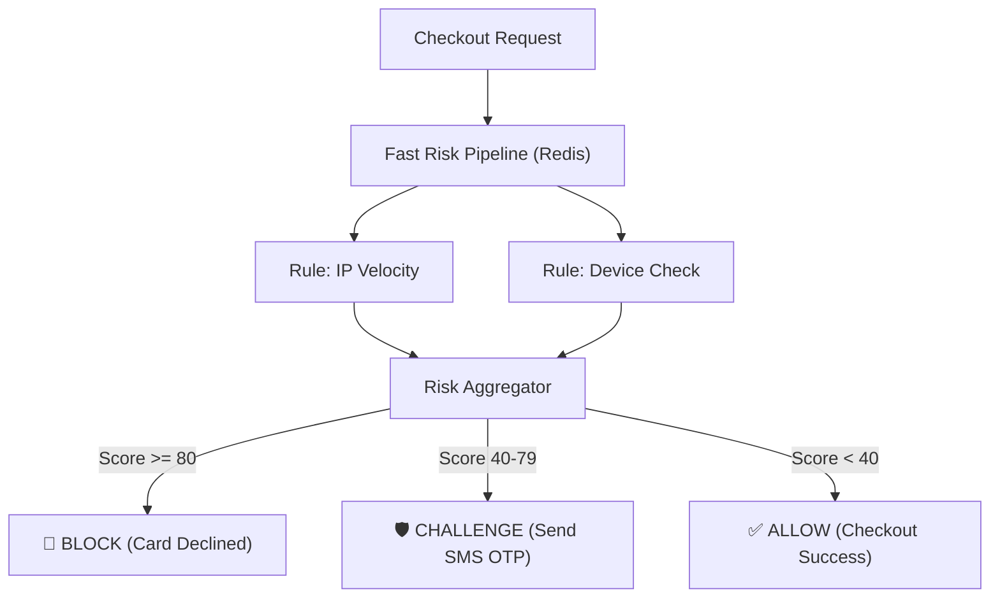

# Real-World Fraud Detection Engine Architecture

> **Module:** System Design & Real-Time (Topic 3.8)  

---

## 🛡️ 1. The Fraud Problem

**Analogy:** Imagine running a nightclub. If a bouncer spends 5 minutes meticulously checking every ID at the door, the line wraps around the block and angry customers leave (Cart Abandonment). If the bouncer lets everyone in without checking, underage kids get in, and the city revokes your liquor license (Chargeback Bans). 
You need a system that checks IDs in *milliseconds*.

When attackers buy your products with stolen cards, the real owner disputes the charge. You lose the product, the money, and get hit with a **$15 fee**. Too many chargebacks, and Visa bans you entirely.

---

## 🏗️ 2. The Fast Risk Pipeline (< 50ms)

Fraud engines must execute *synchronously* (while the user is looking at the loading spinner).

### Step-by-Step Flow
1. **Gather Data:** Check IP address, device fingerprints, and purchase history.
2. **Run Fast Rules:** Evaluate thousands of rules in an in-memory database like Redis.
3. **Score & Act:** Output a risk score (0-100) and decide what to do.



---

## 💻 3. Building a Velocity Check in Redis

**Analogy:** A velocity check is like a speed limit camera. If one car (IP address) passes the camera 10 times in an hour, they are probably doing something illegal!

We use a Redis Sorted Set (`ZSET`) where the "score" is the exact timestamp of the purchase. This lets us easily discard old purchases and count recent ones incredibly fast.

### Python 3.11+ Annotated Implementation

```python
import time
import uuid
from redis.asyncio import Redis

class VelocityCheck:
    def __init__(self, redis: Redis):
        self.redis = redis

    async def calculate_risk(self, ip_address: str) -> int:
        # We group counts by IP address
        key = f"fraud:velocity:ip:{ip_address}"
        
        now = time.time()
        one_hour_ago = now - 3600

        # 1. Add current purchase event. 
        # Score = Time. Value = Time + Random UUID (must be unique)
        event_value = f"{now}_{uuid.uuid4().hex}"
        await self.redis.zadd(key, {event_value: now})
        
        # 2. Cleanup: Delete any events older than 1 hour.
        # This creates our "Sliding Window"
        await self.redis.zremrangebyscore(key, "-inf", one_hour_ago)
        
        # 3. Count how many purchases are left in the 1-hour window.
        count = await self.redis.zcard(key)
        
        # 4. Set key to expire so we don't run out of RAM.
        await self.redis.expire(key, 3600)

        # 5. Return a Risk Score based on the count.
        if count > 10:
            return 100 # High Risk (Bots)
        if count > 5:
            return 40  # Medium Risk (Suspicious)
            
        return 0 # Low Risk (Normal user)
```

---

## ⚔️ 4. Interview Tips

### Q: How do you prevent blocking legitimate customers (False Positives)?
**3-Point Pitch:**
1. **The Problem:** Blocking a real customer kills revenue and ruins their experience.
2. **Step-Up Auth:** Instead of a hard block, medium-risk users trigger "Step-Up Authentication" like 3D Secure (3DS). They get redirected to their bank to enter a text message code.
3. **Liability Shift:** If they pass the text-message check, the bank takes the liability! Even if it's fraud later, we don't pay the chargeback fee.

### Q: How do you deploy new fraud rules without breaking checkout?
**3-Point Pitch:**
1. **Shadow Mode:** We never deploy a rule to instantly block users. We deploy it in "Shadow Mode".
2. **Log Only:** It runs in the background, making decisions, but only *logs* what it would have done to a database.
3. **Analyze & Promote:** After a week, Data Analysts review the logs. If the rule successfully flags bots without hurting real users, we promote it to active blocking.
