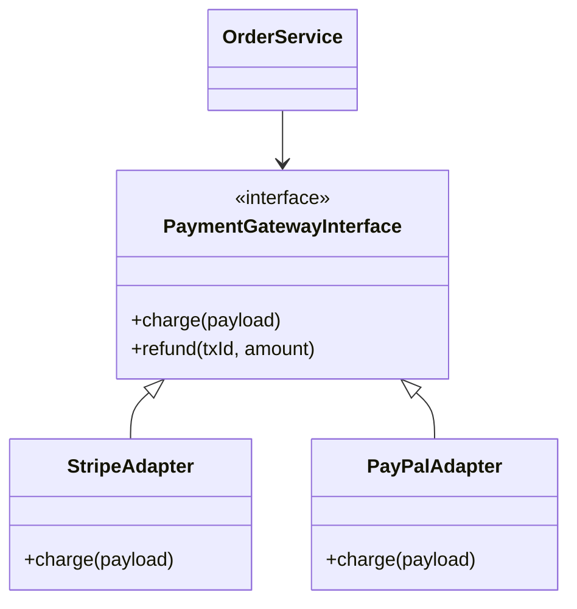

# High-Volume Payment Gateway Integration & Webhook Resiliency

> **Module:** System Design & Real-Time (Topic 3.9)  
> **Source Mapping:** Multi-Gateway Integration (Stripe, Checkout.com, PayPal) & Outbox Pattern

---

## 💳 1. Payment Gateway Abstraction & Strategy Pattern

In production e-commerce, tying your domain logic to `StripeChargeService` is a technical debt nightmare. If Stripe goes down, or if you want to negotiate lower fees with Adyen, you need a **Payment Gateway Abstraction Layer** using the Strategy Pattern.



### Production Code: The Adapter Pattern (Go)

```go
package payment

import (
	"context"
	"errors"
	"time"
)

// PaymentRequest abstracts the provider-specific payload
type PaymentRequest struct {
	AmountCents int
	Currency    string
	SourceToken string
	OrderID     string
}

// Gateway defines the standard contract
type Gateway interface {
	Charge(ctx context.Context, req PaymentRequest) (string, error)
}

// StripeAdapter implements Gateway
type StripeAdapter struct {
	APIKey string
}

func (s *StripeAdapter) Charge(ctx context.Context, req PaymentRequest) (string, error) {
	// Implement strict timeouts! External network calls must bound their latency.
	ctx, cancel := context.WithTimeout(ctx, 3*time.Second)
	defer cancel()

	// ... execute HTTP POST to Stripe ...
	// returning hypothetical transaction ID
	return "ch_12345stripe", nil
}
```

---

## 🔄 2. Out-of-Order Webhook Resolution & The Outbox Pattern

**The Problem:** Webhooks (HTTP callbacks from Stripe) traverse the public internet asynchronously. A `payment_intent.succeeded` webhook might arrive *before* the customer's browser completes the redirect and saves the `Order` in your database.
If you process the webhook synchronously, your database returns `Order Not Found`, the webhook fails (500), and state is desynced.

**The Solution:** Deferred Outbox / Webhook Queuing.

### Deep Mechanics (State Machines & Queues)

1. **Immediate Ack:** The Webhook controller validates the crypto-signature and immediately returns HTTP 200.
2. **Persistence:** The raw JSON payload is inserted into a `webhook_events` table (or Kafka).
3. **Async Worker:** A background job processes the event. If the `Order` doesn't exist yet, it utilizes **Exponential Backoff** to delay processing.

### Production SQL Schema (PostgreSQL)
```sql
CREATE TABLE webhook_events (
    id UUID PRIMARY KEY,
    provider VARCHAR(50) NOT NULL, -- 'stripe', 'paypal'
    event_type VARCHAR(100) NOT NULL, -- 'payment_intent.succeeded'
    payload JSONB NOT NULL,
    status VARCHAR(20) DEFAULT 'PENDING',
    retry_count INT DEFAULT 0,
    created_at TIMESTAMPTZ DEFAULT NOW(),
    -- Idempotency constraint: ensure we don't insert duplicate webhooks
    CONSTRAINT unique_provider_event UNIQUE(provider, id)
);

-- Index for the background worker polling for PENDING events
CREATE INDEX idx_webhook_status ON webhook_events(status, created_at) WHERE status = 'PENDING';
```

### CLI Analysis: Explaining the Partial Index
By using a Partial Index (`WHERE status = 'PENDING'`), the index remains tiny (only containing unprocessed events), allowing blazing fast queue polling.
```bash
# postgres psql command
EXPLAIN ANALYZE SELECT * FROM webhook_events WHERE status = 'PENDING' LIMIT 10;
# Output will show an 'Index Scan using idx_webhook_status' 
# execution time typically < 0.1ms.
```

---

## ⚔️ 3. Staff / Senior Interview Discussion Points

### Q1: Stripe is returning 500 Server Errors. Your site is losing sales. How did you design for this?
> **A:** **Circuit Breaker Pattern + Multi-Acquiring.** 
> Our abstraction layer wraps the payment call in a Circuit Breaker. If Stripe fails 5 times in 10 seconds, the breaker "opens". Subsequent payment attempts instantly fail-over to the backup adapter (e.g., Braintree or Checkout.com) without waiting for Stripe to time out. A background thread pings Stripe's health endpoint to "half-open" and test recovery.

### Q2: How do you ensure you don't process a webhook twice if Stripe resends it?
> **A:** **Idempotent Webhook Processing.** 
> Every webhook contains a unique Event ID (e.g., `evt_123`). We use this ID as the Primary Key or Unique Constraint in our `webhook_events` table (or use Redis `SETNX`). If Stripe resends `evt_123`, the DB throws a Unique Constraint Violation, which we gracefully catch and return a `200 OK` to Stripe to stop the retries.

### Q3: What happens if a webhook processing fails halfway through updating the database?
> **A:** **ACID Transactions & Transactional Outbox.** 
> All state changes triggered by the webhook (marking order paid, unlocking inventory, generating invoice) must be wrapped in a single database transaction (`BEGIN ... COMMIT`). If an API call (like sending a receipt email) is needed, we don't do it synchronously in the transaction; we insert a job into an `outbox_messages` table within the same transaction to guarantee reliable execution later.
