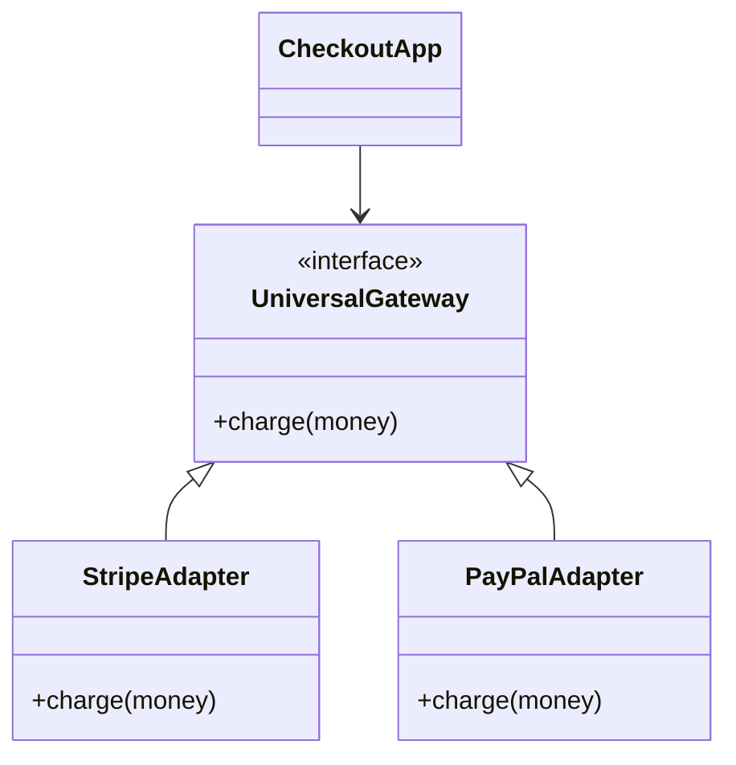

# High-Volume Payment Gateway Integration & Webhooks

> **Module:** System Design & Real-Time (Topic 3.9)  
> **Source Mapping:** Multi-Gateway Integration & Outbox Pattern

---

## 💳 1. Payment Gateway Abstraction

**Analogy:** Imagine having a TV that only works with one specific brand of remote control. If that remote breaks, you can't watch TV! Instead, you want a "Universal Remote" that can control any TV.
In code, tying your logic directly to `Stripe` is dangerous. If Stripe goes down, you want to easily swap to `PayPal`. We use the **Strategy Pattern** to create our "Universal Remote".



### Python 3.11+ Adapter Pattern

```python
import asyncio
from abc import ABC, abstractmethod
from dataclasses import dataclass

@dataclass
class PaymentInfo:
    amount: int
    card_token: str

# 1. Our "Universal Remote" interface
class PaymentGateway(ABC):
    @abstractmethod
    async def charge(self, info: PaymentInfo) -> str:
        pass

# 2. The Stripe-specific implementation
class StripeAdapter(PaymentGateway):
    async def charge(self, info: PaymentInfo) -> str:
        # Always wrap external network calls in a timeout!
        # If Stripe is hanging, we don't want our whole app to freeze.
        async with asyncio.timeout(3.0):
            # ... send HTTP POST to Stripe ...
            await asyncio.sleep(0.5) 
            return "success_stripe_123"
```

---

## 🔄 2. The Outbox Pattern for Webhooks

**Analogy:** You order a package (Customer checkout) and the mail carrier rings your bell to deliver it (Stripe Webhook). 
**The Problem:** What if the carrier rings your bell *before* you've even had time to walk home from the store? You aren't there to receive it!
In systems, Stripe might send the "Payment Success" webhook *before* your database finishes saving the new order. 

**The Solution:** Have the mail carrier drop the package in a secure drop-box (Outbox Queue) on your porch. You can process it when you are ready.

### Step-by-Step Flow
1. **Receive & Accept:** Stripe sends the webhook. We immediately return `200 OK`.
2. **Store Safely:** We save the raw JSON payload into a database table (`webhook_events`).
3. **Process Later:** A background worker reads the table and processes it at its own pace.

### SQL Implementation

```sql
-- 1. Create a table to act as our "Drop-box"
CREATE TABLE webhook_events (
    id UUID PRIMARY KEY,
    event_type VARCHAR(100) NOT NULL,
    payload JSONB NOT NULL,
    status VARCHAR(20) DEFAULT 'PENDING',
    created_at TIMESTAMPTZ DEFAULT NOW()
);

-- 2. Add an index to quickly find ONLY the pending ones
CREATE INDEX idx_pending_webhooks ON webhook_events(status) WHERE status = 'PENDING';
```

---

## ⚔️ 3. Interview Tips

### Q: Stripe is down and returning 500 Errors. How do you save sales?
**3-Point Pitch:**
1. **The Risk:** Relying on a single provider means their downtime is your downtime.
2. **Circuit Breaker Pattern:** We wrap our Stripe calls in a "Circuit Breaker". If Stripe fails 5 times, the breaker "opens" and stops trying Stripe.
3. **Failover:** While the breaker is open, all traffic is instantly routed to a backup provider (like PayPal or Adyen) so we don't lose revenue.

### Q: What if a webhook processing crashes halfway through?
**3-Point Pitch:**
1. **The Danger:** If a webhook updates the inventory but crashes before marking the order as "Paid", our data is corrupted.
2. **ACID Transactions:** We wrap all database updates in a single SQL Transaction (`BEGIN ... COMMIT`).
3. **All or Nothing:** If it crashes halfway, the database rolls back everything, ensuring our system state is always consistent. We can then retry safely later.
