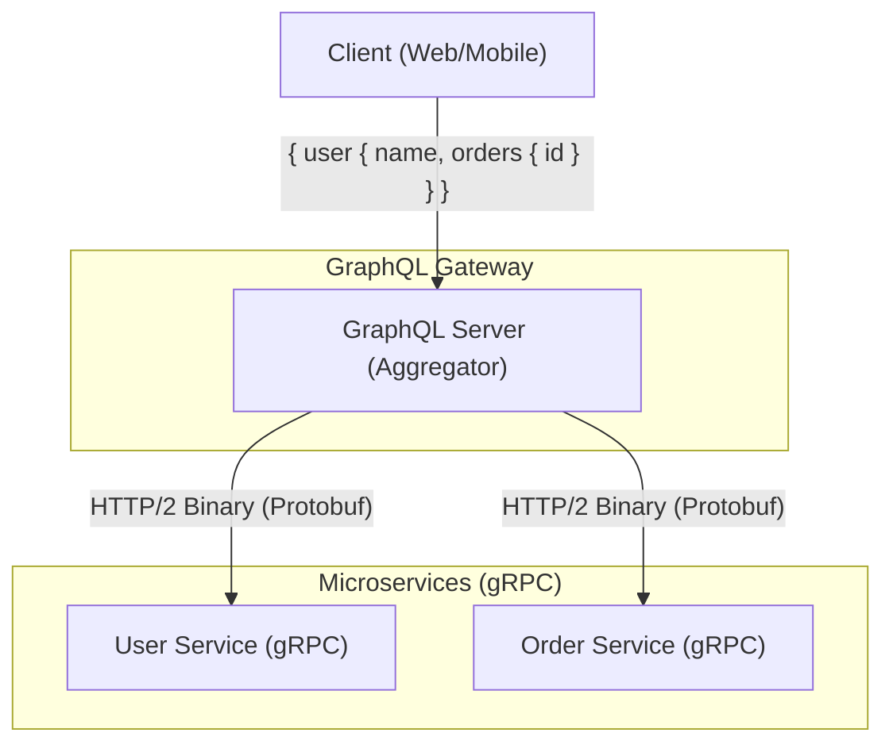
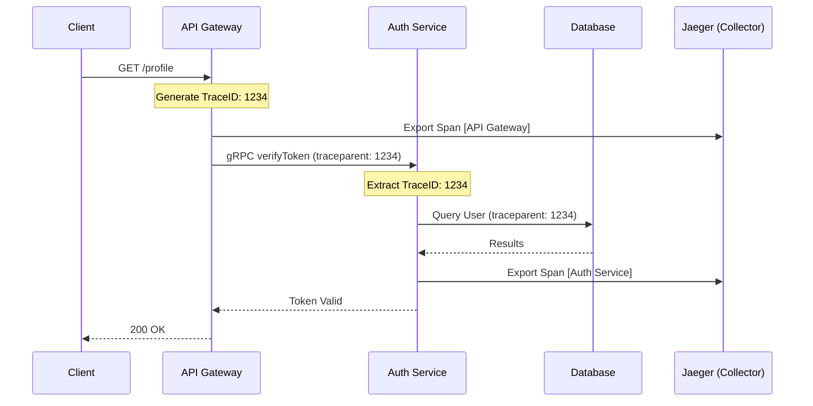

# gRPC, GraphQL, and OpenTelemetry: Modern APIs and Observability

## 1. Analogy First

Imagine you run a massive international shipping logistics company. 
- **REST** is like sending a standardized form via regular mail. It's well understood, but can be slow, and sometimes you get too much info on the form or too little, requiring you to send another letter.
- **gRPC** is like a dedicated, high-speed telegraph line using a highly compressed, pre-agreed morse code dictionary (Protobuf) over a fast train track (HTTP/2). It is blisteringly fast, bidirectional, and highly efficient, but both ends must perfectly understand the dictionary.
- **GraphQL** is like a smart warehouse clerk. Instead of asking for "Box A" and "Box B" in separate requests, you give the clerk a specific checklist: "I need the exact weight of Box A and just the destination of Box B." The clerk fetches exactly what you asked for in one trip.
- **OpenTelemetry** (with Jaeger/Prometheus) is your real-time tracking system. It attaches a unique GPS tracker (Trace ID) to every package as it moves through multiple warehouses (microservices), so if a package is delayed, you know exactly which warehouse caused the bottleneck.

---

## 2. Step-by-Step Mechanics

### gRPC & Protobuf Mechanics
1. **Define the Contract**: Write a `.proto` file defining the service methods and message structures.
2. **Compile**: Use the `protoc` compiler to generate client and server code in your language of choice.
3. **Connect**: The client initiates an HTTP/2 connection to the server.
4. **Serialize & Transmit**: The client serializes the request into a compact binary format (Protobuf) and sends it over the wire.
5. **Receive & Execute**: The server deserializes the binary payload, executes the function, and returns a serialized binary response.

### OpenTelemetry Mechanics (Distributed Tracing)
1. **Instrument**: Add OpenTelemetry SDKs to your services (auto or manual instrumentation).
2. **Initialize Trace**: When a request enters the system (e.g., API Gateway), a Trace ID is generated.
3. **Propagate Context**: The Trace ID is injected into headers (like `traceparent`) for outgoing requests (HTTP/gRPC) to downstream services.
4. **Emit Spans**: Each service creates "Spans" (representing a unit of work, like a DB query) containing the Trace ID and timing data.
5. **Export & Visualize**: Spans are exported to a backend like Jaeger, which reconstructs the full request journey across all microservices.

---

## 3. Annotated Python 3.11+ Code

Here is how you might implement a simple gRPC server with OpenTelemetry tracing integrated.

```python
# 1. We import necessary libraries for gRPC and OpenTelemetry.
import grpc
from concurrent import futures
import time

# OpenTelemetry imports
from opentelemetry import trace
from opentelemetry.sdk.trace import TracerProvider
from opentelemetry.sdk.trace.export import BatchSpanProcessor, ConsoleSpanExporter
from opentelemetry.instrumentation.grpc import GrpcInstrumentorServer

# Assuming proto generated files exist: hello_pb2, hello_pb2_grpc
# import hello_pb2
# import hello_pb2_grpc

# 2. Setup OpenTelemetry Tracer
provider = TracerProvider()
# 3. For demonstration, we export spans to the console. In prod, use JaegerExporter.
processor = BatchSpanProcessor(ConsoleSpanExporter())
provider.add_span_processor(processor)
trace.set_tracer_provider(provider)
tracer = trace.get_tracer(__name__)

# 4. Define the gRPC Servicer
class Greeter(): # Normally inherits from hello_pb2_grpc.GreeterServicer
    def SayHello(self, request, context):
        # 5. Create a custom span within the gRPC request handling
        with tracer.start_as_current_span("SayHello_business_logic") as span:
            span.set_attribute("peer.ip", context.peer())
            # 6. Simulate some work
            time.sleep(0.1)
            # return hello_pb2.HelloReply(message=f"Hello, {request.name}!")
            return f"Hello, {request.name}!"

def serve():
    # 7. Instrument the gRPC server automatically with OpenTelemetry
    grpc_server_instrumentor = GrpcInstrumentorServer()
    grpc_server_instrumentor.instrument()

    # 8. Start the gRPC server
    server = grpc.server(futures.ThreadPoolExecutor(max_workers=10))
    # hello_pb2_grpc.add_GreeterServicer_to_server(Greeter(), server)
    server.add_insecure_port('[::]:50051')
    print("Starting gRPC Server on port 50051...")
    server.start()
    server.wait_for_termination()

if __name__ == '__main__':
    serve()
```

---

## 4. Clean Mermaid Diagrams

### gRPC vs GraphQL Architecture



### Distributed Tracing (OpenTelemetry)



---

## 5. Interview Tips

### Q: Why choose gRPC over REST?
**3-Point Pitch:**
1. **Performance:** gRPC uses HTTP/2 for multiplexing and Protobuf for binary serialization, resulting in smaller payloads and faster parsing than JSON over HTTP/1.1.
2. **Strict Contracts:** Protobuf enforces strict typing and schemas, catching contract mismatches at compile time rather than runtime.
3. **Code Generation:** It natively generates idiomatic client and server stubs across multiple languages, reducing boilerplate code.

### Q: When is GraphQL a better fit than REST?
**3-Point Pitch:**
1. **No Over/Under-fetching:** Clients specify exactly the fields they need, reducing bandwidth usage on mobile networks.
2. **Single Endpoint Aggregation:** A single query can retrieve hierarchical data from multiple backend microservices, reducing network round-trips.
3. **Strong Typing & Introspection:** The GraphQL schema acts as executable documentation, enabling powerful developer tooling and autocomplete.

### Q: Why do we need OpenTelemetry in a microservices architecture?
**3-Point Pitch:**
1. **Distributed Root Cause Analysis:** In microservices, a single user request hits multiple services. Tracing correlates these hops using a shared Trace ID to find the exact bottleneck.
2. **Vendor Agnosticism:** OpenTelemetry provides a standard unified API for metrics, logs, and traces, so you can swap out backends (Jaeger to Datadog) without changing application code.
3. **Performance Profiling:** It provides waterfall visualizations of request lifecycles, showing exactly how long DB queries, external API calls, and internal compute take per request.
