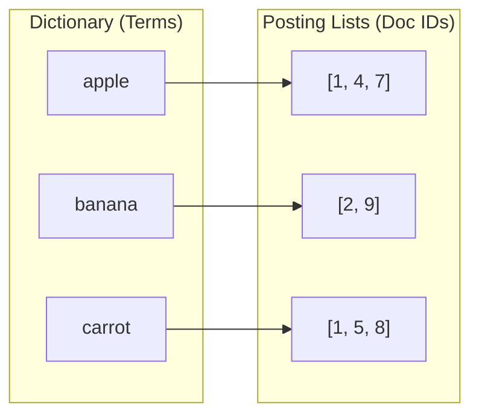
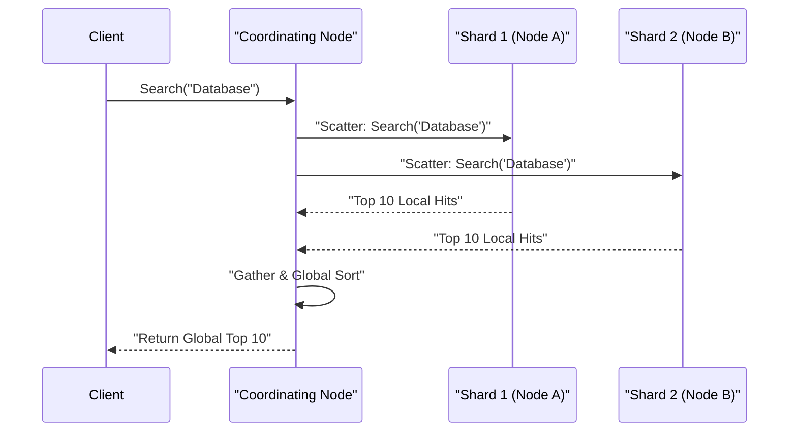

# Elasticsearch & OpenSearch: Inverted Index & Full-Text Search

## 1. Analogy First
Imagine looking for every page in a massive textbook that mentions the word "Database." 
- **B+Tree approach (Traditional DB):** You start at page 1 and read every single word until the end of the book (Full Table Scan). Or if you indexed by page number, you still can't easily find a specific word.
- **Inverted Index approach (Elasticsearch):** You flip to the **Index at the back of the book**. You look up "Database" alphabetically, and it gives you a list of exact page numbers: `[42, 89, 105]`. You instantly jump to those pages.

An Inverted Index maps **words (terms)** to their **locations (documents)**, making full-text search blazingly fast.

## 2. Step-by-Step Mechanics

### Inverted Index vs B+Tree
1. **Analysis/Tokenization:** Text is broken down into tokens (words), lowercased, and stemmed (e.g., "Running" -> "run").
2. **Indexing:** Tokens are added to an Inverted Index. Each token points to a posting list (List of Document IDs containing the token).
3. **Querying:** When a user searches for "fast run", the system looks up "fast" and "run" in the index, retrieving their posting lists, and intersecting them to find documents with both.
4. **B+Tree Contrast:** B+Trees (used in Postgres/MySQL) are great for exact matches and range queries (e.g., `WHERE age > 20`) because they keep data sorted. But they are terrible for `WHERE description LIKE '%fast run%'` because they must scan.

### Relevance Scoring: TF-IDF & BM25
1. **Term Frequency (TF):** How often does the word appear in this document? (More frequent = more relevant).
2. **Inverse Document Frequency (IDF):** How rare is the word across all documents? ("the" is everywhere, so it has low weight. "Erlang" is rare, so it has high weight).
3. **BM25 (Best Matching 25):** The modern evolution of TF-IDF. It dampens the TF effect so that a document with 100 occurrences of a word isn't infinitely better than one with 10 occurrences, and accounts for document length (shorter documents matching the term get a slight boost).

### Lucene Segments & Merging
1. **Immutability:** Lucene indexes are divided into immutable **segments**. Once written, a segment is never changed.
2. **New Data:** New documents are written to an in-memory buffer, then periodically flushed as a new small segment.
3. **Merging:** Over time, many small segments accumulate (which slows down reads). A background process merges them into larger segments and removes deleted documents (which were only marked with a tombstone).

### Sharding & Cluster Routing
1. **Sharding:** An index is split into multiple shards. Each shard is a fully functional Lucene index.
2. **Routing:** When a document is inserted, Elasticsearch uses a hash formula to determine the shard: `shard = hash(routing_key) % number_of_primary_shards`.
3. **Scatter-Gather Phase:** During a search, the coordinating node forwards the query to all shards (Scatter). Each shard returns its top matches locally. The coordinating node merges and sorts these results to return the final global top N (Gather).

## 3. Quoted Mermaid Diagrams

### Inverted Index Structure


### Scatter-Gather Search Routing


## 4. Annotated Python 3.11+ Code

```python
# pip install elasticsearch
from elasticsearch import Elasticsearch

# 1. Connect to Elasticsearch cluster
client = Elasticsearch("http://localhost:9200")

def setup_index():
    # 2. Define index settings and mappings
    # We specify the analyzer and properties to optimize for BM25 text search
    mapping = {
        "mappings": {
            "properties": {
                "title": {"type": "text", "analyzer": "english"},
                "content": {"type": "text", "analyzer": "english"}
            }
        }
    }
    # 3. Create the index
    client.indices.create(index="articles", body=mapping, ignore=400)

def index_document(doc_id: int, title: str, content: str):
    # 4. Insert a document into the index. 
    # Lucene will tokenize the text and update the in-memory segment buffer.
    doc = {
        "title": title,
        "content": content
    }
    client.index(index="articles", id=doc_id, document=doc)
    
def search_articles(query: str):
    # 5. Perform a full-text search query.
    # This triggers the Scatter-Gather routing across shards.
    # Documents will be scored using the BM25 algorithm automatically.
    search_body = {
        "query": {
            "match": {
                "content": query
            }
        }
    }
    response = client.search(index="articles", body=search_body)
    
    # 6. Parse and return results
    hits = response["hits"]["hits"]
    results = []
    for hit in hits:
        # Note the '_score' field, which is the BM25 relevance score
        results.append({
            "id": hit["_id"],
            "score": hit["_score"],
            "title": hit["_source"]["title"]
        })
    return results

if __name__ == "__main__":
    setup_index()
    index_document(1, "Elasticsearch Basics", "Learn about inverted indices and segment merging.")
    index_document(2, "B+Trees vs Inverted", "B+Trees are bad for full text search. Inverted indices rock.")
    
    # Force a refresh to make documents immediately searchable (not recommended in prod)
    client.indices.refresh(index="articles")
    
    print(search_articles("full text search"))
```

## 5. Interview Tips (3-Point Pitches)

### "How does an Inverted Index work compared to a B+Tree?"
1. **Mapping:** An inverted index maps terms (words) to a posting list of document IDs, like an index at the back of a book.
2. **Speed:** It makes full-text search $O(1)$ to find the posting list, and fast intersection for multiple words, whereas a B+Tree would require a full table scan for wildcard text matches.
3. **Use Case:** B+Trees are ideal for structured, exact-match, or range queries (Postgres), while Inverted Indices excel at unstructured, fuzzy full-text search (Elasticsearch).

### "How does relevance scoring work in Elasticsearch?"
1. **TF-IDF foundation:** It calculates Term Frequency (how often the word appears in the document) and Inverse Document Frequency (how rare the word is globally).
2. **BM25 improvement:** BM25 improves on TF-IDF by adding a saturation curve for Term Frequency (preventing keyword stuffing) and penalizing overly long documents.
3. **Customization:** Scores can be tweaked via function scores, field boosting (e.g., matching the title is worth more than the body), and exact-phrase boosts.

### "Explain Segment Merging in Lucene."
1. **Immutability:** Lucene segments are immutable. New data creates new small segments in memory that are flushed to disk.
2. **Merge Process:** Because querying many small segments is slow, a background process merges them into larger segments and removes deleted documents.
3. **Performance Impact:** Merging is I/O intensive. If you have heavy write loads, segment merging can cause CPU/Disk spikes, so it must be monitored and tuned.
