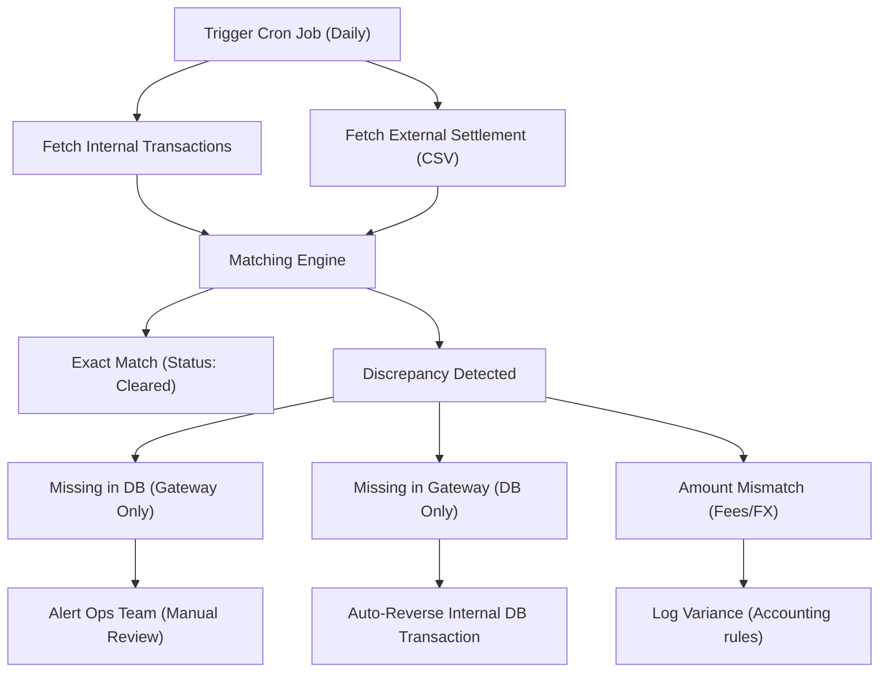

# 13. Reconciliation & Matching Systems

## 1. The Real-World Analogy: The Checkbook and the Bank Statement
Imagine you are tracking your monthly expenses. Every time you buy a coffee or pay a bill, you write it down in your personal notebook. At the end of the month, your bank sends you a statement of all your transactions. 

**Reconciliation** is the process of sitting down and comparing your notebook against the bank statement line by line to ensure they match exactly. 
- If the bank statement shows a $5 monthly fee you didn't write down, you have a discrepancy.
- If you wrote down a $20 dinner but the restaurant never charged your card, you have a discrepancy.

In backend systems (especially in FinTech and ad-tech like ADZOIC), money moves between multiple distributed systems (your database, payment gateways like Stripe/PayPal, ad networks). Because networks fail, timeouts happen, and systems crash, your internal database will eventually disagree with the external system. Reconciliation ensures that no money is lost in the void and that your accounting is completely accurate.

## 2. Types of Reconciliation
Reconciliation isn't always as simple as matching a single ID.

*   **Internal vs. External:** Internal reconciliation matches records between two of your own microservices (e.g., Order Service vs. Billing Service). External matches your DB against a third-party report (e.g., your DB vs. Stripe Settlement CSV).
*   **1-to-1 Matching:** One record in your DB corresponds to exactly one record in the external system.
*   **1-to-Many Matching:** One bulk settlement record in the external system corresponds to many individual transactions in your DB.
*   **Matching Criteria:** We usually match by **Transaction ID** first. If that's missing, we fall back to a combination of **Amount + Timestamp + User ID** (heuristic matching).

## 3. Handling Discrepancies (Workflow)

When records don't match, they fall into a few common buckets:
*   **Missing in DB:** The gateway processed a payment, but your system crashed before saving it. You owe the user their product!
*   **Missing in Gateway:** Your DB says a payment succeeded, but the gateway has no record. You might be giving away free stuff!
*   **Amount Mismatches:** Usually caused by FX (foreign exchange) conversions or unexpected gateway fees.
*   **Partial Failures:** A multi-step transaction failed halfway (e.g., charged the card but failed to issue the digital receipt).



## 4. Production Reconciliation System (Python 3.11+)

Here is a simplified but production-like asynchronous reconciliation job in Python, demonstrating how we parse files and match records.

```python
import asyncio
import csv
from decimal import Decimal
from dataclasses import dataclass
from typing import List, Dict, Optional

# Data structure for our internal database records
@dataclass
class InternalTx:
    tx_id: str
    amount: Decimal
    status: str

# Data structure for the external gateway settlement records
@dataclass
class ExternalTx:
    tx_id: str
    amount: Decimal
    fee: Decimal

# Data structure for recording discrepancies found during matching
@dataclass
class DiscrepancyReport:
    missing_in_db: List[ExternalTx]
    missing_in_gateway: List[InternalTx]
    amount_mismatches: List[Dict[str, any]]

async def fetch_internal_records() -> Dict[str, InternalTx]:
    """Simulate fetching yesterday's successful transactions from our database."""
    # In reality, this would be an async DB query (e.g., using asyncpg or SQLAlchemy)
    await asyncio.sleep(0.1) 
    # Return a dictionary keyed by transaction ID for fast O(1) lookups
    return {
        "TX_1001": InternalTx(tx_id="TX_1001", amount=Decimal("50.00"), status="SUCCESS"),
        "TX_1002": InternalTx(tx_id="TX_1002", amount=Decimal("20.00"), status="SUCCESS"),
        "TX_1003": InternalTx(tx_id="TX_1003", amount=Decimal("15.00"), status="SUCCESS"), # Missing in gateway
        "TX_1005": InternalTx(tx_id="TX_1005", amount=Decimal("100.00"), status="SUCCESS") # Amount mismatch
    }

async def parse_settlement_csv(file_path: str) -> Dict[str, ExternalTx]:
    """Simulate downloading and parsing a settlement CSV from a payment gateway."""
    await asyncio.sleep(0.1) # Simulate network I/O
    # Hardcoding the parsed data for this example instead of reading a real file
    # Notice TX_1004 is here but not in our DB, and TX_1005 has a different amount
    return {
        "TX_1001": ExternalTx(tx_id="TX_1001", amount=Decimal("50.00"), fee=Decimal("1.50")),
        "TX_1002": ExternalTx(tx_id="TX_1002", amount=Decimal("20.00"), fee=Decimal("0.60")),
        "TX_1004": ExternalTx(tx_id="TX_1004", amount=Decimal("30.00"), fee=Decimal("0.90")), # Missing in DB
        "TX_1005": ExternalTx(tx_id="TX_1005", amount=Decimal("99.00"), fee=Decimal("3.00"))  # Amount mismatch
    }

async def run_reconciliation_job():
    """Main cron job entrypoint to run the reconciliation process."""
    print("Starting daily reconciliation job...")
    
    # Fetch both datasets concurrently using asyncio.gather for performance
    internal_data, external_data = await asyncio.gather(
        fetch_internal_records(),
        parse_settlement_csv("stripe_settlement_2023-10-01.csv")
    )
    
    # Initialize our discrepancy report
    report = DiscrepancyReport(missing_in_db=[], missing_in_gateway=[], amount_mismatches=[])
    
    # 1. Match Gateway Records against DB
    for tx_id, ext_tx in external_data.items():
        # Check if the gateway transaction exists in our internal database
        if tx_id not in internal_data:
            # If not, the DB missed a payment (e.g., webhook failed)
            report.missing_in_db.append(ext_tx)
        else:
            # If it does exist, compare the amounts (ignoring fees for this simple check)
            int_tx = internal_data[tx_id]
            if int_tx.amount != ext_tx.amount:
                # Log the mismatch for finance team review
                report.amount_mismatches.append({
                    "tx_id": tx_id,
                    "internal_amount": int_tx.amount,
                    "external_amount": ext_tx.amount
                })
    
    # 2. Match DB Records against Gateway (to find orphans in DB)
    for tx_id, int_tx in internal_data.items():
        # Check if our recorded successful transaction is missing from the gateway
        if tx_id not in external_data:
            # DB thinks payment succeeded, but gateway didn't settle it
            report.missing_in_gateway.append(int_tx)
            
    # 3. Output the final report and workflows
    print(f"Reconciliation Complete. Found {len(report.missing_in_db)} missing in DB, "
          f"{len(report.missing_in_gateway)} missing in gateway, "
          f"{len(report.amount_mismatches)} amount mismatches.")
    
    # In a real system, we would save this report to the DB, queue jobs to auto-resolve 
    # specific issues, and trigger Slack/Email alerts to Ops for the rest here.

if __name__ == "__main__":
    # Run the async event loop
    asyncio.run(run_reconciliation_job())
```

## 5. Interview Pitches: Reconciliation Questions

**Q1: How do you handle reconciling millions of transactions without running out of memory?**
*   **Chunking & Streaming:** Instead of loading the entire DB and CSV into memory, stream the CSV line-by-line and query the DB in batches using cursors.
*   **MapReduce/Spark:** Offload heavy matching logic to a big data processing framework like Apache Spark, grouping records by Transaction ID across distributed nodes.
*   **Database Joins:** If data is loaded into a data warehouse (like Snowflake or BigQuery), perform the reconciliation entirely using SQL joins rather than application memory.

**Q2: What happens if a transaction ID is missing from the external report? How do you match them?**
*   **Heuristic Matching:** Fall back to matching a combination of attributes: `User ID + Exact Amount + Date/Time window`.
*   **Fuzzy Time Windows:** Because timestamps across systems rarely match to the millisecond, use a +/- 24-hour window when joining records.
*   **Manual Queue:** If heuristic matching yields multiple ambiguous matches (e.g., a user bought two $10 items on the same day), push the record to an ops queue for manual resolution.

**Q3: How do you deal with floating-point errors and currency conversions (FX) during reconciliation?**
*   **Integers/Decimals Only:** Never use floating-point types (`float`) for money; always use `Decimal` types or store cents as integers to avoid precision loss.
*   **Tolerance Thresholds:** Implement a variance threshold (e.g., allow up to $0.05 difference) to automatically accept minor discrepancies caused by rounding.
*   **Separate FX Ledgers:** Record the base amount, the converted amount, and the exact exchange rate provided by the gateway at the time of transaction, storing any difference in a dedicated "FX Gain/Loss" account.
