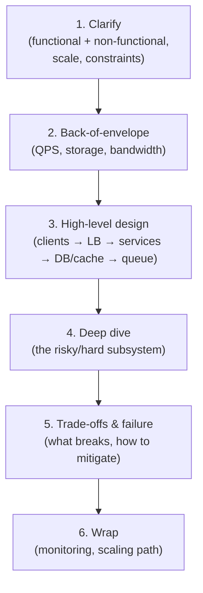
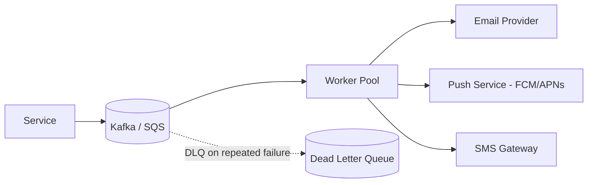

# 14. System Design Case Studies: Interview Attack Framework

## 1. Real-World Analogy: The Architect's Whiteboard

Think of a system design interview like being handed an empty plot of land and asked to design a city, but you only have 35 minutes and the interviewer keeps throwing storms at it:

- **The framework** is your blueprint — you don't guess, you *attack systematically*: clarify requirements → estimate scale → sketch high-level components → dive deep on the hard part → address failure/trade-offs.
- **Case studies** are rehearsed buildings (rate limiter, URL shortener, etc.) so when the interviewer says "design X," you already know the load-bearing walls.

## 2. Step-by-Step Flow: The Universal Attack Framework



## 3. Case Study A: Design a Rate Limiter

**Requirements**: 1000 req/s per API key, burst allowed, reject with `429`.
**Algorithm choice** (from `system-design/04`):
- **Token Bucket**: refill tokens at rate `r`, capacity `b`. Allows bursts up to `b`. Best default.
- **Leaky Bucket**: strict fixed output rate, smooths traffic (good for downstream protection).
- **Sliding Window Log**: precise but memory-heavy; **Sliding Window Counter** is the practical compromise.

```python
import time, redis

# Token bucket in Redis (atomic Lua for race-free check)
LUA = """
local tokens = tonumber(redis.call('get', KEYS[1]) or ARGV[2])
local now = tonumber(ARGV[1])
local rate = tonumber(ARGV[3]); local cap = tonumber(ARGV[2])
tokens = math.min(cap, tokens + (now - (redis.call('get', KEYS[1]..':ts') or now))/1000 * rate)
if tokens >= 1 then
  redis.call('set', KEYS[1], tokens-1); redis.call('set', KEYS[1]..':ts', now)
  return 1 else return 0 end
"""
r = redis.Redis()
allowed = r.eval(LUA, 1, "rl:apikey123", str(time.time()*1000), "10", "1000")
print("ALLOW" if allowed else "429 TOO MANY REQUESTS")
```
**Deep dive**: Store counters in Redis (shared across app instances). Use a Lua script so the check-and-decrement is atomic (avoids the race that lets 2 requests both pass at the limit).

## 4. Case Study B: Design a URL Shortener

**Scale**: 100M new URLs/month, 1B redirects/month, 5-year retention.
**Back-of-envelope**: 100M × 12 × 5 = 6B rows; at ~500 bytes = 3TB. Read-heavy (100:1 read:write) → cache hot keys in Redis.
**Key generation**: `base62` of an auto-increment or `hash(url + salt)`. Collision → retry/snowflake.
```sql
CREATE TABLE urls (short_code CHAR(7) PRIMARY KEY, long_url TEXT NOT NULL, created_at TIMESTAMP);
-- Redirect: SELECT long_url FROM urls WHERE short_code = ?  (cache hit in Redis first)
```
**Deep dive**: 301 (permanent, cached by browsers, saves load) vs 302 (temporary, counts every click for analytics). Use 301 for speed, 302 if you need click metrics.

## 5. Case Study C: Design a Notification System

**Requirements**: send email/SMS/push; reliable (no lost notifications); per-user preferences; retries.
**Pattern**: **Queue-based fan-out** (from `system-design/03,06`).

**Deep dive**: Template rendering separated from sending; provider abstraction so you can swap SendGrid→Mailgun; **idempotency key** (`user_id + type + dedup_hash`) prevents double-send on retry (ties to `system-design/02` idempotency).

## 6. Case Study D: Design a Food Delivery App (approximation)

**Core domains**: Users, Restaurants (menu/catalog), Orders, Delivery/Dispatch, Payments, Notifications.
**Hard part — dispatch matching**: assign nearest available driver to an order. Use **geospatial indexing** (`ST_Distance` / Redis GEO / Elasticsearch) + a dispatch worker that polls new orders and matches drivers within radius.
**Scale**: orders are write-heavy peaks at lunch/dinner → sharding by region (`system-design/05`); real-time driver location via WebSockets (`system-design/01`).

## 7. Interview Elevator Pitches

**Q: How do you start any design question?**
1. **Clarify** before drawing — scale, read/write ratio, latency/consistency needs.
2. **Estimate** to size the system (QPS, storage) — grounds your choices.
3. **Sketch** the high-level flow, then **deep-dive** the riskiest subsystem.

**Q: Rate limiter — which algorithm?**
1. **Token/Leaky bucket** for API protection (bursts vs smoothness).
2. **Redis + Lua** for atomic, shared counters across instances.
3. **429 + Retry-After** header so clients back off cleanly.

**Q: URL shortener key collision?**
1. **Base62** of a unique counter (DB sequence or Snowflake) — collisions impossible by construction.
2. If hashing, **retry on collision** or use a longer salt.
3. **Cache** hot redirects in Redis; 301 to save compute.
