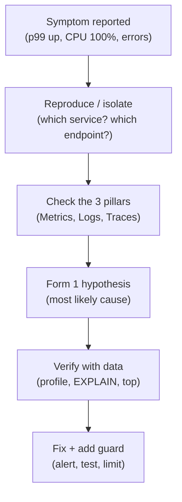

# 15. Troubleshooting & Debugging Scenarios: Production War Stories

## 1. Real-World Analogy: The ER Doctor

Debugging production is triage, not guesswork:
- **Methodology first**: where do you start? At the **symptom's layer** (user sees 500? start at edge → app → DB), not by randomly changing things.
- **Metrics before hypotheses**: you wouldn't prescribe medicine without vitals. Check the dashboard (Grafana/Prometheus — see `system-design/observability`) before theorizing.

## 2. Step-by-Step Flow: The Debugging Methodology

## 3. Scenario A: API Latency Spike (p99 up 10x)

**Symptom**: p99 jumps from 80ms to 800ms; RPS unchanged.
**Triage**:
1. Is it one endpoint or all? (isolate) → one slow report endpoint.
2. Check DB: `SELECT * FROM pg_stat_activity WHERE state='active'` → a long-running query holding connections.
3. `EXPLAIN ANALYZE` → missing index on `created_at` in a `WHERE` + `ORDER BY`.
**Fix**: add composite index; add query timeout; cache the report (`system-design/04`).
**Guard**: statement timeout + slow-query log alert.

## 4. Scenario B: Database CPU at 100%

**Triage**:
1. `SHOW PROCESSLIST` / `pg_stat_statements` → top queries by total time.
2. Usually **N+1 queries** (from `laravel-internals/03`) or a full-table scan.
3. Check **connections**: connection storm from a misconfigured pool (max too high).
**Fix**: index the hot query; enable Eloquent eager loading; cap connection pool; add read replica (`system-design/05`) to offload reads.
**Guard**: PgBouncer for pooling; CPU alert at 70%.

## 5. Scenario C: Memory Leak Hunt

**Symptom**: RAM climbs until OOM-kill, then restarts (sawtooth pattern in Grafana).
**Triage**:
1. Is it per-request growth (leak) or cache unbounded? Check RSS over time.
2. Common in PHP/Laravel: **static arrays accumulating**, big collections held in memory, or a long-running worker (`laravel-internals/04`) holding state.
3. Profile with `memory_get_peak_usage()` in a loop, or xhprof/Blackfire.
**Fix**: release references, use generators for large iterations, restart workers on `php artisan queue:restart` after deploy.
**Guard**: memory_limit + worker max-jobs-before-restart.

## 6. Scenario D: Queue Backlog Growing

**Symptom**: Horizon/Redis queue depth climbs; jobs delayed.
**Triage**:
1. Are workers running? `horizon:status` / `queue:work` processes alive?
2. Is a **slow job** blocking the pool (long-running sync API call)?
3. Is it a **poison message** retrying forever (no DLQ)?
**Fix**: scale workers horizontally (`system-design/06`), move slow work to dedicated queue/worker, add **Dead Letter Queue** (`system-design/03`) for failed-after-N jobs.
**Guard**: queue-depth alert; per-job timeout; retry with backoff + jitter.

## 7. Interview Elevator Pitches

**Q: A prod API is slow — what's your first move?**
1. **Reproduce & isolate** the endpoint/region, not guess.
2. **Check metrics + traces** to find the slow span (DB? external call?).
3. **Verify with EXPLAIN/profile**, fix the root cause, then add a guard (timeout/alert).

**Q: DB at 100% CPU?**
1. **pg_stat_statements / PROCESSLIST** to find the hot query.
2. Usually a **missing index or N+1** — fix the query, not the hardware.
3. **Offload reads** to a replica; cap the connection pool.

**Q: Growing queue backlog?**
1. Confirm **workers are alive** and not all blocked on a slow job.
2. **Scale workers** + route slow jobs to a dedicated queue.
3. Add a **DLQ** so poison messages stop retrying forever.
