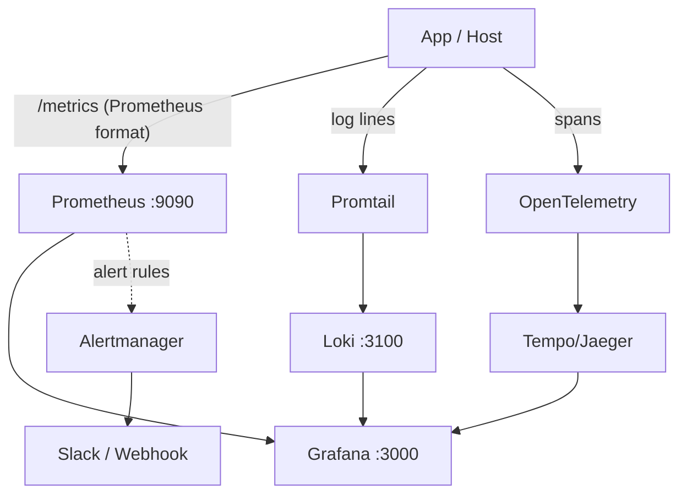

# 16. Observability: Metrics, Logs, Traces & SLOs (from a Real Homelab)

## 1. Real-World Analogy: The Car Dashboard

You can't drive a production system blind. Observability is your dashboard:
- **Metrics** = the speedometer & fuel gauge (numbers over time: CPU%, request rate, error %).
- **Logs** = the mechanic's note ("check engine at 2pm, code P0420").
- **Traces** = the dashcam, replaying exactly which subsystems a single request touched and how long each took.
- **SLOs** = the rule "if the engine light stays on > 5 min, pull over" — automated health contracts.

> **Real setup (this homelab)**: Prometheus `:9090` scrapes `node-exporter` every 15s; Loki `:3100` stores logs shipped by Promtail; Grafana `:3000` is the single pane of glass unifying both. This is the exact stack below.

## 2. Step-by-Step Flow: The Three Pillars



## 3. Metrics & Prometheus

**Metric types** (what to reach for):
- **Counter**: only goes up (requests total, errors total). Rate it: `rate(http_requests_total[5m])`.
- **Gauge**: up/down (active connections, queue depth, CPU%).
- **Histogram**: request duration buckets → compute p95/p99: `histogram_quantile(0.99, rate(latency_seconds_bucket[5m]))`.
- **Summary**: pre-computed quantiles (client-side).

```yaml
# prometheus.yml (real config from this homelab)
global:
  scrape_interval: 15s
scrape_configs:
  - job_name: "node"
    static_configs:
      - targets: ["172.25.0.1:9102"]   # node-exporter
```
**Deep dive**: a **time series** = metric name + labels (`method`, `status`). High-cardinality labels (e.g. `user_id`) explode storage — keep labels low-cardinality.

## 4. SLI / SLO / SLA

- **SLI** (Indicator): the measured signal — e.g. *"99.5% of requests return 200 in < 300ms."*
- **SLO** (Objective): the target — *"99.9% availability over 30 days."*
- **SLA** (Agreement): the contractual promise with penalty.
- **Error Budget**: `1 - SLO`. If you burn it, freeze features and stabilize.

```promql
# SLI: success ratio over 30d
sum(rate(http_requests_total{status!~"5.."}[30d]))
  / sum(rate(http_requests_total[30d]))
```

## 5. Logging & Loki

- **Structured logs** (JSON) beat plain text — queryable by field.
- **Loki** is label-based (like Prometheus for logs); Promtail tails files and ships them.
- Query: `{app="laravel"} |= "exception" | json | latency > 500`.
- **Log levels**: ERROR for failures, WARN for degraded, INFO for flow, DEBUG sparingly (noise).

## 6. Distributed Tracing

For a request crossing 5 services, a **trace** (W3C `traceparent` header) links spans so you see *where the time went*. Instrument with OpenTelemetry; visualize in Tempo/Jaeger. Essential once you have >1 service (ties to `system-design/03` event-driven).

## 7. Alerting Best Practices

1. **Alert on symptoms, not causes** (page on "checkout p99 > 1s", not "CPU high").
2. **Route via Alertmanager** → Slack/webhook; silence during maintenance.
3. **Actionable only** — if nobody will act at 3am, it's a dashboard, not an alert.

## 8. Interview Elevator Pitches

**Q: Metrics vs Logs vs Traces?**
1. **Metrics**: aggregated numbers over time (SLOs, dashboards).
2. **Logs**: discrete events for post-mortem ("what exactly happened").
3. **Traces**: per-request path across services (where's the latency).

**Q: What's an SLO and error budget?**
1. **SLO** is the reliability target (e.g. 99.9%); **SLI** is the measured value.
2. **Error budget** = allowed failure (0.1%); burn it → stop features, fix stability.

**Q: Prometheus cardinality pitfall?**
1. **High-cardinality labels** (user_id, email) create millions of series → OOM.
2. Keep labels low-cardinality (`status`, `method`, `route`), not unique IDs.
3. Use logs/traces for high-cardinality debug data, not metrics.
