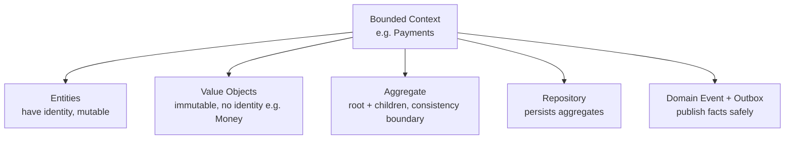

# 17. Domain-Driven Design: Bounded Contexts, Aggregates & the Outbox

## 1. Real-World Analogy: The Hospital vs The Hotel

A single company has many *sub-organizations* that each speak their own dialect:
- **Bounded Context**: The hospital's "Patient" (medical history, allergies) is NOT the hotel's "Guest" (loyalty points, room pref) — even though it's the same human. Each context has its **own model** and **ubiquitous language**. Mixing them creates a big-ball-of-mud.
- **Aggregate**: Inside the hospital context, an `Admission` (root) owns `Vitals`, `Prescriptions` — you never mutate a Prescription except through the Admission. One transaction = one aggregate.

## 2. Step-by-Step Flow: DDD Building Blocks



## 3. Core Concepts

- **Ubiquitous Language**: developers and domain experts use the *same* terms in code, docs, and conversation. `Order` means exactly one thing in the Order context.
- **Entity**: has an identity that persists across changes (`Order #102` is the same order whether it's pending or shipped).
- **Value Object**: defined only by its attributes, immutable — `Money(100, USD)`, `Address`. Two $100 USD values are interchangeable.
- **Aggregate & Aggregate Root**: a cluster treated as one consistency unit. The root guards invariants. *Rule: reference another aggregate only by ID, never by object.*
- **Repository**: abstracts persistence so domain code doesn't know about SQL.

## 4. Example: Payment Context Aggregates

```php
// Aggregate Root: Payment (guards invariants)
class Payment extends Model {
    public function settle(Money $amount): void {
        if ($this->status !== 'pending') {
            throw new DomainException('Only pending payments can settle');
        }
        if ($amount->greaterThan($this->amount)) {
            throw new DomainException('Cannot settle more than owed');
        }
        $this->status = 'settled';
        // emit a domain event via Outbox (see below)
        $this->recordEvent(new PaymentSettled($this->id, $amount));
    }
}
// Value Object: Money (immutable)
final class Money {
    public function __construct(public int $minor, public string $currency) {}
    public function add(Money $o): Money { /* assert same currency */ }
}
```

## 5. Domain Events & the Outbox Pattern

When the Payment settles, other contexts (Notifications, Reconciliation) need to know — **without coupling** and **without losing the event if the DB commit succeeds but the message broker fails**.

**The Outbox pattern** (already in your `system-design/09` payment gateway doc):
1. In the *same DB transaction* as the state change, insert a row into `outbox_events`.
2. A separate relay reads `outbox_events` and publishes to Kafka/Redis, then marks it sent.
3. This gives **atomicity + at-least-once delivery** — no lost events, no dual-write inconsistency.

```sql
BEGIN;
  UPDATE payments SET status='settled' WHERE id=102;
  INSERT INTO outbox_events (aggregate, payload, sent)
    VALUES ('payment', '{"id":102,"type":"settled"}', 0);
COMMIT;
-- relay later: SELECT * FROM outbox_events WHERE sent=0 → publish → UPDATE sent=1
```

## 6. Interview Elevator Pitches

**Q: What is a bounded context?**
1. A **semantic boundary** where a domain model (and its language) applies consistently.
2. The same real-world thing can be modeled differently in different contexts (Patient vs Guest).
3. Prevents a single, contradictory "god model" — enables independent teams/services.

**Q: Entity vs Value Object?**
1. **Entity** has identity that survives change (Order #102).
2. **Value Object** is defined by attributes, immutable, interchangeable (Money, Address).
3. Prefer value objects — easier to reason about, no identity to track.

**Q: Why the Outbox pattern?**
1. Avoids **dual-write** inconsistency (DB committed, broker failed → lost event).
2. Write the event in the **same transaction** as the state change.
3. A relay publishes it later → **atomic + reliable delivery** for event-driven systems.
