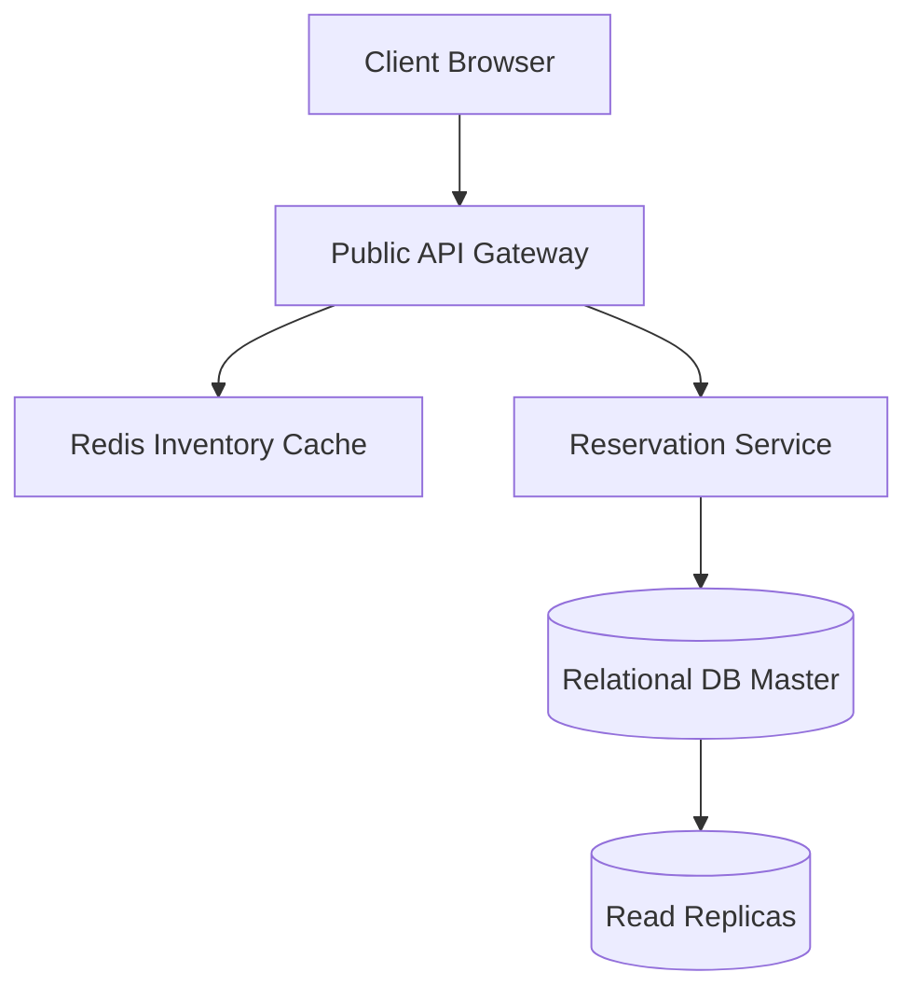

# 🏨 Hotel Reservation & High-Concurrency Booking Systems

This guide details the system design, data modeling, and transaction safety required to build a resilient, high-concurrency booking engine (applicable to hotels, flights, and ticket sales).

---

## 💡 Conceptual Blueprint & First Principles

Booking systems require strict consistency (no double bookings) alongside high availability for browsing inventories.



1. **Inventory Scoping**: Users reserve a room *type* (e.g., Deluxe King) for a specific date range, not a specific room number (which is assigned at check-in).
2. **Access Patterns**: High read-to-write ratio. Browsing room details/rates is heavy; bookings are sparse but critical.
3. **Transaction Safety**: Must adhere to ACID principles to ensure payments match inventory decreases.

---

## 🔬 Under-the-Hood Mechanics

### The Inventory Table Design
To manage room counts dynamically across dates, we pre-populate the inventory:

| hotel_id | room_type_id | date       | total_inventory | total_reserved |
|----------|--------------|------------|-----------------|----------------|
| 101      | 2001         | 2026-08-17 | 50              | 12             |
| 101      | 2001         | 2026-08-18 | 50              | 15             |

Checking availability for $N$ rooms over a date range:
```sql
SELECT date, total_inventory, total_reserved 
FROM room_type_inventory 
WHERE hotel_id = ? AND room_type_id = ? AND date BETWEEN ? AND ?;
```
For *every* date in the range, the system verifies:
$$\text{total\_reserved} + N \le \text{total\_inventory} \times 1.10 \quad (\text{allowing 10\% overbooking})$$

---

## 💻 Production Code & Patterns

### Solving Concurrency: Locking Options

#### Option 1: Pessimistic Locking (`SELECT FOR UPDATE`)
Locks selected rows until the transaction commits, preventing concurrent modifications.

```php
use Illuminate\Support\Facades\DB;

public function reservePessimistic(int $hotelId, int $roomTypeId, string $start, string $end, int $qty)
{
    return DB::transaction(function () use ($hotelId, $roomTypeId, $start, $end, $qty) {
        // Locks rows matching date range
        $inventories = DB::table('room_type_inventory')
            ->where('hotel_id', $hotelId)
            ->where('room_type_id', $roomTypeId)
            ->whereBetween('date', [$start, $end])
            ->lockForUpdate()
            ->get();

        foreach ($inventories as $inv) {
            if (($inv->total_reserved + $qty) > ($inv->total_inventory * 1.10)) {
                throw new \Exception("Insufficient inventory for date: {$inv->date}");
            }
        }

        DB::table('room_type_inventory')
            ->where('hotel_id', $hotelId)
            ->where('room_type_id', $roomTypeId)
            ->whereBetween('date', [$start, $end])
            ->increment('total_reserved', $qty);

        return true;
    });
}
```
* **Trade-off**: Highly reliable but creates database lock queues. Scalability drops under high contention.

#### Option 2: Optimistic Locking (Version Column)
Allows simultaneous reads, but verifies the row version hasn't changed before writing.

```php
// Update checks if version matches original fetch
$updated = DB::table('room_type_inventory')
    ->where('id', $invId)
    ->where('version', $originalVersion)
    ->update([
        'total_reserved' => $newReserved,
        'version' => $originalVersion + 1
    ]);

if (!$updated) {
    // Conflict detected: roll back and retry
    throw new ConcurrentModificationException("Inventory updated by another request.");
}
```
* **Trade-off**: Scalable with low contention. With high traffic, rollback loops degrade performance.

#### Option 3: Database Check Constraints
The database prevents updates that violate inventory rules.

```sql
ALTER TABLE room_type_inventory 
ADD CONSTRAINT check_inventory_limit 
CHECK (total_reserved <= CAST(total_inventory * 1.10 AS UNSIGNED));
```
Any transaction trying to over-allocate immediately throws a database error, allowing the application to catch the constraint exception and fail gracefully.

---

## ⚔️ Staff / Senior Interview Scenarios

### Q1: How do you scale a booking database to handle Booking.com levels of traffic?
* **Answer**:
  1. **Sharding**: Shard the relational database by `hash(hotel_id) % num_shards`. Since reservations, rates, and inventory queries are scoped by hotel, all transactions stay local to a single shard.
  2. **Inventory Cache**: Offload reads and initial booking checks to Redis. Use a Lua script to atomically check and decrement inventory:
     ```lua
     local key = KEYS[1] -- hotel_room_date
     local qty = tonumber(ARGV[1])
     local limit = tonumber(ARGV[2])
     local current = tonumber(redis.call('get', key) or "0")
     if current + qty <= limit then
         redis.call('incrby', key, qty)
         return 1
     else
         return 0
     end
     ```
     Upon successful Redis reservation, push the booking asynchronously to a queue for database persistence.
