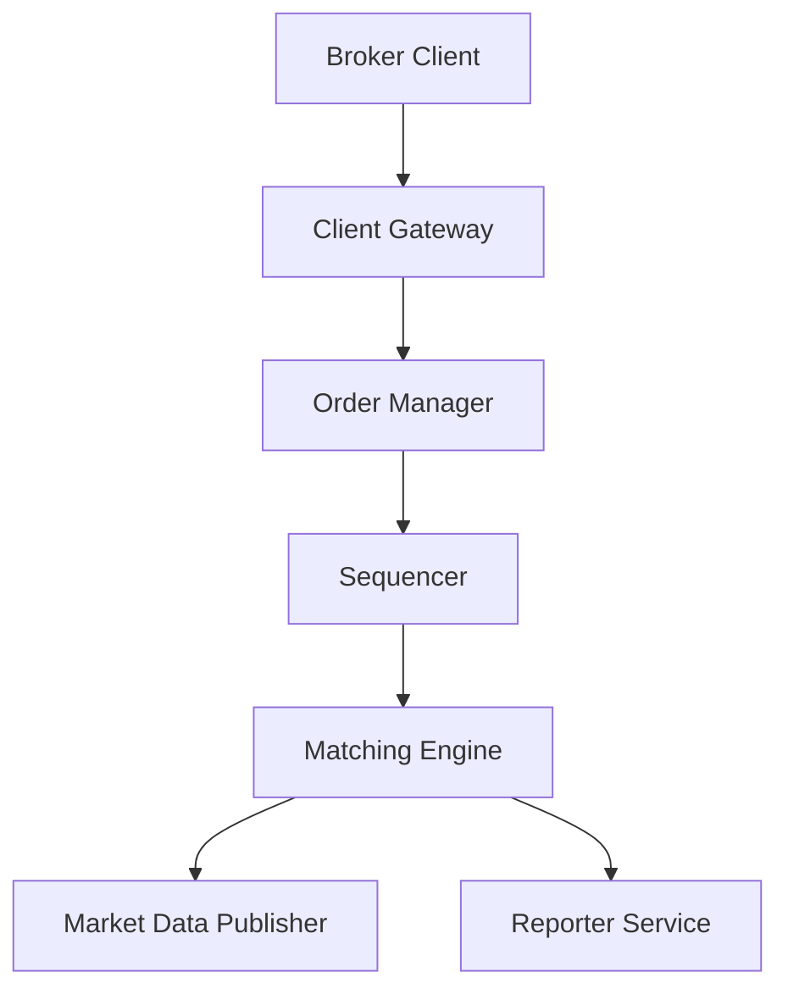

# 📈 Stock Exchange & Matching Engine Architecture

This guide details the system design, latency constraints, and deterministic logic required to build a high-performance, low-latency electronic stock exchange.

---

## 💡 Conceptual Blueprint & First Principles

A stock exchange's primary job is to match buyers (bids) and sellers (asks) fairly and atomically. Think of it like this:

*   **Order Book & Matching Engine (The Auctioneer's Notebook)**: Imagine a room full of traders. The auctioneer maintains a notebook. On the left side, buy offers (Bids) are written, sorted with the highest price at the top. On the right side, sell offers (Asks) are written, sorted with the lowest price at the top. The matching engine is the automated auctioneer that checks if the top buy price matches or exceeds the top sell price. If yes, a trade is executed!
*   **The Sequencer (The Deli Ticket Machine)**: When you go to a busy deli, you pull a numbered ticket (1, 2, 3...). The workers serve you in that exact order. Even if the deli workers change shifts or the power goes out, the state can be fully restored by looking at the ticket queue. The Sequencer stamps every order with a sequence number, making execution 100% predictable and reproducible.
*   **In-Memory Execution (The F1 Race Pit Stop)**: During an F1 race, when a car pulls into the pit stop, the crew does only the absolute bare essentials: swap tires and refuel in 2 seconds. They do not write up invoices, update insurance databases, or wash the car. In a stock exchange, the matching engine only does the matches in ultra-fast RAM (In-Memory). Writing logs to databases or sending emails is delegated to background workers.



1. **Deterministic Execution**: The matching engine must process transactions in a predictable sequence. Given the same inputs, it must yield the exact same outputs (fills/trades).
2. **State Partitioning**: The exchange must be partitioned by symbol (ticker). Each matching engine instance runs in memory and handles a subset of symbols.
3. **Execution Path Isolation**: Keep the critical trade execution path completely in-memory and non-blocking, delegating reports, reporting logs, and candlestick rendering to background streams.

---

## 🔬 Under-the-Hood Mechanics

### The L3 Order Book Data Structure
The order book contains active bids and asks sorted by price and time:
*   **Bids**: Max-Heap (highest price has priority).
*   **Asks**: Min-Heap (lowest price has priority).

For low-latency execution, arrays of orders at the same price are stored as doubly linked lists. The price index is maintained using a hash table or B-Tree.

```
       BIDS (Buy Orders)                  ASKS (Sell Orders)
  Price Level   [Queue List]         Price Level   [Queue List]
     $150.00    [Order A <-> Order B]   $150.05    [Order E <-> Order F]
     $149.95    [Order C]               $150.10    [Order G]
```

### Determinism & The Sequencer
To guarantee fault-tolerance and high availability, the matching engine relies on a **Sequencer**:
*   Every inbound order receives a monotonically increasing sequence ID (e.g., $1, 2, 3$).
*   If a matching engine node crashes, a secondary backup node reads the sequence stream, replays the orders, and reconstructs the exact same order book state without inconsistencies.

---

## 💻 Production Code & Patterns

### Simple L3 Matching Engine Loop (PHP In-Memory Concept)

```php
namespace App\Services;

class OrderBook
{
    // Arrays representing the order book levels in RAM
    public array $bids = []; // Buy orders, sorted high to low
    public array $asks = []; // Sell orders, sorted low to high

    public function matchLimitOrder(array $incomingOrder): array
    {
        $fills = [];
        $qty = $incomingOrder['quantity'];
        $price = $incomingOrder['price'];
        $side = $incomingOrder['side']; // 'BUY' or 'SELL'

        if ($side === 'BUY') {
            // Match incoming BUY order against resting Ask (SELL) orders
            while ($qty > 0 && !empty($this->asks)) {
                // Get the cheapest available sell price
                $bestAskPrice = array_key_first($this->asks);
                
                // If the buyer is offering less than the cheapest seller's price, no deal can be made
                if ($price < $bestAskPrice) {
                    break; // Price limit not met
                }

                // Get the list of orders waiting at this price level
                $bestAskQueue = &$this->asks[$bestAskPrice];
                
                // Match until the buyer is satisfied or this price level is cleared
                while ($qty > 0 && !empty($bestAskQueue)) {
                    // Fetch the oldest order at this price level (First-In, First-Out)
                    $restingOrder = array_shift($bestAskQueue);
                    
                    // Determine how much we can match (either all of it, or what's left of the buyer's qty)
                    $matchQty = min($qty, $restingOrder['quantity']);

                    $qty -= $matchQty; // Reduce incoming order quantity
                    $restingOrder['quantity'] -= $matchQty; // Reduce sell order quantity

                    // Record the transaction
                    $fills[] = [
                        'buyer_order_id' => $incomingOrder['id'],
                        'seller_order_id' => $restingOrder['id'],
                        'price' => $bestAskPrice,
                        'quantity' => $matchQty,
                    ];

                    // If the sell order is not fully completed, put the remainder back at the front of the line
                    if ($restingOrder['quantity'] > 0) {
                        array_unshift($bestAskQueue, $restingOrder);
                    }
                }

                // If no more sell orders are left at this price level, remove the price level entirely
                if (empty($bestAskQueue)) {
                    unset($this->asks[$bestAskPrice]);
                }
            }

            // If the buy order is still not fully satisfied, place the remaining quantity on the Bids book
            if ($qty > 0) {
                $this->bids[$price][] = [
                    'id' => $incomingOrder['id'],
                    'quantity' => $qty,
                ];
                // Sort Bids descending (highest buy offers at the top)
                krsort($this->bids);
            }
        }
        // ... Similar logic for SELL orders matching bids
        return $fills;
    }
}
```

---

## ⚔️ Staff / Senior Interview Scenarios

### Q1: How do you achieve microsecond-level latency in an exchange?
* **Answer**:
  1. **In-Memory Matching**: Avoid database reads/writes on the critical path. The active order book resides entirely in RAM (specifically using cache-friendly arrays or structs).
  2. **Network Protocol**: Avoid HTTP/JSON overhead. Use binary protocols like FIX (Financial Information eXchange) or SBE (Simple Binary Encoding) over TCP/UDP.
  3. **Zero-Garbage Collection (GC)**: Run matching engines in languages without automatic GC cycles (e.g., C++, Rust, or optimized Go with pre-allocated memory pools) to avoid unpredictable latency spikes.
  4. **Colocation**: Host the brokers' server rigs in the same physical data center as the exchange matching engine to eliminate speed-of-light fiber optic propagation delays.

### Q2: What is Event Sourcing in the context of an Order Manager?
* **Answer**: The Order Manager keeps state transitions (e.g., `OrderPlaced`, `OrderModified`, `OrderFilled`, `OrderCancelled`) as an immutable log of events instead of updating database records directly. This allows:
  * Complete audit trails for compliance.
  * Rapid reconstructs of the current state by replaying events from a checkpoint.
  * Decoupling the write-heavy order ingestion path from read-heavy portfolio balances.
